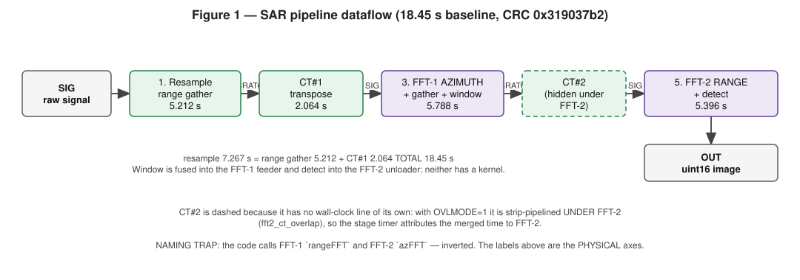
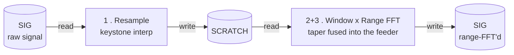
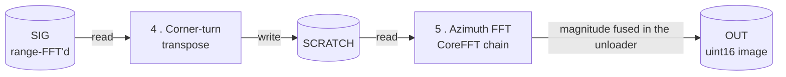
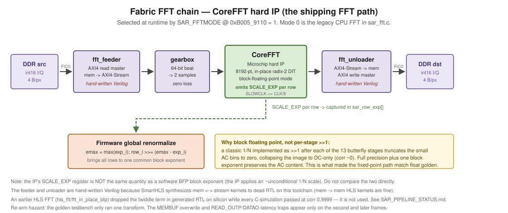
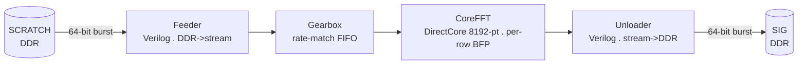
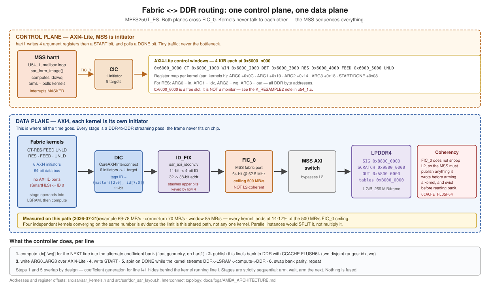
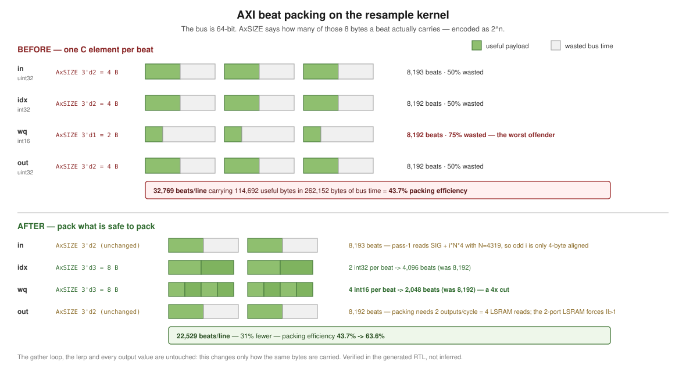
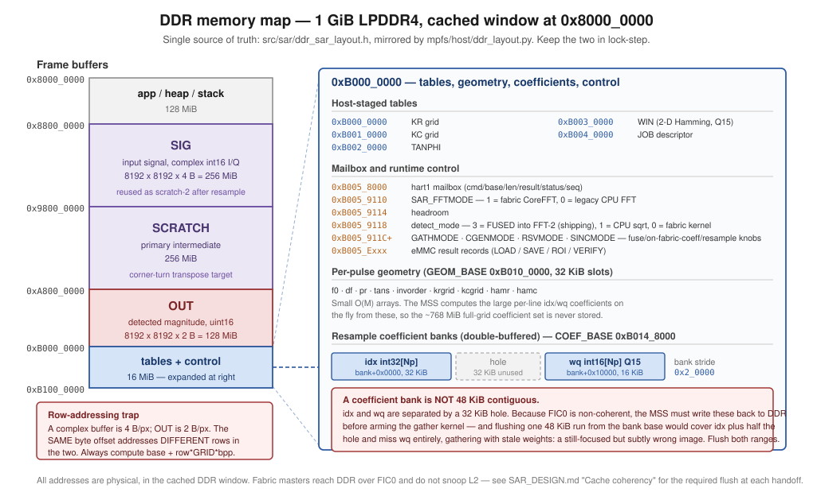

# SAR image former — architecture reference

> **New here?** Every acronym, magic value and stage nickname in this project is defined in [`docs/GLOSSARY.md`](GLOSSARY.md).

A document describing the baseline reference design for a spotlight-mode SAR image-formation
processor on PolarFire SoC MPFS250T_ES: pipeline dataflow, memory map, fixed-point/BFP contracts,
control interface and register map, AMBA/AXI interconnect topology, and fabric resource usage /
current timing baseline. This is where to look up a register offset, a memory address, an
interconnect topology fact, or a fixed-point contract while writing new code against this design.

This document does **not** cover *how to operate* the board (bring-up, build, program, run,
verify — see [`USER_GUIDE.md`](USER_GUIDE.md)) or *how the design got built / optimized*
see [`SAR_IMPLEMENTATION_RECORD.md`](SAR_IMPLEMENTATION_RECORD.md)). Where this document needs a single current timing number it
states it and points to `SAR_IMPLEMENTATION_RECORD.md` Part 3 rather than re-deriving the optimization history.

## Table of contents

1. [What it computes](#1-what-it-computes)
2. [Pipeline dataflow](#2-pipeline-dataflow)
3. [Memory map & buffers](#3-memory-map--buffers)
4. [Fixed-point / BFP contracts](#4-fixed-point--bfp-contracts)
5. [Cache coherency](#5-cache-coherency)
6. [On-board data path (eMMC)](#6-on-board-data-path-emmc)
7. [Boot sequence](#7-boot-sequence)
8. [Control interface & register map](#8-control-interface--register-map)
9. [AMBA / AXI interconnect topology](#9-amba--axi-interconnect-topology)
10. [Resource usage & current timing baseline](#10-resource-usage--current-timing-baseline)
11. [Verification contract](#11-verification-contract)
12. [Known deviations from the ideal design](#12-known-deviations-from-the-ideal-design)

---

## 1. What it computes

Input is an Umbra CPHD phase-history array (spotlight, X-band, single channel, complex float32).
Output is a focused magnitude image. The algorithm is the Polar-Format Algorithm (PFA):
interpolate the polar-sampled phase history onto a Cartesian k-space grid (the keystone resample),
taper it, then take a separable 2-D FFT and detect magnitude.

The processing frame is a fixed 8192 × 8192 complex grid. A full capture is decimated to fit;
per-axis sizing and rejection rules live in `mpfs/host/ddr_layout.py` (`plan_frame` /
`check_input_dims`). Only the native 8192-point transform exists — 16384-point and multi-length
paths were dropped (see `docs/SAR_IMPLEMENTATION_RECORD.md` for why).

For the algorithm derivation and the software-to-fabric port history, see `docs/SAR_IMPLEMENTATION_RECORD.md`
Parts 1–2. This section and §2 describe only the current as-built contract.

---

## 2. Pipeline dataflow



**Figure 1 — SAR pipeline dataflow.** Stage times are the silicon-verified 18.45 s baseline
(2026-07-27, CRC `0x319037b2`). `*` marks the corner-turn/FFT-2 overlap: CT#2 is strip-pipelined
under FFT-2, so its cost is hidden and 5.396 s is the merged wall time. Note the stage names are
historically inverted — "range FFT" is FFT-1, the AZIMUTH transform.

Stages run sequentially: the MSS arms a kernel, polls its DONE flag, then arms the next. This is
not a fused concurrent pipeline. Every stage is a DDR-to-DDR streaming pass, because the frame
(256 MiB complex) far exceeds on-chip SRAM; on-chip each stage holds only a row, a transpose tile,
or AXI burst FIFOs.

Buffers in the **shipping** configuration (`GATHMODE=1`, `DETMODE=3`), taken from
`sar_form_image()` rather than restated from memory:

| # | Stage | Engine | In | Out |
|---|---|---|---|---|
| 1 | Resample — range gather | `RES` + MSS coefficients | SIG | SCRATCH |
| 1 | Resample — internal corner-turn (**CT#1**) | `CT` (`corner_turn_v`) | SCRATCH | **SIG** |
| 2 | Window (2-D Hamming, separable) | *fused into the FFT-1 feeder* | — | — |
| 3 | FFT-1 (**azimuth** transform) + azimuth gather | `FEED`→`GBX`→CoreFFT→`UNLD` | SIG | SCRATCH |
| 4 | Corner-turn (**CT#2**) | `CT` (`corner_turn_v`) | SCRATCH | SIG |
| 5 | FFT-2 (**range** transform) | `FEED`→`GBX`→CoreFFT→`UNLD` | SIG | **OUT** |
| 6 | Detect (magnitude) | *fused into the FFT-2 unloader* | — | — |

Note stage 1: the range gather writes SCRATCH and CT#1 then writes **SIG** — which is why a frame
**overwrites its own input**, and why the one-ELOD-per-PIPE rule below exists. With `OVLMODE=1`,
stages 4 and 5 are folded: CT#2 is strip-pipelined under FFT-2 (`fft2_ct_overlap()`), so the stage
timer reports CT#2 as 0 and FFT-2 as the merged wall time.

Non-shipping configurations move these buffers around (`gather_fused` and `det_fused` each flip a
source or destination). The table above is the one that produces CRC `0x319037b2`.

Current shipping baseline runtime: **14.92 s** (2026-07-29, 100 MHz fabric clock) — resample
3.740 s · range-FFT 5.417 s · azimuth-FFT 5.769 s. Set by `sar_resample_v`, which fuses range-gather
coefficient generation into the fabric so 32 KB `idx` + 16 KB `wq` per line never reach DDR.
Verified by **correlation 0.977** against the known-good top-left crop, plus a value-level check of
pass 1 on silicon (99.19% exact against the bit-accurate model). **Not** by CRC equality: this
kernel is fixed-point where the previous path was float32, so crop CRC is now `0x221e5e7a`
(top-left) and the older `0x319037b2` was a CENTRE crop of the float32 path — a different
measurement, not a superseded one. Chip power (vectorless SmartPower): **2.42 W**. Timing margin:
100 MHz setup slack **+0.255 ns**, the binding constraint on any clock increase.

The previous baseline was 18.45 s (2026-07-27), verified bit-exact at CRC `0x319037b2`.
This is the single current number; the chronological optimization history (110.8 s → 14.92 s, one measured step at a time)
lives in `docs/SAR_IMPLEMENTATION_RECORD.md` Part 3 — do not re-derive it here. Orchestration is `sar_form_image()`
in `src/sar/sar_sequencer.c`.

Measured per stage at that baseline:

| stage | time | share |
|---|---:|---:|
| resample (range gather + internal corner-turn) | 7.267 s | 39.4% |
| range-FFT — **FFT-1, the AZIMUTH transform** | 5.788 s | 31.4% |
| azimuth-FFT — **FFT-2, the RANGE transform**, with corner-turn #2 overlapped into it | 5.396 s | 29.2% |
| window / corner-turn / detect | 0 | fused or overlapped |

The `rangeFFT` / `azFFT` field names are historical and **inverted** with respect to what the
transforms do: `rangeFFT` is FFT-1, the azimuth transform, and `azFFT` is FFT-2, the range
transform. The table above is authoritative; the field names are not.

Four changes took 37.72 → 25.16 s, each silicon-validated with the CRC unchanged: multi-hart
coefficient generation, the on-fabric azimuth coefficient generator (`sar_coeffgen.v`), a second
CoreFFT chain, and the multi-hart block-exponent renormalize epilogue. The last runs in **both**
FFT passes, which is why it beat its single-pass prediction.

A fifth change took 25.16 → **18.45 s** (−26.7%): replacing the SmartHLS corner-turn with the
hand-written `corner_turn_v.v`, which issues FULL-WIDTH (`arsize=3'b011`) bursts where the HLS
kernel issued half-width beats, and double-buffers so fill and drain overlap. Both corner-turn
sites improved — resample (which contains CT#1) 11.175 → 7.267 s, and the CT#2/FFT-2 overlap
8.610 → 5.396 s. It costs ~3x the LSRAM of the kernel it replaced (128 blocks vs ~43).

The range-FFT moved the WRONG way, 5.374 → 5.788 s (+8%), and that is unexplained. The likely
reading is DDR contention: the corner-turns now finish sooner and compete differently for FIC_0.
It is not attributed, so do not repeat it as if it were.

**Runtime knobs that make up this configuration** (all fail-safe: an unset or cold-boot DDR word
means OFF, so the shipping binary is behaviour-neutral until deliberately switched):
`DETMODE=3`, `GATHMODE=1`, `OVLMODE=1`, `SAR_CGENMODE='CGN1'`, `SAR_DUALFFT='DFF2'`,
`SAR_RWRK_NW=0x52575204`, `SAR_FFTBLK` default 64.

> **ONE ELOD PER PIPE RUN.** The internal corner-turn transposes SCRATCH → SIG, so a run
> **overwrites its own input**. A second PIPE without reloading the scene silently processes the
> previous run's intermediate data and returns a wrong, run-dependent CRC. This is not corruption
> and not specific to any one configuration — single chain does it identically.

**Buffer flow per pass** (see §3 below for the full buffer map):





### 2.1 Kernel-level decomposition

The table above is the *timing* view: six instrumented stages matching `sar_stage_ts[0..6]`. At
kernel granularity there are seven arm/wait cycles (the window kernel is no longer armed), because
the resample stage internally runs range-resample, a corner-turn, and azimuth-resample before
reporting one timestamp. Both views are correct; this is the one to use when reasoning about
buffer traffic or arming order.

| # | Stage | Kernel | Reads | Writes | Timing stage |
|---|---|---|---|---|---|
| 1 | range resample (per pulse, ×M) | `RES` | SIG + COEF idx/wq | SCRATCH (row `invorder[i]`, tan φ-sorted) | resample |
| 2 | corner-turn (transpose) | `CT` | SCRATCH | SIG | resample |
| 3 | azimuth resample (per range bin, ×Np) | `RES` | SIG + COEF | SCRATCH (uniform k-space) | resample |
| 4 | ~~window (2-D Hamming)~~ | *fused into `FEED`* | — | — | window (now 0.00 s) |
| 5 | range FFT | `FEED` → CoreFFT → `fft_unloader` | SCRATCH (stream) | SCRATCH (AXI4 write) | rangeFFT |
| 6 | corner-turn (transpose) | `CT` | SCRATCH | SIG | cornerturn |
| 7 | azimuth FFT | `FEED` → CoreFFT → `fft_unloader` | SIG (stream) | SIG (AXI4 write) | azFFT |
| 8 | ~~detect (magnitude)~~ | *fused into `UNLD`* | — | OUT (final image) | detect (now 0.00 s) |

The corner-turn appears twice — once inside resample and once between the two FFT passes — and
steps 2 and 6 both write SIG while steps 1 and 3 both write SCRATCH. This is the SIG/SCRATCH
ping-pong; a stage that reloads a buffer it just wrote is a bug, not an optimisation.

### 2.2 Resample (keystone / polar-format interpolation)

Two passes with a transpose between them, all inside `resample_2pass()`.

- Pass 1 (range): each real pulse row of SIG (N samples) is resampled to the padded width Np and
  written to SCRATCH at its `tan_phi`-sorted row `invord[i]`, so SCRATCH ends up pulse-sorted.
  Padded rows M..Mp-1 are then zeroed.
- Transpose SCRATCH → SIG so range bins become rows.
- Pass 2 (azimuth): each range-bin row (M sorted pulses) is resampled to Mp, leaving the resampled
  k-space in SCRATCH.

**Interpolation contract** — a two-tap linear gather:

```
out[i] = in[idx[i]] + (in[idx[i]+1] - in[idx[i]]) * wq[i] / 32768
```

equivalently `in[idx]·(1-w) + in[idx+1]·w` with `w = wq/2^15`. `idx` is an index into the source in
its natural order; `idx = -1` means out-of-range and zero-fills.

**Coefficient generation math** (`sar_resample_coeffs.c`, mirrors host `interp_coeffs()` at
corr 1.0), computed just-in-time on the MSS, one line
at a time, from small per-pulse geometry arrays (precomputing the full grid would be ~768 MiB):

- **Pass 1 (range), per pulse `i`:** source positions `kr[i,j] = 2·pr[i]/C · (f0[i] + j·df[i])`,
  `j = 0..N-1`; `interp_coeffs(KRGRID, kr_i)`; result row = `INVORDER[i]`.
- **Pass 2 (azimuth), per range bin `j`:** source positions `src[k] = KRGRID[j]·tan_s[k]`,
  `k = 0..M-1`; `interp_coeffs(KCGRID, src)`.

`sar_interp_coeffs` mirrors host `interp_coeffs` exactly (two-pointer, ascending/descending `xp`,
`idx = -1` for out-of-range, `wq = round(frac · 32768)` clamped to Q15) — verified corr = 1.0 vs
`np.interp`.

The MSS double-buffers: while the fabric kernel gathers line `i` from coefficient bank `b`, the
CPU fills bank `b^1` for line `i+1`. Coefficient generation is float on the CPU; the interpolation
itself is fixed-point in fabric. Steps overlap by design, so coefficient generation for line `i+1`
hides behind the kernel running line `i` — coefficient work is currently "free" and becomes the
binding constraint only once the gather is substantially faster (see `SAR_IMPLEMENTATION_RECORD.md` Part 3 §3.3).

**Resample is three workloads with different parallelism** (measured 2026-07-21, deci-1
Centerfield, `sar_resample_ts[0..3]`):

| Part | Share | Shape | Parallel across lines? |
|---|---:|---|---|
| Range gather | 28% | 5,634 pulse lines, Np=8192 outputs each | yes — fully independent |
| Corner-turn | 25% | one global transpose of the 256 MiB frame | **no** — global data movement |
| Azimuth gather | 46% | 8,192 range-bin lines, Mp=8192 outputs each | yes — fully independent |

Independence of the two gathers is provable from the host reference (`resample_coeffs` is a plain
per-row loop, `apply1` a pure per-row map, no loop-carried dependency); the ordering between the
three is strict — the corner-turn needs all of the range output, and azimuth needs all of the
corner-turn output. Azimuth costs more per line than range (1.652 ms vs 1.475 ms line time,
Mp=8192 vs N=4319 samples/line) — the two gathers are not interchangeable when optimizing, azimuth
is worth about 1.6× range. The corner-turn appears **twice** in the pipeline (once here, once
between the FFT passes) from a single shared kernel — together ~17% of a full run.

### 2.3 Window — fused into the range-FFT feeder (2026-07-21)

Separable Hamming taper applied as the on-the-fly product `hamr[j] · hamc[k]` from two Q15 1-D
tapers, rather than a materialized 2-D table. Zero inside the zero-pad region. Window is
data-extent Hamming only (`hr[:n] = hamming(n)`, zero in pad), not a full 128 MB taper.

There is no longer a standalone window pass. The taper is applied inside `fft_feeder_v.v` as data
streams into the range FFT: `hamc` lives in a 4096×32b on-chip table (2 taps/word, table entry `n`
serves beat `n` 1:1), `hamr[row]` arrives as a scalar in the same register write that arms the row,
and a 3-stage registered multiply sits on the FIFO write side. Runtime-enabled (reg 0x18 bit 16) —
ON for the range pass, OFF for the azimuth pass, which shares the same feeder instance.

Two things this depends on, both deliberate:

- The arithmetic reproduces `hls_window/window.cpp` bit-for-bit, including its truncation ORDER
  (`cw = (hamr*hamc)>>15` first, then `(sample*cw)>>15`). Note `silicon_emulator.window_fixed()`
  uses the OTHER order (two independent `>>15` rounds) and is therefore NOT bit-exact against the
  silicon it mirrors — unresolved, see §12.
- It is in hand-written Verilog, not HLS. Fusing the window into the resample gather was tried
  twice, was bit-exact in `shls sw` and II=1 in `shls hw`, and hit two distinct SmartHLS
  miscompiles on silicon — see `docs/fpga/DEV_GUIDE.md` §1. Do not retry that route.

### 2.4 The two FFT passes — a naming correction



**Figure 8 — CoreFFT streaming chain.** `fft_feeder → gearbox → CoreFFT → fft_unloader`. Since
2026-07-26 there are **TWO** such chains (`FEED/GBX/FFT/UNLD` and `FEED_B/GBX_B/FFT_B/UNLD_B`),
enabled by `SAR_DUALFFT` and splitting each pass's rows in contiguous blocks; the figure shows one.


The shipping FFT is the Microchip **CoreFFT hard IP**, driven as a streaming chain
`fft_feeder → gearbox → CoreFFT → fft_unloader`, selected at runtime by `SAR_FFTMODE` @
`0xB0059110` = 1 (mode 0 is a retained legacy CPU FFT in `sar_fft.c`). The feeder and unloader are
hand-written Verilog (`fft_feeder_v.v`, `fft_unloader_v.v`) — not a style choice: SmartHLS
synthesizes mem-to-stream and stream-to-mem kernels to dead RTL on this toolchain.
Memory-to-memory HLS kernels (resample, corner-turn) are fine. See §12 for the source-doc
contradiction on this point.

**The two FFTs are mislabelled in the code, and this doc uses the corrected names.** Verified from
the fixed-point mirror (`silicon_emulator.py`) and the sequencer: the frame after resample is
`(Np=range, Mp=azimuth)`, and each `fft_pass` transforms the LAST axis (columns). So:

| Pipeline position | True axis it transforms | Fused into it | Historical CODE name (still in the RTL/timing printout) |
|---|---|---|---|
| **FFT-1** (first pass, `SIG→SCRATCH`) | **azimuth** | the 2-D Hamming **window** + the azimuth resample gather | `rangeFFT` / "range FFT" / the first `fft_pass` |
| corner-turn (CT#2) | (global transpose, `SCRATCH→SIG`) | — | `cornerturn` |
| **FFT-2** (second pass, `SIG→OUT`) | **range** | magnitude **detect** | `azFFT` / "azimuth FFT" / the second `fft_pass` |

The code identifiers (`sar_stage_ts` labels, `SAR_SEQ_TIMEOUT_FFT1/2`, the `run_m3_iso.sh`
printout strings `range-FFT`/`azimuth-FFT`) were **not** renamed — parsers and old logs depend on
them — so when reading a raw timing dump, `range-FFT` is FFT-1 (azimuth axis) and `azimuth-FFT` is
FFT-2 (range axis). This is the same swap the `sar-verification-methodology` "orientation gremlin"
warns about; a transposed golden comparison is exactly what an inverted label predicts.

The corner-turn between them is the load-bearing data-movement primitive: a global transpose
cannot be fused into a neighbouring stage, so it is the one stage that must fully materialize the
frame in DDR. It is tiled through on-chip LSRAM and is why the buffer plan needs a distinct
destination (SCRATCH → SIG rather than in place).

Because **FFT-1 (azimuth axis) is fed directly by the azimuth resample pass with no corner-turn
between them**, the azimuth resample was fused into FFT-1's feeder exactly as the window already
was (§2.2, §2.3).

**CoreFFT chain detail:** the FFT is not a single
kernel — it is a hand-assembled stream chain, because SmartHLS mem↔stream kernels are dead RTL
here.



The **gearbox** (`corefft_stream64_adapter.v`) rate-matches the 64-bit DDR burst stream to
CoreFFT's serial DATAI/DATAO ports (whose `DATAO_VALID` trails `READ_OUTP` by ~4 cycles) — this was
the fix that stopped the range FFT dropping beats.

#### 2.4a Corner-turn / FFT-2 overlap (Step 2, 2026-07-23)

A global transpose "cannot be fused into a neighbouring stage" (its read side needs the entire
source matrix to exist first) — but it **can** be **overlapped** with one, on this silicon,
without fusing anything.

**Why this pair, and not corner-turn + FFT-1 or resample's gather + its own corner-turn.** To write
destination row `r`, `corner_turn` must read source column `r` across the entire source height —
so a transpose can never start any output until its entire source matrix already exists; there is
no way to strip-pipeline a transpose against an upstream producer that is still writing that
source. That rules out overlapping the range-gather with resample's own internal corner-turn
(gather still writing SCRATCH), and rules out overlapping FFT-1 with the corner-turn that follows
it (FFT-1 still writing SCRATCH). What a transpose CAN do is stream its OUTPUT progressively to a
downstream consumer — each `(c_base, c_count)` strip call, once run to completion, has fully
written its destination rows, so a consumer reading those specific rows is safe the moment that
strip's DONE fires. FFT-2 is exactly such a consumer: it reads SIG row-by-row, and the
corner-turn's `dst` rows are exactly SIG rows. This overlap is a one-time opportunity created by
the DDR buffer layout (SCRATCH read-only during this phase, OUT a third buffer distinct from SIG
and SCRATCH thanks to fused detect); it does not generalise to the other two transpose boundaries
in the pipeline.

**Correctness — the non-coherent-FIC0 hazard.** Two independent fabric masters have no ordering
guarantee between one master's DDR write and another master's later read. The fix shipped is
**strip-granular kernel calls, each run to hardware DONE**: `fft2_ct_overlap()`
(`sar_sequencer.c`) arms corner-turn strip `s` (`c_base = s·S`, `c_count = S`, `S = 1024` → 8
strips), lets it free-run, processes FFT-2 rows `[(s-1)·S, s·S)` from strip `s-1` (already
known-complete from the previous iteration's `sar_k_wait`), then explicitly waits for strip `s`'s
kernel-DONE before treating it as ready. A prologue processes strip 0's corner-turn alone before
the loop starts; an epilogue processes the last strip's FFT-2 rows after the loop ends. PASS-2 BFP
renormalize stays a single global sweep at the very end.

**The SmartHLS pitfall (read before touching a strip-argument kernel again).** The first
`corner_turn` implementation made the kernel's outer `c0` loop bound a *runtime* value
(mathematically identical to the old `c0 < CT_W` for the full-frame case) — every board-free gate
agreed (`shls sw`/`hw` passed, II stayed 1, post-P&R timing clean) — yet it regressed the kernel
**3.9× on silicon** (6.20 s → 24.36 s), confirmed via the FIC_0 monitor to be a collapse of
read-issue overlap across the tile boundary. The fix keeps **both outer loop bounds as the
original compile-time constants** (`r0 < CT_H`, `c0 < CT_W`) and gates the tile BODY with a
runtime skip guard, `if (c0 >= cb && c0 < ce) { ... }`. That preserved the fast kernel's scheduling
exactly — verified on silicon at 6.20 s, bit-identical to the pre-strip baseline. Full writeup:
`docs/fpga/DEV_GUIDE.md` §1.7.

**Runtime control.** `SAR_OVERLAPMODE` @ `0xB0059130` (`OVLMODE` env in `run_m3_iso.sh`): 0 =
sequential (default), 1 = the overlap path. Only takes effect when `SAR_GATHERMODE=1` and
`detect_mode=3` (the shipping gather-fused + detect-fused configuration).

Measured result (~75% of the corner-turn hidden under FFT-2): see `docs/SAR_IMPLEMENTATION_RECORD.md` Part 3 for
the numbers; this section documents only the mechanism.

### 2.5 Detect

Per-pixel magnitude `sqrt(I² + Q²)`, saturated to uint16.

This runs IN FABRIC (since 2026-07-21), fused into the azimuth-FFT unloader: `fft_unloader_v.v`
takes the magnitude as the second FFT streams to DDR, so there is no separate detect stage and no
CPU involvement in the datapath at all.

It is hand-written Verilog, NOT HLS — the standalone HLS detect kernel was unusable for months:
SmartHLS mis-synthesized its sign extension — source-correct C (`(int16_t)(x >> 16)`) was read as
**unsigned** in the generated RTL, so every negative-I pixel overflowed and saturated to `0xFFFF`
(about half the image), collapsing correlation. Both `shls` cosim and a correlation check passed
anyway; only a value-level comparison caught it. The Verilog declares the operands explicitly
`signed`; `tb/tb_fft_unloader_det.v` mutation-tests exactly this (stripping `signed` reproduces
2035/2048 mismatches).

The global block exponent forces one residual CPU pass: `emax` is not known until every row is
transformed, so the unloader emits magnitudes at each row's native exponent and firmware applies
`>>(emax - exp_i)` afterwards — a uint16 shift over 128 MB (no sqrt, no sign handling), rather than
the old complex-to-magnitude pass over 512 MB.

Validated by A/B against the known-good CPU detect on identical input: max |diff| 2 LSB, zero
pixels beyond that over 1,048,576, correlation 0.999866. `mpfs/host/model_detect_fusion.py`
predicted that ≤2 LSB bound before any RTL existed.

I and Q must be read as signed int16 before squaring:

```c
sext16(u) = (int32_t)((u & 0xFFFF) ^ 0x8000) - 0x8000
```

Engine selection is runtime: `detect_mode` @ `0xB0059118`. **Note:** an earlier draft of this
document (§2.4) stated "`1` = CPU detect (the shipping path)", but every other current source
(`SAR_IMPLEMENTATION_RECORD.md` Part 3) states the shipping
default is `detect_mode == 3` (fused fabric detect, `DETMODE=3`). That single line looks like a
stale leftover from before the fusion became the default; this document treats `DETMODE=3` /
fabric-fused as current, consistent with the majority of sources and with §2's stage table above.

### 2.5a Resample coefficients — where they come from, and how fast

The resample gathers do not compute geometry; they consume precomputed per-output pairs
`(idx, wq)` — a source index and a Q15 interpolation weight — and evaluate

```
out[q] = lerp(src[idx[q]], src[idx[q]+1], wq[q])      idx < 0 => zero fill (the FFT pad)
```

There are `Mp` = 8192 of these **per line**, and 8192 lines per pass, so a pass needs **67 million
coefficient pairs**. Producing them, not consuming them, was the pipeline's dominant cost for most
of its history.

**The two passes are not symmetric, and that is the whole story.**

| | pass 1 (range) | pass 2 (azimuth) |
|---|---|---|
| inverts | `kr = 2·pr/C·(f0 + j·df)` onto uniform `KR` | `kc = kr·tanφ` onto uniform `KC` |
| in the source variable | **affine** | **not** affine |
| so the inverse is | closed form: `t = (KR[q] − x0)·inv` | a **search** in sorted `tan_s` |
| cost | 1 subtract + 1 multiply per output | bracket advance + divide-free interpolation |

Pass 2's search is why `sar_coeffs_init()` sorts `tanφ` into `tan_s`, why `invorder[]` exists (pass 1
writes row `i` to `invorder[i]` so rows arrive tan-sorted), and why `tan_s` must be **strictly
monotonic** — a repeated value makes the bracket ill-posed. It is also why the on-fabric generator
carries three 8192×32 tables (`tanmem`, `itanmem`, `kcmem`) rather than one.

#### Throughput: CPU vs fabric

Measured per line of pass 2 (silicon, 8192 outputs):

| producer | µs/row | vs fabric floor |
|---|---:|---|
| CPU, single hart (`sar_coeffs_pass2`) | **1499** | 2.1× slower than CoreFFT |
| CPU, 4 harts (`SAR_CWRK_NW=4`) | **~508** | still pacing the stage |
| **on-fabric `sar_coeffgen`** | **~147** | **4.7× faster than the CoreFFT floor** |
| CoreFFT itself (the irreducible consumer) | 698 | — |

The CoreFFT floor is 69,790 cycles/row = 698 µs at 100 MHz. So with CPU coefficients the stage is
**coefficient-paced** — the fabric sits idle waiting — and with the fabric generator it becomes
**FFT-paced**, which is the point: only then does a second CoreFFT chain buy anything, and that
coupling is enforced in firmware (`SAR_DUALFFT` silently drops to one chain unless `SAR_CGENMODE`
is on, recording it in `RPROF[11]`).

Confirmed by the residual-wait probe: with CPU coefficients `RPROF[9]` (fabric wait after coeff-gen
returns) is **0.53 µs/row**, i.e. 99.95% of the stage was the CPU.

#### How the fabric generator works

`sar_coeffgen.v` is hand-written, streams `{m_idx, m_wq}` straight into the FFT‑1 feeder's
`c_idx/c_wq/c_valid/c_ready` port, and has **no AXI4 initiator at all** — it costs zero DIC ports
and touches DDR never. Streaming also deletes the `idx`/`wq` DDR round-trip: 6,144 of a row's 8,961
read beats (**68.6%**) and the CPU's per-row L2 flush disappear with it.

The one division (`1/dx`, `RINV`) is **per row, not per output**, so it stays on the CPU and arrives
as a scalar — there is no divider in fabric.

Correctness is not argued from simulation: `mpfs/host/check_coeffgen_fixed.py` proves the integer
binary32 datapath **bit-identical** to the C reference on real staged geometry, including at
production 8192×8192, so switching the source cannot move the pipeline CRC. That is what makes
`SAR_CGENMODE` a same-bitstream, same-binary A/B.

**Pass 1 is still on the CPU.** It is the cheaper maths (closed form, one table, ~16 LSRAM instead
of 48) and is the largest remaining lever at ~5.8 s — see `mpfs/fpga/coeffgen1_design.md`. Its
arithmetic is already gated bit-exact at production geometry; what it lacks is a consumer, since
`RES` reads `idx`/`wq` from DDR rather than from a stream.

### 2.6 Data movement: how bytes get between fabric and DDR



**Figure 2 — Fabric-to-DDR routing.** Every fabric master reaches DDR through the DIC and FIC_0;
FIC_0 is non-coherent, which is why the CPU must flush L2 before arming a kernel. The DIC has one
DDR target window (`0x8000_0000..0xBFFF_FFFF`) — addresses outside it are not decoded at all.

Two planes cross FIC_0, and only one of them matters for performance. Full interconnect topology
(masters, targets, AXI ID handling): §9.

**Control plane** — a handful of register writes per line, never the bottleneck. Kernels never
talk to each other and never self-sequence; the MSS arms one, waits for DONE, then arms the next.

**Data plane** — six initiators (five kernels + the FFT unloader) converge on one data
interconnect, then `ID_FIX`, then FIC_0, then the MSS AXI switch, then LPDDR4. Nothing on this path
snoops L2.

**What the controller does, per resample line:**

1. Compute `idx[]`/`wq[]` for the **next** line into the alternate coefficient bank (float
   geometry, on hart1).
2. Publish the **current** line's bank to DDR with `CCACHE FLUSH64` — two disjoint ranges, because
   a bank is not contiguous (§3).
3. Write ARG0..ARG3 over AXI4-Lite.
4. Write START.
5. Spin on DONE while the kernel streams DDR → LSRAM → compute → DDR.
6. Swap bank parity and repeat.

Steps 1 and 5 overlap by design, so coefficient generation for line `i+1` hides behind the kernel
running line `i`.

### 2.7 AXI beat packing



**Figure 3 — AXI beat packing.** Why element width matters on a 64-bit port: a 4-byte element per
beat wastes half the bus. Measured on the corner-turn (E4, 2026-07-27): 524,288 bursts × 128 beats
= 512 MiB of beat capacity to move a 256 MiB frame.

The bus is 64-bit, but `AxSIZE` decides how many of those 8 bytes a beat actually carries (2^n).
The resample kernel originally moved one C element per beat: `AxSIZE 3'd2` (4 bytes) for `in`,
`idx` and `out`, and `3'd1` (2 bytes) for `wq` — 32,769 beats per line carrying 114,692 useful
bytes inside 262,152 bytes of bus time (43.7% packing efficiency), with `wq` wasting 75% of every
beat it used.

Reading `idx` as two int32 per 64-bit word and `wq` as four int16 per word, then unpacking into the
existing LSRAM arrays, cuts this to 22,529 beats and 63.6% efficiency. The gather loop, the lerp
and every output value are untouched — only the transport changes.

Two streams are deliberately left unpacked:

- **`in`** — pass 1 reads `BUF_SIG + i*N*4` with N=4319, so for odd `i` the address is only 4-byte
  aligned and an 8-byte beat needs 8-byte alignment. Pass 2 would be fine, but one kernel binary
  serves both passes.
- **`out`** — producing two outputs per cycle would need four LSRAM reads per cycle from `buf`,
  which the two-port LSRAM cannot do; II would go to 2 and cancel the gain.

`idx` and `wq` are always safe because every coefficient bank (`0xB014_8000 + b*0x2_0000`, and
`+0x1_0000` for wq) is 8-byte aligned by construction.

> Tooling trap: a `#pragma HLS memory partition` placed anywhere other than immediately above the
> variable's **declaration** is silently dropped — SmartHLS warns `[HLS pragma] ignored`, exits 0,
> and the partitioning simply is not there. See `docs/fpga/DEV_GUIDE.md` §1.6.

---

## 3. Memory map & buffers



**Figure 4 — DDR memory map.** The cached window is full to the byte: SIG + SCRATCH + OUT + code
end exactly at `0xB000_0000`. There is no room for a fourth frame buffer, and the non-cached
segment at `0xC000_0000` is NOT reachable by the fabric.

Defined in `src/sar/ddr_sar_layout.h` and mirrored by `mpfs/host/ddr_layout.py`. These two must
stay in lock-step; the header is the bare-metal mirror, the Python module is the host-side single
source. Cached LPDDR4 window `0x8000_0000`–`0xBFFF_FFFF`.

| Base | Size | Region |
|---|---|---|
| `0x8000_0000` | 128 MiB | app / heap / stack (also copied to L2 scratch `0x0a00_0000`) |
| `0x8800_0000` | 256 MiB | SIG — input signal, complex int16 I/Q; reused as scratch-2 after resample |
| `0x9800_0000` | 256 MiB | SCRATCH — primary intermediate, corner-turn target |
| `0xA800_0000` | 128 MiB | OUT — detected magnitude, uint16 (`GRID_MAX²×2 B`, GRID_MAX=8192) |
| `0xB000_0000` | 16 MiB | tables, geometry, coefficient banks, mailbox and control |

Buffers ping-pong SIG ↔ SCRATCH so an in-place FFT never reads and writes the same page. ⚠ **SIG
is reused as transpose scratch** once resample consumes the raw input — a re-run must reload SIG
first. OUT holds only the final image and is never an intermediate.

Within the tables region: host-staged grids at `0xB000_0000` (`KR`, `KC`, `TANPHI`, `WIN`, and
**JOB** at `0xB004_0000`); the hart1 mailbox at `0xB005_8000`; the M2 bring-up harness result table
at `0xB005_0000`; runtime knobs at `0xB0059110`/`9114`/`9118`/`911C`/`9130`; eMMC result records at
`0xB005_Exxx`; per-pulse geometry from `GEOM_BASE 0xB010_0000` in 32 KiB slots
(`F0/DF/PR/TANS/INVORDER` at `…0100000–…0120000`, `KRGRID …0128000`, `KCGRID …0130000`,
`HAMR …0138000`, `HAMC …0140000`); and the double-buffered resample coefficient banks from
`COEF_BASE 0xB014_8000`, stride `0x2_0000`.

A coefficient bank is not 48 KiB contiguous: `idx` (int32[Np], 32 KiB) sits at bank+0x0000 and
`wq` (int16[Np], 16 KiB) at bank+0x10000, with a 32 KiB hole between. Anything that publishes a
bank must treat it as two disjoint ranges.

### 3.1 JOB descriptor

`sar_job_t` (96 B at `0xB004_0000`; `pack_job` in `ddr_layout.py`):
`magic = 'SAR1'`, `M`, `N` (real pulses × samples),
`fft_r = pow2(N)`, `fft_a = pow2(M)`, `out_dtype`, `bfp_in_exp`, `sig_len`, `sig_crc`, then 64-bit
`sig`/`kr`/`kc`/`tanphi`/`win`/`out`/`scratch` addresses. The pipeline reads geometry from the
fixed addresses above, not from JOB's legacy address fields — the JOB descriptor carries only
scalars plus the SIG/OUT/SCRATCH bases (also true of the eMMC-loaded path, §6).

---

## 4. Fixed-point / BFP contracts

- Complex samples are int16 I and int16 Q packed as one 32-bit word per pixel, hi16 = I, lo16 = Q.
- The detected OUT image is uint16 magnitude, 2 bytes per pixel.
- Therefore a complex buffer is 4 B/px and OUT is 2 B/px, and **the same byte offset addresses
  different rows in the two**. Always compute row addresses explicitly as
  `base + row · GRID · bytes_per_px`. This has bitten the project more than once.
- Resample weights `wq` are Q15 (`w = wq / 32768`).
- Window tapers `hamr`, `hamc` are Q15 int16.
- Geometry arrays (`f0`, `df`, `pr`, `tans`, `krgrid`, `kcgrid`) are float32; `invorder` is int32.
- Element format throughout: complex int16 packed `uint32 = (I<<16)|Q`; tapers Q15; detect out
  uint16.

Datapath sizing, from the fixed-point emulator study (`src/fixedpoint.py` /
`form_image_pfa_fixed.py`; full quantization-study numbers and rationale in `docs/SAR_IMPLEMENTATION_RECORD.md`
Part 1/§1.3 and Part 2 Stage 1): **16-bit mantissa, 18-bit twiddle, 48-bit accumulate, BFP
arithmetic shift after every stage.** Measured FFT block-exponent growth is +9/+10 bits (range
pass −6→3 over 13 stages, azimuth pass 3→13), covered by a 5-bit exponent per FFT line. At 16-bit
the fixed image is visually identical to float (corr 0.9992 on the ship scene) and retains ~53 dB
usable dynamic range at ~4.6 ENOB. If 53 dB proves marginal, 18-bit mantissa buys roughly 12 dB
more and still fits one 18×18 DSP per multiply.

Confirmed CoreFFT configuration (in-place Radix-2, natural-order in/out matching the golden's
convention), from `docs/SAR_IMPLEMENTATION_RECORD.md` Part 2 Stage 2:

| Parameter | Value | Why |
|---|---|---|
| `POINTS` | 8192 | the padded grid; powers of 2 32…16384 supported |
| `WIDTH` | 16 | shared data/twiddle bit width, matches the 16-bit datapath |
| `SCALE` | 0 | conditional BFP — downscale a stage only on real overflow |
| `SCALE_EXP_ON` | 1 | exports the block exponent on `SCALE_EXP` (`FFT Result = DATAO · 2^SCALE_EXP`) |

### 4.1 Block floating point

Block floating point is the reason the fixed-point pipeline matches the float golden. CoreFFT runs
in BFP mode and reports a per-row `SCALE_EXP`; the true value is `DATAO · 2^SCALE_EXP`. Firmware
captures the per-row exponents in `sar_row_exp[]` and renormalizes globally to a common block
exponent, `row_i >>= (emax - exp_i)`.

The alternative — a classic 1/N implemented as `>>1` after each of the 13 butterfly stages —
truncates the small AC bins to zero and collapses the image to DC-only (corr ~0). Fixed-point FFT
dynamic range must be managed with a block exponent, not per-stage truncation. (The CPU FFT
fallback, `sar_fft.c` mode 0, hit this exact bug historically before switching to full-precision
`int32` accumulation with one global block exponent applied at the output — see `SAR_IMPLEMENTATION_RECORD.md`
Part 2.)

Note that the IP's `SCALE_EXP` register is not the same quantity as a software BFP block exponent
(the IP applies an approximately unconditional 1/N scale). Do not compare the two directly.

### 4.2 Order facts (from the golden reference)

Subtleties the firmware must honor to match
`emulate_fabric.py` (the golden fabric path):

- Window is data-extent Hamming only (§2.3) — not a full-frame taper.
- The fabric FFT is **plain** (`fft2`, no `ifftshift`/`fftshift`). Centering/orientation is
  recovered as host post-processing after dump, not on-board.
- Output is laid out `[range][cross]` — a transpose of the float reference; host resolves
  orientation (§11).
- `idx < 0 → 0` (out-of-grid) is how the FFT zero-pad region is filled, via padded query grids.

---

## 5. Cache coherency

FIC0 is not coherent — fabric masters reach DDR without snooping the L2. Every handoff across the
CPU/fabric boundary therefore needs an explicit cache operation:

| Handoff | Requirement |
|---|---|
| CPU writes data, fabric reads it | Write back L2 to DDR before arming the kernel |
| Fabric writes data, CPU reads it | Invalidate L2 before reading, or the CPU sees stale lines |
| SDMMC DMA writes DDR, CPU or fabric reads it | Write back / invalidate after the transfer completes |

Two mechanisms are in use:

- `flush_l2_cache(hartid)` — the MPFS HAL's whole-cache operation. It is a way-by-way walk: for
  each of the 16 ways it reads 131 KiB from the L2 zero device (~268k volatile loads) and
  manipulates the WayMask allocation policy. Correct, but expensive, and it invalidates
  everything.
- `flush_coef_bank_to_ddr(bank, n)` in `sar_sequencer.c` — writes only the covering lines to the
  CCACHE `FLUSH64` register (`CACHE_CTRL_BASE 0x0201_0000`), which writes back and invalidates the
  line containing a given physical address. Used on the resample per-line critical path, where the
  only CPU-dirty data is the coefficient bank. Roughly 768 stores instead of ~268k loads.

Because the coefficient bank is discontiguous (§3), `flush_coef_bank_to_ddr()` flushes `idx` and
`wq` as separate ranges. A single 48 KiB run from the bank base would cover `idx` plus half the
hole and miss `wq` entirely, so the kernel would gather with stale weights — producing a
still-focused but subtly wrong image that a correlation check would likely not catch.

Anything a JTAG poll reads must be written back explicitly — a debugger read of DDR is a physical
read that does not snoop L2, so a value the CPU wrote but did not flush appears stale. Two cases:

- The progress word at `0xB005_9100` is published by the `SAR_PROG` macro itself, one cache line
  per update. This used to happen for free as a side effect of the per-line whole-L2 flush in
  `resample_2pass()`; once that flush was narrowed to the coefficient banks it had to become
  explicit. Without it the progress counter appears frozen for the whole resample stage, which is
  indistinguishable from a hung pipeline.
- Known gap: `MBX_CMD_CRC32`'s handler writes `mbx->result` with only a fence and no writeback, so
  a JTAG read of it returns a stale value. The dedicated result records at `0xB005_Exxx` are
  written back and are trustworthy.

A large CPU write is not self-publishing. Pass 1 zeroes the padded pulse rows — about 84 MB against
a 2 MiB L2 — so most lines write-back-evict naturally as the loop advances and the region *looks*
published. The final ~2 MiB stays dirty, so without an explicit flush the corner-turn reads the
previous run's data in the highest pad rows instead of zeros. Whole-L2 is the right instrument
here: at 64 B per line, targeting 84 MB would be ~1.3 M `FLUSH64` stores, far worse than one
way-walk, and it runs once per pipeline rather than per line.

The general rule: narrowing a flush is safe only after enumerating everything the wide flush was
incidentally publishing. Cache maintenance that works by side effect is a latent dependency.

**Reading state over JTAG** — how a debugger reaches memory changes what it sees:

- While the hart is halted, accesses go through its progbuf — the hart's own load/store path, and
  therefore cache-coherent. This is why the host can write the mailbox and poll `mbx->status`
  without any flush.
- While the hart is running, the debugger must use the system bus — a physical read that does not
  snoop L2. Anything polled during a run — notably the progress word at `0xB005_9100` — must be
  explicitly written back by the firmware, or it appears frozen.

---

## 6. On-board data path (eMMC)

The scene lives on the board's soldered 8 GB eMMC, so a run needs no host data transfer (retiring
the ~3 h JTAG scene load that previously preceded every run). Operational procedure lives in
`docs/USER_GUIDE.md` §4 and the `emmc-onboard-pipeline` skill; this section is the layout/format
reference.

Two fixed-LBA partitions, each self-describing via a superblock and TOC, so job geometry is
reconstructed at load time and never trusted from volatile RAM:

| Region | LBA | Size | Contents |
|---|---|---|---|
| INPUT (`SARI`, `0x53415249`) | `0x80000` (256 MiB) | 4 GiB | packed scene image: superblock + one blob per scene |
| OUTPUT (`SARO`, `0x5341524F`) | `0x880000` (4.25 GiB) | 3 GiB | superblock + persisted output image(s) |

A scene blob (`SARB`, `0x53415242`) is a header, a segment table, and ten 512-aligned role
segments: `sig, f0, df, pr, tans, invorder, krgrid, kcgrid, hamr, hamc`. Each segment is tagged by
role and the firmware resolves role to DDR address via `sar_emmc_role_addr()`, scattering to the
fixed addresses in §3. The JOB descriptor (§3.1) carries only scalars plus the SIG/OUT/SCRATCH
bases — the pipeline reads geometry from the fixed addresses, not from JOB's legacy address
fields.

Measured rates (LEGACY mode, 25 MHz, 8-bit, single-block): read 1.5 MB/s, write 0.13 MB/s. Scene
LOAD is 81.5 s; persisting the 128 MiB OUT image is about 16 min.

What eMMC does and does not solve: it eliminates the recurring 3 h JTAG input load. It does not
speed host transfer — dumping the full OUT image to the PC is still bound by the FlashPro6 JTAG
link at roughly 9 KB/s. Keep the image on-card and dump small ROI crops to verify.

SDMA would speed writes by one to two orders of magnitude but is currently unusable: hart1 runs
with `MSTATUS_MIE` cleared and `MSS_MMC_sdma_write` completes via the MMC PLIC ISR, so with
interrupts off it spins forever in an unhaltable hang. Single-block transfers are synchronous and
cannot hang.

Output persistence is commit-last: invalidate the superblock, write the image, write the
superblock last. A power loss mid-image therefore leaves an invalid superblock and readers reject
the torn image. Do not reorder this.

---

## 7. Boot sequence

Nothing runs automatically. The board boots into a command loop and waits; the pipeline executes
only when a host writes a `PIPE` command into the mailbox — deliberate, to keep the board
debuggable and make every run explicit and repeatable.

### 7.1 Power-on chain

1. eNVM holds `app.elf`, programmed in boot mode 1. The MPFS HAL's startup code runs first: it
   trains LPDDR4 and brings up FIC_0 before any application code executes.
2. E51 (hart 0, the monitor core) enters `e51()`. It releases the MMUART0 subblock clock/reset,
   raises a software interrupt to hart 1, and then idles in an infinite loop forever. It does no
   compute.
3. U54_1 (hart 1) enters `u54_1()` and does the work:
   - spins on `MIP.MSIP` waiting for the E51 wake (an active poll, not `WFI`, so the hart stays
     haltable by JTAG), then clears the soft interrupt;
   - clears `MSTATUS_MIE` and `mie` — interrupts stay masked for the lifetime of the
     application. This is the reason eMMC SDMA is unusable (§6): its completion path is an ISR;
   - installs a direct-mode trap vector for fault recovery;
   - clears the result table, runs the self-test battery, latches `g_m2_done`;
   - zeroes the mailbox and enters the command loop, incrementing a heartbeat each pass.
4. U54_2..4 are unused.

Boot mode matters for debuggability: mode 1 (this application) and mode 0 (a WFI stub) both leave
hart 1 haltable over JTAG. An HSS build does not — JTAG then cannot halt the hart, so it is never
used for this work.

### 7.2 What boot does *not* do

- It does not program the fabric. The bitstream is loaded separately (JTAG or SPI flash); the
  firmware assumes fabric is already live. A dark fabric mimics several unrelated faults — kernels
  never complete, and the eMMC appears dead because the eMMC/SD mux select is a fabric tie.
- It does not load a scene. DDR does not survive a power cycle, so SIG is undefined at boot.
- It does not run the pipeline.

---

## 8. Control interface & register map

The hart1 mailbox at `0xB005_8000` is the single entry point. Layout: `cmd` +0, `base` +4, `len`
+8, `result` +0xC, `status` +0x10 (done = `0xC0FFEE03`), `seq` +0x14. Write `base` and `len` first
and `cmd` last; the hart clears `cmd` to acknowledge.

| Command | Code | Purpose |
|---|---|---|
| `ELOD` | `0x454C4F44` | Load scene eMMC → DDR, plus JOB |
| `PIPE` | `0x50495045` | Run the image-formation pipeline |
| `ESAV` | `0x45534156` | Persist OUT → eMMC SARO |
| `EVOU` | `0x45564F55` | Verify the persisted image by full CRC against the TOC |
| `EROI` | `0x45524F49` | Crop an ROI from the DDR OUT image |
| `EROE` | `0x45524F45` | Crop an ROI from the persisted SARO image |
| `EPRV` | `0x45505256` | Provision the INPUT partition |
| `EMMC` | `0x454D4D43` | eMMC self-test |
| `CRC3` | `0x43524333` | CRC32 `[base,base+len)` → `result` (verify a JTAG-loaded region) |

Results are latched in dedicated DDR records (`0xB005_E000` LOAD, `E100` SAVE, `E200` ROI, `E300`
VERIFY, `0xB005_D000` provision), each written back to DDR so a JTAG physical read sees them.
Verdict 0 is pass; 1 PARAM, 2 INIT, 3 MAGIC, 4 IO, 5 CRC.

Per-stage timing is instrumented in `sar_stage_ts[0..6]` from MTIME at 1 µs per tick, readable
without re-running the pipeline via `bash mpfs/host/run_stage_timing.sh`. Temporary mcycle
profiling counters (`tc`/`tw`/`tf` @ `0xB0059120`) remain in `sar_sequencer.c` and in the
programmed eNVM firmware — numerically inert, not yet stripped.

`result` from `PIPE` comes from `sar_seq_status_t` (`sar_sequencer.h`): 0 = `SAR_SEQ_OK`, else the
failing stage code (`TIMEOUT_RESAMPLE/WINDOW/FFT1/CORNER/FFT2/DETECT/...`). Bounded per-stage spins
mean a stuck kernel yields a TIMEOUT code, never an un-haltable lock-up.

Runtime engine-select knobs (environment variables to `run_m3_iso.sh` for A/B testing):

| Register | Purpose |
|---|---|
| `SAR_FFTMODE` @ `0xB0059110` | 1 = fabric CoreFFT chain (shipping), 0 = legacy CPU FFT (`sar_fft.c`) |
| `SAR_GATHERMODE` @ `0xB005911C` | 1 = fuse the azimuth-resample gather into the FFT-1 feeder, 0 = standalone azimuth resample |
| `detect_mode` @ `0xB0059118` | 3 = fused fabric detect (shipping default, see §2.5's caveat), 0/1/2 = CPU / test paths |
| `SAR_OVERLAPMODE` @ `0xB0059130` | 1 = corner-turn/FFT-2 strip overlap (§2.4a), 0 = sequential |
| `SAR_CWRK_NW` @ `0xB0059134` | 2/3/4 = spread per-line resample-coefficient generation over that many U54 harts; anything else (incl. cold-boot garbage) = 1 = single-hart |
| `SAR_RWRK_NW` @ `0xB005912C` | `0x52575202/03/04` (`'RWR'\|nw`) = split the FFT block-exponent renormalize epilogue over 2/3/4 harts; **any other value = OFF** (the word is uninitialised DDR on a cold boot, so only the exact magic enables it). A/B is same-binary: run once without it, once with `0x52575204`, and compare `RPROF[8]` and the output CRC — the split is bit-identical by construction (`mpfs/host/check_renorm_split.py`), so the CRC MUST NOT move |
| `SAR_CGENMODE` @ `0xB0059138` | `0x43474E31` (`'CGN1'`) = azimuth resample coefficients from the on-fabric `sar_coeffgen`; **any other value = OFF** (DDR/CPU coefficient path). Bit-exact by construction, so the output CRC MUST NOT move |
| `SAR_DUALFFT` @ `0xB005913C` | `0x44464632` (`'DFF2'`) = split each FFT pass's ROWS across TWO CoreFFT chains in CONTIGUOUS BLOCKS of `SAR_FFTBLK` rows (chain A takes a block, chain B the next); **any other value = ONE chain** (the word is uninitialised DDR on a cold boot, so only the exact magic enables it). Requires `SAR_CGENMODE` on for FFT-1 — on the CPU coefficient path the stage is already CPU-paced and the firmware silently drops back to one chain, recording that in `RPROF[11]`. The BFP contract (`emax` = max over all `sar_row_exp[]`, then per-row shift) is order- and partition-independent, so the split is bit-exact: the A/B is same-bitstream and same-binary, and the output CRC MUST NOT move |
| `SAR_FFTBLK` @ `0xB0059140` | consecutive rows a chain takes before handing over, when `SAR_DUALFFT` is on. Must DIVIDE `seg = 8192/nch`; **0, garbage or a non-divisor falls back to the default 64**, which is the silicon-measured best. This is a DRAM-LOCALITY knob ONLY — every value tiles the frame exactly, so none of them can change the output. Measured (valid runs, one ELOD each): blk 64 → 27.83 s, blk 4096 (contiguous halves) → 28.28 s. blk 1 and 256 have never been validly measured, so 64 is best-known, not proven optimal |

Fabric kernels are controlled over AXI4-Lite through FIC0; per-kernel register offsets are in
`src/sar/sar_kernels.h`. There are two register-map models in the project's history — the
hardware uses the per-kernel model in `sar_kernels.h`, not an older monolithic one (a historic,
now-superseded host-offload single-accelerator model that predates this document).

### 8.1 Per-kernel control windows

Each fabric kernel exposes a 4 KiB AXI4-Lite control target at `0x6000_n000` (§9). Per-kernel
register offsets (`sar_kernels.h`): `START`/`DONE` at `+0x08` (write 1 = go; read 0 = done — no
STATUS/ERR/IRQ register), `ARG0 +0x0C`, `ARG1 +0x10`, `ARG2 +0x14`, `ARG3 +0x18`, each a single
32-bit word (pointers are 32-bit DDR byte addresses). Frame dims 8192² are compile-time-baked; the
only runtime-variable geometry is `fft_feeder.nbeats` (`= 8192·8192/2 = 33,554,432`).

Verified kernel signatures (checked against the generated
RTL):

| Kernel | Base | Signature | ARGs |
|---|---|---|---|
| `corner_turn` (`CT`) | `0x6000_0000` | `corner_turn(src, dst)` | 0=src 1=dst |
| `fft_feeder_B` (`FEED_B`) | `0x6000_1000` | 2nd chain feeder — **was `K_WINDOW`** | same as `FEED` |
| `fft_unloader_B` (`UNLD_B`) | `0x6000_2000` | 2nd chain unloader — **was `K_RESAMPLE2`** | same as `UNLD` |
| `resample` (`RES`) | `0x6000_3000` | `resample(in, idx, wq, out)`, per line | 0=in 1=idx 2=wq 3=out |
| `fft_feeder` (`FEED`) | `0x6000_4000` | `fft_feeder(src, &stream, nbeats)` | 0=src 1=nbeats |
| `fft_unloader` (`UNLD`) | `0x6000_5000` | AXI4-Stream slave → AXI4 write master; drains CoreFFT output to DDR | dst + nbeats (no descriptors/TLAST) |

The `window` and `detect` kernels are still synthesized and occupy fabric resources (§10) — they
are simply never started once the equivalent function is fused into the feeder/unloader.

---

## 9. AMBA / AXI interconnect topology

Definitive reference for the on-chip AMBA (AXI4 / AXI4-Lite / AXI4-Stream) architecture of the SAR
fabric accelerator (`SAR_TOP` SmartDesign, Libero SoC 2025.2, MPFS250T_ES Icicle Kit). Canonical
wiring source: `mpfs/fpga/build_full_prog_ffv.tcl`.

### 9.1 Topology overview

```
                         ┌──────────────── PolarFire SoC MSS (5x RISC-V) ────────────────┐
                         │   FIC_0_AXI4_INITIATOR (ctrl master)   FIC_0_AXI4_S (DDR slv) │
                         └──────────┬─────────────────────────────────────▲─────────────┘
            CONTROL PLANE           │ (AXI4-Lite, 32b)                     │ DATA PLANE (AXI4, 64b)
                                    ▼                                      │  ▲ ID_FIX (9<->4 ID restore)
                         ┌──────────────────┐                   ┌─────────┴──┴───────┐
                         │  CIC  AXIIC_CTRL │  1 init / 6 targ  │   DIC   AXIIC_C0   │ 6 init / 1 targ
                         │  CoreAXI4ICon 3.0│                   │  CoreAXI4ICon 3.0  │
                         └─┬─┬─┬─┬─┬─┬──────┘                   └─▲─▲─▲─▲─▲─▲────────┘
              target0..5  │ │ │ │ │ │ (AXI4 x5 + AXI4-Lite x1)     │ │ │ │ │ │ initiator0..5 (AXI4)
            0x6000_0000 → │ │ │ │ │ └─ UNLD ctrl 0x6000_5000       │ │ │ │ │ └─ UNLD (stream->DDR writeback)
                          │ │ │ │ └─ FEED 0x6000_4000          CT ─┘ │ │ │ └─ FEED
                          │ │ │ └─ RES 0x6000_3000             WIN ──┘ │ └─ RES
                          │ │ └─ DET 0x6000_2000               DET ────┘ (each kernel: ctrl target
                          │ └─ WIN 0x6000_1000                              on CIC + data initiator
                          └─ CT  0x6000_0000                                on DIC)

      STREAM PATH:  FEED --AXI4-Stream--> GBX(gearbox) --native--> CoreFFT --native--> GBX
                                                                              └--AXI4-Stream--> fft_unloader (AXI4 write master)
```

> **Historical note, resolved:** an earlier revision of this topology (through 2026-07-04) had a
> `CoreAXI4DMAController` (`DMA`) as slave 5 / initiator 5, draining CoreFFT's output stream via
> AXI4-Stream + S2MM descriptors. It **deadlocked on the 2nd back-to-back AXI4-Stream S2MM
> transaction** (three firmware/TDEST workarounds failed) and was replaced by the HLS
> `fft_unloader` kernel: an AXI4-Stream slave input + a plain AXI4 write master to DDR, the same
> pattern as the other kernels. The gearbox also gained a 64-deep elastic output skid FIFO so it
> drains CoreFFT unconditionally and backpressures the unloader instead of wedging CoreFFT's
> `read_outp`. §9.7 and §8.1 already reflect the current (`fft_unloader`) state; this note exists
> only so a reader of older commit history isn't confused by references to a `DMA` block.

### 9.2 Components (`SAR_TOP` instances)

| Inst | IP / module | Version | Role |
|------|-------------|---------|------|
| `MSS` | ICICLE_MSS (PolarFire SoC MSS) | — | 5× RISC-V (1×E51 + 4×U54); FIC_0 = fabric bridge (AXI4 initiator for control, AXI4 target for DDR) |
| `CCC` | PF_CCC_C0 (PLL) | — | `OUT0_FABCLK_0` = fabric clock; `OUT1_FABCLK_0` = fabric/8 for CoreFFT SLOWCLK — see §9.3 for the current value |
| `RST` | CORERESET_C0 | — | Synchronous `FABRIC_RESET_N` (active-low), gated on PLL lock + MSS reset |
| `DIC` | AXIIC_C0 (CoreAXI4Interconnect) | 3.0.130 | **Data plane** — 6 initiators → 1 target (DDR) |
| `CIC` | AXIIC_CTRL (CoreAXI4Interconnect) | 3.0.130 | **Control plane** — 1 initiator (MSS) → **9** targets |
| `FFT` | COREFFT_C0 (CoreFFT) | 8.1.100 | Range/azimuth FFT |
| `GBX` | corefft_stream64_adapter | (HDL) | Gearbox: AXI4-Stream ↔ CoreFFT native handshake, + 64-deep output skid FIFO |
| `CT/RES` | HLS kernels (corner_turn / resample) | (HLS) | mem→mem, active in the shipping datapath |
| `FEED_B/UNLD_B` | 2nd CoreFFT chain feeder / unloader | hand-written Verilog | occupy the two control windows that `WIN`/`DET` used to hold — those kernels were REMOVED, not renumbered |
| `FEED/UNLD` | fft_feeder / fft_unloader | (hand-written Verilog) | DDR↔stream bridges around CoreFFT; SmartHLS mem↔stream kernels synthesize to dead RTL on this toolchain, so both are Verilog, not HLS |
| `ID_FIX` | sar_axi_idconv / sar_id_restore | (HDL) | AXI ID stash/restore on DIC→FIC data path (§9.6) |

### 9.3 Clocking & reset

- **Ref:** board `REF_CLK_50MHz` → `CLKINT` global buffer → `CCC:REF_CLK_0`.
- **Fabric clock** `CCC:OUT0_FABCLK_0` drives **everything**: `MSS:FIC_0_ACLK`, `DIC/CIC:ACLK`,
  `FFT:CLK`, `GBX:clk`, all kernel `clk`, `RST:CLK`. Single synchronous fabric domain.
- **FFT slow clock** `CCC:OUT1_FABCLK_0` → `FFT:SLOWCLK` only, kept at fabric/8.
- **Current value: 100 MHz fabric / 12.5 MHz SLOWCLK** (2026-07-24, silicon-validated, timing MET
  multi-corner). The design was originally brought up at 125 MHz, found not to meet timing
  (25,847 of 315,348 pins with negative slack, worst −3.7 ns, all on this single fabric clock —
  the root cause of an early "M3 FFT-stage hang" that looked functional but was a timing-failing
  bitstream programmed silently), lowered to 62.5 MHz to close timing (0 setup / 0 hold
  violations), and later raised back to 100 MHz once the timing margin and the actual latency
  bottleneck were understood. See `docs/SAR_IMPLEMENTATION_RECORD.md` Part 2 Stage 4 and Part 3 §3.1 item 8 for the
  full story — not repeated here. PolarFire CCC output = `VCO/(DIV×4)`, not `VCO/DIV`.
- **Reset:** `MSS:MSS_RESET_N_M2F` → `RST:EXT_RST_N`; `CCC:PLL_LOCK_0` → `RST:PLL_LOCK`. `RST`
  emits `FABRIC_RESET_N` (active-low, synchronized to the fabric clock) → `FFT:NGRST`,
  `DIC/CIC:ARESETN`, `GBX:resetn`. The HLS kernels use active-HIGH reset → `FABRIC_RESET_N` is
  inverted per-kernel (`sd_invert_pins ${k}:reset`).

### 9.4 Data plane — DIC (`AXIIC_C0`, AXI4, 64-bit)

6 initiators → 1 target. All ports AXI4 (`TYPE=0`), 64-bit data, 8-bit interconnect ID.

| DIC initiator | Master | DIC target | → |
|---|---|---|---|
| 0 | `CT:axi4initiator` | 0 | `ID_FIX:S_AXI` → `ID_FIX:M_AXI` → `MSS:FIC_0_AXI4_S` → **DDR** `0x8000_0000`–`0xBFFF_FFFF` |
| 1 | `FEED_B:axi4initiator` | | 2nd chain feeder (was `WIN`) |
| 2 | `UNLD_B:axi4initiator` | | 2nd chain unloader (was `DET`) |
| 3 | `RES:axi4initiator` | | |
| 4 | `FEED:axi4initiator` | | |
| 5 | `UNLD:AXI4InitiatorDMA_IF`-equivalent (fft_unloader's write master) | | |

Each kernel reads/writes DDR buffers through this interconnect. The DDR window is cached
(`0x8000_0000`–`0xBFFF_FFFF`); key buffers: SIG `0x8800_0000`, SCRATCH `0x9800_0000`, OUT
`0xA800_0000`, TABLES `0xB000_0000` (coeffs `0xB014_8000`), M2 results `0xB005_0000`.

CoreAXI4Interconnect tags each transaction with an 11-bit ID formed as
`{master_number[2:0], master_id[7:0]}`. `master_number` is the interconnect's own index of which
initiator port the transaction arrived on; `master_id` is whatever the master drove. SmartHLS
`axi_initiator` kernels have no ID ports at all, so `master_id` is always 0 and kernels differ only
in the high bits — `RES` is `0x300`, a seventh initiator would be `0x600`.

### 9.5 Control plane — CIC (`AXIIC_CTRL`)

1 initiator (`MSS:FIC_0_AXI4_INITIATOR`) → **9** targets. The bare-metal sequencer on a U54 configures
and starts each block through its register window. Per-target 4 KB; address-decoded by the CIC.

| CIC target | Block | Base addr | Protocol (`TYPE`) | Notes |
|---|---|---|---|---|
| 0 | `CT:axi4target` | `0x6000_0000` | AXI4 (0) | HLS AXI4-Lite-style control |
| 1 | `FEED_B:axi4target` | `0x6000_1000` | AXI4 (0) | 2nd chain feeder (was `WIN`) |
| 2 | `UNLD_B:axi4target` | `0x6000_2000` | AXI4 (0) | 2nd chain unloader (was `DET`) |
| 3 | `RES:axi4target` | `0x6000_3000` | AXI4 (0) | |
| 4 | `FEED:axi4target` | `0x6000_4000` | AXI4 (0) | |
| 5 | `UNLD:axi4target` (fft_unloader control, was `DMA` control) | `0x6000_5000` | **AXI4-Lite (1)** | 32-bit + 64→32 DWC; addr `[10:0]` sliced. See §9.8. |

### 9.6 Data-plane ID converter — `ID_FIX`

CoreAXI4Interconnect *widens* a target's AXI ID (prepends `log2(NUM_INITIATORS)` source-routing
bits); it does **not** FIFO-compress. The MSS `FIC_0_AXI4_S` accepts only a **4-bit** ID, so the
DIC's 9-bit target ID was being truncated at the boundary → response-routing corruption → silent
data-plane hang. `ID_FIX` (`sar_axi_idconv.v`) sits on `DIC:SLAVE0 ↔ FIC_0_AXI4_S`, narrows that
11-bit ID to FIC_0's 4 bits by forwarding the low 4 bits and stashing the upper 7 in a table
**keyed by those same low 4 bits**, re-attaching them on the response, and zero-extends the
address 32→38. This is the verified data-plane fix (M2 diagnostic tag `0x30` PASS).

Since every kernel's low 4 bits are zero, all initiators collide on `aw_tab[0]`. That is safe only
because stages run strictly one at a time — the module's header states the assumption outright:
"≤1 outstanding txn per distinct low-4 tag (sequential kernels)". `ID_FIX` is a pure combinational
pass-through and does **not** throttle outstanding transactions.

> Consequence for any future parallelism: two kernels running concurrently would reconstruct each
> other's response IDs and mis-route. This is invisible to synthesis and to timing closure — such
> a design builds clean and fails only on silicon. Fixing it is an RTL change to
> `sar_axi_idconv.v` (forward `master_number` through the 4-bit tag, since `master_id` is always
> 0). See `docs/SAR_IMPLEMENTATION_RECORD.md` Part 3 §3.3 — this is the hard prerequisite blocker found
> while scoping a 2nd concurrent gather instance.

### 9.7 FFT stream path & write-back (AXI4-Stream)

Current path (the `CoreAXI4DMAController` in §9.1's historical note is gone):

```
DDR --(FEED master)--> AXI4-Stream(64b) -> gearbox -> CoreFFT(8192,16,BFP) -> gearbox(+skid FIFO) -> AXI4-Stream(64b) -> fft_unloader(AXI4 write master) -> DIC->ID_FIX->FIC0 -> DDR
```

- `FEED:out_var{,_valid,_ready}` → `GBX:s_axis_t{data,valid,ready}` (AXI4-Stream into the
  gearbox).
- `GBX` ↔ `FFT` **native** CoreFFT handshake: `datai_re/im/valid`, `buf_ready`, `datao_re/im/valid`,
  `outp_ready`, `read_outp`.
- `GBX:m_axis_*` → `fft_unloader:s_axis_*` — no `TLAST`/`TID`/`TDEST`/descriptors; the gearbox
  output skid FIFO absorbs the unloader's write backpressure.
- The `fft_unloader` writes the stream to DDR via its own DIC data initiator (§9.4).

CoreFFT is in-place radix-2, native (non-AXI) handshake; the gearbox bridges the 64-bit beat
stream (2 samples/beat) to CoreFFT's 1-sample/cycle rate and holds the output skid FIFO. Firmware
`fft_pass()` arms the unloader, then the feeder, and waits for both idle (no DMA descriptor
logic). `nbeats = 8192·8192/2 = 33,554,432`.

### 9.8 Protocol-type rule (the AXI4-Lite gotcha)

`CoreAXI4Interconnect TARGET_TYPE`: **0 = AXI4, 1 = AXI4-Lite, 3 = AXI3**. A reduced-AXI4-Lite
peripheral (no `AxID`/`AxBURST`/`AxPROT` — e.g. the `fft_unloader` control target, formerly the DMA
control target) **must** be `TYPE=1`, else the 64→32 downsizer tries full-AXI4 burst/ID conversion
and silently black-holes single-beat reads (this was the original DMA-control-hang bug). The
address must be wired with an explicit slice (`sd_create_pin_slices` → `sd_connect_pins`), not a
bare `pin[10:0]`. Full rationale + prevention: `docs/fpga/DEV_GUIDE.md` §2.

### 9.9 Software contract

The bare-metal sequencer (`sar_sequencer.c`) drives the pipeline via the CIC control windows:
configure each kernel's args (DDR buffer addresses, dims) + START, poll done, advance stage.

### 9.10 Complete address map (cross-reference)

Consolidated from `sar/ddr_sar_layout.h` (DDR map + register offsets), `sar/sar_kernels.h`
(control windows), `sar/sar_sequencer.c` (pipeline buffer flow) — restates §3 and §8.1 in one
topology-oriented table:

| Region | Base | Size | Role |
|---|---|---|---|
| app / heap / stack | `0x8000_0000` | 128 MB | firmware (also copied to L2 scratch `0x0a00_0000`) |
| **SIG** | `0x8800_0000` | 256 MB | raw I/Q input **and** reused as transpose scratch mid-run |
| **SCRATCH** | `0x9800_0000` | 256 MB | inter-stage working buffer |
| **OUT** | `0xA800_0000` | 128 MB | final detected image (`GRID_MAX²×2 B`, GRID_MAX=8192) |
| M2 results | `0xB005_0000` | small | bring-up harness result table |
| CRC/PIPE mailbox | `0xB005_8000` | 24 B | on-target command mailbox |
| TABLES | `0xB000_0000` | — | `KR 0xB000_0000`, `KC …0010000`, `TANPHI …0020000`, `WIN …0030000`, `JOB …0040000` |
| GEOM | `0xB010_0000` | — | `F0/DF/PR/TANS/INVORDER …0100000–…0120000`; `KRGRID …0128000`, `KCGRID …0130000`; `HAMR …0138000`, `HAMC …0140000` |
| COEF banks | `0xB014_8000` | — | per-bank resample `IDX` (int32) + `WQ` (int16) |
| CIC control windows | `0x6000_0000`–`0x6000_8FFF` | 4 KB each | `CT`(0) `FEED_B`(1) `UNLD_B`(2) `RES`(3) `FEED`(4) `UNLD`(5) `FIC0MON`(6) `COEFG`(7) `COEFG_B`(8) |

### 9.11 The five data flows

```
(1) INGRESS  host OpenOCD/GDB -USB-> FlashPro6(J33) -JTAG-> Debug Module -> halted U54
                       L-> MSS L2/system bus -> DDR   (sig/coeffs/job loaded via load_image or eMMC LOAD)
(2) CONTROL  U54 sar_sequencer.c -> MSS FIC_0 initiator -> CIC -> kernel/UNLD windows (set ARGs + START, poll done)
(3) COMPUTE  kernel AXI4 data master -> DIC -> ID_FIX -> FIC_0_AXI4_S -> DDR  (SIG<->SCRATCH working set; ->OUT)
(4) FFT      FEED -AXI4-Stream-> GBX -> CoreFFT -> GBX -AXI4-Stream-> fft_unloader ->(DIC->ID_FIX->FIC)-> DDR
(5) EGRESS   host dump/crop OUT 0xA8000000 <-JTAG<- MSS <- DDR     (compare to golden image)
```

Bulk JTAG transport is latency-bound by the FlashPro6 USB-HID at a measured ~84 kbit/s (~111 s/MB;
97 MB ≈ ~2.7 hr) — slow but reliable run-to-completion. Integrity is verified via the on-target CRC
mailbox (`CRC3`, §8): the host writes cmd + base + len, resumes hart1, and firmware computes a
zlib-compatible CRC32 (poly `0xEDB88320`) at ~75 MB/s and writes the result + status
`0xC0FFEE03` — seconds, versus a slow full readback + host compare.

### 9.12 Coherency (cross-reference)

All buffers are in the cached DDR window, but the fabric reaches DDR over the non-coherent FIC.
Full rules: §5.

---

## 10. Resource usage & current timing baseline

### 10.1 Fabric resource usage

Measured on MPFS250T_ES from the **currently shipping, silicon-verified build** (commit `d07bce7`,
2026-07-27 — the one that reproduces CRC `0x319037b2` at 18.45 s), read from
`libero_ffv/designer/SAR_TOP/SAR_TOP_compile_netlist_resources.rpt`:

| Type | Used | Device total | % |
|---|---:|---:|---:|
| 4LUT (logic) | 84,130 | 254,196 | 33.1% |
| DFF (registers) | 62,652 | 254,196 | 24.7% |
| LSRAM (20 Kb blocks) | 412 | 812 | 50.7% |
| µSRAM | 866 | 2,352 | 36.8% |
| Math (18×18 MACC) | 68 | 784 | 8.7% |

LSRAM by block (from `SAR_TOP_compile_netlist_hier_resources.csv`, column 9 — column 8 is µSRAM,
and reading the wrong one makes `COEFG` look like it owns 396 blocks): `CT` 128, `RES` 66,
`FEED`/`FEED_B` 54 each, `COEFG`/`COEFG_B` 32 each, `FFT`/`FFT_B` 21 each, `UNLD`/`UNLD_B` 2 each.

The hand-written corner-turn is the single largest LSRAM consumer at **128 blocks**, roughly 3x the
~43 the SmartHLS kernel used — the price of double-buffering full-width tiles. It bought 6.71 s per
frame. 400 blocks remain free.

Timing, multi-corner, 100 MHz fabric clock (`OUT0`): setup worst slack **+0.182 ns**, hold
**+0.029 ns**, both MET with the violation reports clean. `OUT1` (CoreFFT `SLOWCLK`, CLK/8) has
+67.8 ns setup. **The 100 MHz domain has very little margin left** — the critical path is ~9.82 ns
of a 10 ns period — so any change that lengthens it, or a clock increase, needs path surgery first
rather than optimism.

Growth since the 2026-07-21 window-fused build (30,377 LUT / 132 LSRAM / 19 MACC) is dominated by
the second CoreFFT chain and the on-fabric coefficient generators: `sar_coeffgen` alone is three
8192×32 tables ≈ 48 LSRAM per instance.

> Do not estimate these by hand. Hand-derived LSRAM counts on this design have been wrong in BOTH
> directions THREE times — 50 blocks optimistic for the coefficient generator, ~89 pessimistic for
> the second chain (projected 416, actual 327), and 53 optimistic for the hand-written corner-turn
> (projected ~359 total, actual 412). Read the report.

### 10.1a Power

First measured 2026-07-27 on the verified `d07bce7` build with Libero SmartPower, vectorless
(`bash mpfs/host/run_power_report.sh`, opt-in — see `docs/fpga/DEV_GUIDE.md` §3.13):

| | mW | share |
|---|---:|---:|
| **Total** | **2357.6** | 100% |
| Static | 436.6 | 18.5% |
| Dynamic | 1921.0 | 81.5% |

By type: gate 1206.6 (51.2%), memory 481.7 (20.4%), I/O 283.0 (12.0%), net 199.7 (8.5%), core
static 153.3 (6.5%), DSP 32.8 (1.4%). Main rail VDD 1.05 V at 1991 mA; VDDI 1.1 at 204 mA.

By clock domain the 100 MHz `OUT0` accounts for ~791 mW of the dynamic total (529 clocks / 143
combinational / 119 register outputs); the 12.5 MHz CoreFFT `SLOWCLK` (`OUT1`) is ~2.5 mW.

Three caveats, or the number misleads. It is **vectorless** — SmartPower assumed default toggle
rates rather than reading real switching activity, so the build-to-build delta is trustworthy and
the absolute value is a ballpark. A frame is **not one operating point**: both CoreFFT chains stream
during the FFT passes while the fabric is near-idle during the CPU renormalize epilogue, so one
average hides the peak. And it is **fabric only** — it excludes the four U54s, the DDR controller
and the PHY. For a whole-board figure, read the Icicle Kit's on-board current sense over I2C.

**Per-block breakdown**, aggregated from `SAR_TOP_compile_netlist_hier_resources.csv`. LUT/DFF are
from the build in the tree at the time of writing (`7b6fbbc`, the pass-1 coeffgen build, which adds
~1.2k LUT over the `d07bce7` baseline); **LSRAM, µSRAM and MACC are identical in both**, because
pass-1 reuses the existing coefficient table.

| Block | 4LUT | DFF | LSRAM | µSRAM | MACC | Notes |
|---|---:|---:|---:|---:|---:|---|
| `COEFG` / `COEFG_B` | 13,763 ea | 8,402 ea | 32 ea | 396 ea | 12 ea | on-fabric coefficient generators — the µSRAM story of this design |
| `CIC` | 11,548 | 7,762 | 0 | 55 | 2 | AXI4-Lite fanout, 1 master → **9** slaves |
| `RES` | 6,541 | 5,379 | 66 | 14 | 4 | linear-interp gather — the last SmartHLS block in the datapath |
| `CT` | 5,562 | 4,987 | **128** | 3 | 0 | hand-written `corner_turn_v.v`, double-buffered full-width tiles |
| `FFT` / `FFT_B` | ~4,990 ea | ~1,958 ea | 21 ea | 0 | 4 ea | CoreFFT twiddle ROM + butterfly datapath |
| `FEED` / `FEED_B` | ~4,082 ea | 3,641 ea | 54 ea | 0 | 11 ea | DDR → CoreFFT stream, with the gather and window taper fused in |
| `GBX` / `GBX_B` | ~3,118 ea | 4,144 ea | 0 | 0 | 0 | CoreFFT stream rate-match; register-based elastic FIFO, not LSRAM |
| `UNLD` / `UNLD_B` | 2,690 ea | 2,061 ea | 2 ea | 0 | 4 ea | CoreFFT stream → DDR, with detect fused in |
| `DIC` | 2,682 | 3,307 | 0 | 2 | 0 | CoreAXI4Interconnect, kernel masters → FIC_0 |
| `FIC0MON` | 1,187 | 627 | 0 | 0 | 0 | FIC_0 bus monitor (the E4 telemetry source) |

*(Remainder is RST/CCC/MSS-interface glue and the two register slices.)*

Four things this table says that are worth reading off it:

- **The coefficient generators dominate µSRAM**, at 396 blocks each — 792 of the 866 total. They are
  also the largest LUT consumers. That is the cost of keeping coefficient generation off the CPU.
- **`CT` is the largest LSRAM consumer at 128 blocks**, roughly 3× the SmartHLS kernel it replaced.
  That memory buys the double-buffering that took its bus idle from 41.5% to 2.0%.
- **The two interconnects are not free**: `DIC` + `CIC` together are ~14.2k LUT, comparable to a
  compute kernel. AXI4 crossbars carry per-channel FIFOs, arbitration and address decode.
- **MACC is nearly untouched** — 68 of 784. The FFT runs on CoreFFT's own butterfly, not a MACC
  farm, so arithmetic density is not the constraint here; memory and DDR bandwidth are.

There is no longer any dead weight to strip. The standalone `WIN` and `DET` kernels that earlier
versions of this table listed as "instantiated but never armed" were **removed** — window is fused
into the feeder and detect into the unloader, and their two CIC windows were reused in place by the
second FFT chain.

**Realized-vs-classic datapath note:** the design
does not use one central DMA + one big corner-turn FIFO. Instead, each kernel is its own
AXI-initiator master (`max_burst_len(64)`), the corner-turn is a **hand-written tiled transpose**
(`corner_turn_v.v`, 128 LSRAM of double-buffered full-width tiles) rather than one monolithic FIFO, and the one true streaming FIFO is the
CoreFFT gearbox (register-based elastic FIFO, not LSRAM). These substitutions were forced by two
silicon realities: `CoreAXI4DMAController`'s back-to-back-stream deadlock (§9.1) and SmartHLS's
dead mem↔stream RTL (§9.2).

### 10.2 Current timing baseline

See **§2** for the current baseline and its per-stage table. There is ONE home for that number and
it is §2 — this section used to restate it and drifted a full generation behind (it claimed 37.72 s
while §2 said 18.45 s), which is exactly the failure mode duplicating a measurement invites.

For the chronological optimization history (110.8 s → 18.45 s) and the per-optimization before/after
measurements, see `docs/SAR_IMPLEMENTATION_RECORD.md` Part 3. Not re-derived here either.

### 10.3 Validation results summary

- **Fabric FFT chain**: phase-exact vs bit-accurate golden (0.0° spread @ 256 and 8192 points);
  fabric == CPU FFT (corr 0.9999); zero-loss gearbox.
- **Full pipeline on silicon**: corr **0.9923** vs the CPHD-derived golden on the Centerfield
  decimated scene (a point-target crop hits 0.9962); runs end-to-end at full deci-1 resolution
  (`RETURN=0`), producing a correctly focused image (river + fields resolved, matches the
  emulator). Output crop is bit-identical across every fusion/overlap/clock configuration tested.
- **Bit-accurate silicon mirror** (`silicon_emulator.py`) == float golden (corr 1.0); used to
  isolate the detect sign-extension bug and to predict full-resolution output before it was
  measured.
- **Full 8192² frame reconciliation** (two understood, benign offsets): the silicon DDR row order is vertically flipped vs the
  emulator array order (a fixed output-convention difference, not an error), and silicon magnitude
  is ~½ the emulator's (a single fixed-point right-shift difference in detect/renorm scaling) — a
  global factor that does not affect scene structure or correlation. After removing both offsets,
  deterministic scene content correlates ~0.73 (16×16 multilook) / ~0.64 (8×8); raw
  full-resolution single-look pixel correlation is lower (~0.3) because single-look SAR speckle
  decorrelates pixel-for-pixel under small fixed-point/phase differences between the silicon HLS
  resample and the emulator model — the structural match in the rendered imagery is exact; the
  correlation number there is speckle-limited, not a scene mismatch.

---

## 11. Verification contract

Correlation is scale-, phase- and orientation-invariant, so it hides real bugs — the detect
sign-extension defect passed a correlation check while corrupting half the image. Verify by value:
feed known inputs, diff actual complex sample values against the bit-accurate emulator
(`silicon_emulator.py`, which equals the float golden at corr 1.0), and only then compare to the
reference image.

When comparing a board image to the golden, account for orientation before declaring a divergence.
The board result matches the golden in the `T.rot180` orientation
(`board == golden.T[::-1,::-1]`). A naive band comparison once read corr 0.06 on a correct image
that scanned to 0.97 — run the full 8-dihedral orientation search (`mpfs/host/correlate_cpufft.py`)
first.

Current reference result: corr 0.9923 against `golden_small_mag.npy` on the Centerfield decimated
scene, with a point-target crop at 0.9962.

Full verification methodology (value-level testing, phase-exact checks, the golden-orientation
pitfall) lives in the `sar-verification-methodology` skill — not repeated here.

---

## 12. Known deviations from the ideal design

These are deliberate and load-bearing. Do not "fix" them without reading the linked history.

| Deviation | Reason |
|---|---|
| Detect is fabric, in the FFT unloader (not a kernel of its own) | The standalone HLS detect kernel is unusable (sign-extension miscompile). Fusing it into `fft_unloader_v.v` in Verilog both fixes that and deletes a 19+ s pass (§2.5) |
| Resample gather is II=1 but ~2.44× AXI-stalled | The kernel schedules at II=1 on all 4 loops (22,545 cyc = 361 µs/line) yet measures ~880 µs — AXI stall on a correct schedule, not a burst failure (an earlier "single-beat reads" claim was a stale-report error). Diagnosed 2026-07-24 as DDR read-throttle (see `docs/SAR_IMPLEMENTATION_RECORD.md` Part 3 §3.3); localising further needs the FIC_0 monitor |
| FFT feeder/unloader are hand-written Verilog | SmartHLS mem ↔ stream kernels synthesize to dead RTL |
| Window is fused into the FFT feeder (Verilog), not into resample (HLS) | Two distinct SmartHLS miscompiles on the resample-fusion route; the Verilog feeder route works and is silicon-proven (§2.3) |
| `silicon_emulator.window_fixed()` is NOT bit-exact vs `window.cpp` | It applies the two tapers as two separate `>>15` rounds; the kernel folds them into one `cw` first. Differs in the low bit. Pre-existing, found 2026-07-21, unresolved — the mirror's docstring claims bit-accuracy, so one of the two should change |
| eMMC uses single-block transfers, not SDMA | Interrupts are off on hart1; SDMA would hang unhaltably |
| ~50% of OUT saturates at 65535 | Traced to the detect path's BFP shift register (`SAR_REG_BFP_SHIFT` @ `0x6000_001C`, r/w in `sar_accel_driver.c`), not the FFT — raising FFT `out_shift` headroom self-cancels across the two passes. Cosmetic; correlation is measured on unsaturated pixels; **do NOT write `0x6000_001C`** — that address belongs to the LEGACY monolithic driver model, and in the built fabric it lands inside `K_CORNER_TURN`'s control window (`sar_kernels.h`). The live equivalent is the FFT renormalise headroom at `SAR_FFT_HEADROOM_ADDR` (`0xB0059114`) |
| `WIN`/`DET` HLS kernels remain synthesized, unused | Fusing their function into hand-written Verilog (feeder/unloader) fixed correctness and deleted their standalone passes, but the original kernels were never stripped from the bitstream — ~7.2k LUT / 5k DFF / 16 LSRAM / 48 µSRAM / 8 Math reclaimable (§10.1) |

**RESOLVED 2026-07-28 (was flagged as an unresolved source-material contradiction):** two now-superseded standalone docs described `fft_unloader` as a SmartHLS kernel. It is **hand-written Verilog** — `mpfs/fpga/fft_unloader_v.v` exists and is what `sartop_assembly.tcl` instantiates. The likely history is that it began as an HLS kernel on 2026-07-04 when it replaced the `CoreAXI4DMAController`, and was rewritten in Verilog on 2026-07-21 when detect was fused into it — which is consistent with §2.5's account, since the detect fusion relies on explicit `signed` operands that the HLS path mis-synthesised. The rewrite is inferred; the CURRENT state is not — it is checked in and readable. `docs/fpga/DEV_GUIDE.md` §2's historical note, which was the last place still asserting the HLS side, has been corrected.

SmartHLS is treated as an untrusted, behavioural-only tool. Every kernel output is value-checked on
silicon after a rebuild — see the `hls-trust-harness` skill and
`docs/fpga/DEV_GUIDE.md` §1.
