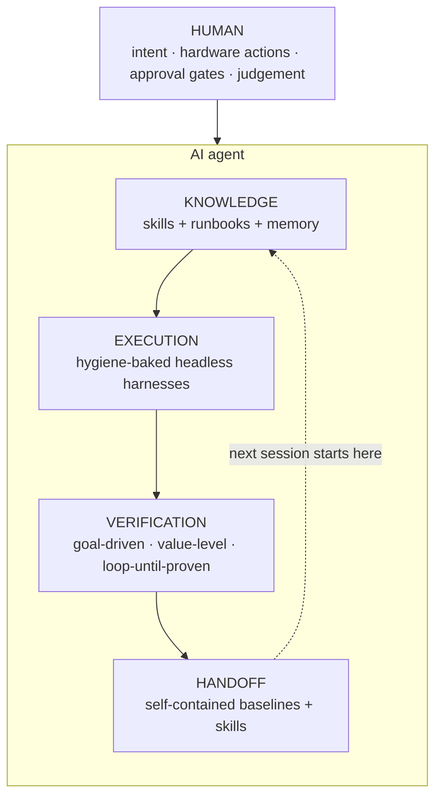
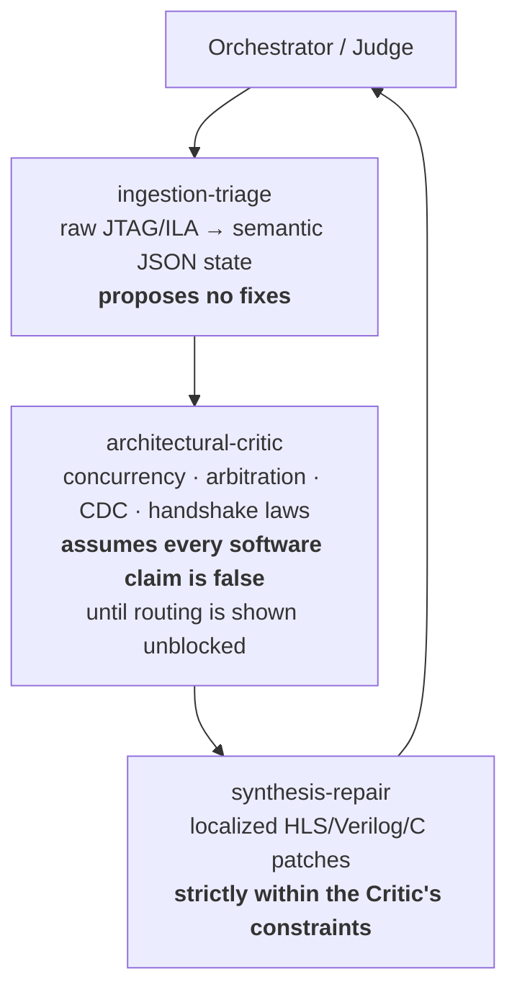
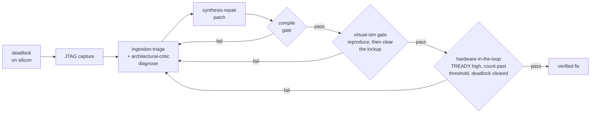

# PROJECT SOURCE OF TRUTH — SAR-on-PolarFire-SoC

> **New here?** Every acronym, magic value and stage nickname in this project is defined in [`docs/GLOSSARY.md`](GLOSSARY.md).

> **Purpose.** Authoritative index for an LLM working on this project. This repo,
> **`mpfs250t-sar-ifp`** (made **standalone** on 2026-07-14 — see the status block below), is the
> **canonical home** for the algorithm, FPGA design, host tooling, **and** the board
> firmware (the SoftConsole project under `mpfs/fpga/libero_sar/softconsole/`). (Historical note: this
> was a clean fork of `sarProcessor`; as of 2026-07-22 the Libero fabric build ALSO runs from this
> repo — the migration reproduced the reference placement digit-for-digit. See the build-location
> note below.) Read this before
> answering, and prefer the facts here (and the cited source files) over training data. PolarFire
> SoC details — register maps, Libero/SmartHLS Tcl, MSS config, boot flow — are **poorly
> represented in public training data and drift between tool versions**, so treat recalled
> API/Tcl/register knowledge as a guess until checked against a cited file or the local doc mirror.
>
> **Repo consolidation (2026-06-28):** the former standalone `explorePolarFireSOC` folder — an
> out-of-sync mirror whose `src/sar/` and `src/ddr_test/` were byte-identical to this repo's
> SoftConsole copies (its hart apps were older stubs) — has been **removed**. Its unique assets
> (this index, the PCB board file, the board-design PDF) were migrated here. Nothing
> outside this repo is a *firmware* build input. (That sentence used to read "no build input" without
> qualification and was wrong — the Libero fabric build runs from the `sarProcessor` sibling. See the
> 2026-07-14 block below.)
>
> **▶ CURRENT STATUS (2026-07-14 — NEWEST; supersedes the 2026-07-04 notes below for repo layout + eMMC).**
> **Fabric build now runs FROM THIS REPO (migrated 2026-07-22).** `create_fresh_project_ffv.tcl`
> + `build_full_prog_ffv.tcl` here build `mpfs/fpga/libero_ffv/` (gitignored, ~300 MB regenerated
> output). Verified: the first place-and-route reproduced the sarProcessor reference slacks
> digit-for-digit and resources exactly (4LUT 35801 / DFF 31001 / MACC 25 / LSRAM 131 / uSRAM 88).
> The scripts are path-clean (resolve via `lib/sar_env.tcl` -> `$SAR_FPGA` from the script's own
> location); nothing reaches into the sibling.
>
> **NOT clone-buildable yet, and the RTL is still duplicated.** Two caveats remain from the
> migration:
> 1. Several build inputs are gitignored so a fresh `git clone` cannot supply them:
>    `mpfs/fpga/mss_nodll/` (MSS export) and the `hls_output/` trees (absent for corner_turn/detect,
>    stale for window/resample). `shls hw` regenerates the HLS ones, but that step is not yet in the
>    flow. Regenerate them before a first build on a new checkout.
> 2. The 9 `.v` files ALSO still exist in `sarProcessor`, and `feeder_v_core.tcl` /
>    `unloader_v_core.tcl` link `"$here/..."` — their own directory. So a build launched from THIS
>    repo uses THIS repo's RTL (correct), but the sibling's stale copies are a trap if anyone builds
>    there. The real fix is to delete the sarProcessor fabric tree once its bitstream history is no
>    longer needed. Until then: this repo is authoritative for RTL; the sibling is legacy.
> **On-board eMMC pipeline (M1–M3) PROVEN on silicon** — the scene lives on the board eMMC and is loaded +
> focused entirely on-board, retiring the recurring ~3 h JTAG scene load: **M1** bring-up (write→read→CRC);
> **M2** provision a CPHD scene to the INPUT partition (`crcE==crcR==0x58d0ea66`, Centerfield 97.6 MB); **M3**
> boot-load eMMC→DDR (81.5 s; 10 segments → role addresses + JOB reconstruct), run `sar_form_image` end-to-end
> (**SAR_SEQ_OK**, no stage timeout), confirm a coherent focused SAR image via an ROI crop, and persist the
> output to the eMMC OUTPUT partition (commit-last, crash-safe). LOAD/PIPE/crop proven; the commit-last
> SAVEOUT + a VERIFY_OUT command are built and await a reflash + re-run next board session. eMMC read
> ~1.5 MB/s (scene load 81.5 s), write ~0.13 MB/s; **host↔PC dump is still ~3 h** (FlashPro6 JTAG ~9 KB/s is
> the bottleneck, not the eMMC) — verify via small ROI crops.
> **FFT engine (corrected):** the range/azimuth FFTs run on the **fabric CoreFFT** chain
> (`fft_feeder → gearbox → CoreFFT → fft_unloader`), selected at runtime by **`SAR_FFTMODE`
> @`0xB0059110` = 1**, which the pipeline flow scripts (`flow_pipe_*.gdb`) set before PIPE. CPU
> `sar_cpu_fft` (`src/sar/sar_fft.c`, mode 0) is the **legacy fallback** — the 2026-07-04 note below that
> calls the FFT a CPU path is superseded. The 2026-07-20 board run confirmed `fft_mode=1` (fabric CoreFFT)
> at runtime, so the eMMC PIPE path exercises the fabric chain. Recipe: `docs/USER_GUIDE.md`
> §4 (eMMC boot-load) + the `emmc-onboard-pipeline` skill. AI-workflow + multi-agent framework:
> §10 below + the personas under `.claude/agents/`.
> **Pipeline total: 14.92 s** (measured 2026-07-29, 100 MHz, `sar_resample_v` baseline). Window AND
> detect are fused into the FFT passes; no CPU stage remains in the datapath, and from this baseline
> the range-gather coefficients are generated ON FABRIC too, so they never reach DDR.
> Per stage: resample 3.740 s · range-FFT 5.417 s · azimuth-FFT 5.769 s.
> Validated by **correlation 0.977** against the known-good top-left crop, NOT by CRC: the kernel is
> fixed-point where the old path was float32, so crop CRC is now `0x221e5e7a` and the previous
> `0x319037b2` (a CENTRE crop of the float32 path) is a different measurement, not a superseded one.
> Chip power, vectorless SmartPower: **2.42 W** (437 mW static / 1980 mW dynamic) — ballpark; the
> useful signal is the build-to-build delta.
> Timing margin: 100 MHz fabric setup slack **+0.255 ns** (2.6%) — the binding constraint;
> 12.5 MHz SLOWCLK +67.5 ns.
> Previous baseline for reference: 18.45 s (2026-07-27, commit `d07bce7`, crop CRC `0x319037b2`),
> per stage resample 7.267 s · range-FFT 5.788 s · azimuth-FFT 5.396 s.
> Authoritative table: `docs/ARCHITECTURE.md` §2.
> How it got here: 110.8 s -> 88.1 s (targeted CCACHE `FLUSH64` writeback of the coefficient banks
> replacing a per-line whole-L2 flush) -> 79.79 s (2-D Hamming window fused into the range-FFT
> feeder, deleting a 512 MB-read + 512 MB-write pass) -> ~78.6 s (resample coefficient closed form)
> -> 58.12 s (magnitude detect fused into the azimuth-FFT unloader, deleting a 512 MB-read +
> 128 MB-write pass AND halving that pass's write traffic)
> -> 48.19 s (azimuth resample gather fused into the FFT-1 feeder, deleting its DDR round-trip;
> resample 27.19 -> 13.46 s)
> -> 45.26 s (corner-turn CT_T 32->128: 512B bursts, each transpose 7.68->6.20s)
> -> 40.91 s (corner-turn/FFT-2 overlap, Step 2: concurrent strip-pipelined execution of the
> inter-FFT corner-turn with FFT-2)
> -> 37.72 s (CCC 62.5->100 MHz; only FFT-2 compute scaled -- FFT-1 is gather-bound; pipeline now latency-bound).
> **The CRC gate no longer applies.** ROI crc `0xd596c9eb` held from the 110.8 s build through the
> window fusion, but the coefficient rewrite and the detect fusion change values deliberately (both
> are MORE accurate). Correctness is now gated by an A/B against the known-good CPU detect on
> identical input: max |diff| 2 LSB, ZERO pixels beyond that over 1,048,576, corr 0.999866 --
> matching a bound `model_detect_fusion.py` predicted before any RTL existed.
> **Largest remaining target after the azimuth-gather fusion: the FFT-1 feeder at 15.97 s** (resample,
> the range gather, is now 13.46 s -- was 26.92 s). The shipping gather kernel schedules
> at II=1 on ALL FOUR loops (verified 2026-07-22 by regenerating the HLS report -- an earlier
> "burst-inference failure / single-beat reads" diagnosis was WRONG, read off a stale hls_output
> from the pre-packing kernel). Scheduled 22,545 cycles = 361 us/line against ~880 us measured, so
> the 2.44x gap is AXI STALL on a correct schedule (`axi_ii_lie`), not a burst failure. Localising
> it needs the FIC_0 monitor (ARLEN histogram + inter-burst gap counters), still unbuilt. See
> `docs/SAR_IMPLEMENTATION_RECORD.md` Part 3 and the `axi_ii_lie` entries in
> `docs/fpga/hls_silicon_stats.jsonl`. The per-stage breakdown lives in exactly one place,
> [`docs/SAR_IMPLEMENTATION_RECORD.md`](SAR_IMPLEMENTATION_RECORD.md) Part 3; detailed current
> design (dataflow, buffer map, fixed-point contracts, eMMC layout, register semantics):
> [`docs/ARCHITECTURE.md`](ARCHITECTURE.md). Open next: the NDSU production scene; and automating the
> closed-loop sim→HIL gate.
>
> **✅ STATUS (2026-07-04) — SAR PIPELINE VALIDATED END-TO-END ON SILICON, image
> corr=0.9923 vs golden.** The HLS `K_FFT` butterfly is unsynthesizable on SmartHLS 2025.2 (drops the
> twiddle term → passthrough; 3 structural fixes failed, cosim blocked), so the HLS FFT was abandoned;
> the shipping FFT is the fabric CoreFFT chain (see the 2026-07-14 block above). Fabric does
> resample/corner-turn/window/FFT; *(2026-07-04 note, SUPERSEDED: detect now runs IN FABRIC, fused
> into the FFT unloader -- see the status block above)* detect ran on the MSS CPU (`detect_mode`
> @`0xB0059118`) because
> SmartHLS mis-synthesizes the fabric detect's sign extension. Full status + per-stage timing + latency roadmap:
> [`docs/SAR_IMPLEMENTATION_RECORD.md`](SAR_IMPLEMENTATION_RECORD.md) Part 3; silicon-debug harness + learnings:
> [`docs/fpga/DEV_GUIDE.md`](fpga/DEV_GUIDE.md) §4. The CoreFFT note below is historical.
>
> **CURRENT STATUS (2026-07-04) — CoreFFT write-back reworked (DMA → HLS unloader → gearbox skid FIFO).**
> The `CoreAXI4DMAController` that drained CoreFFT→DDR is **removed** (it deadlocked on the 2nd
> back-to-back AXI4-Stream S2MM transaction) and **replaced by a SmartHLS `fft_unloader` kernel**
> (AXI4-Stream slave in → plain AXI4 write master out; `mpfs/fpga/hls_fft_unloader/`). Write-back path
> is now `fft_feeder → gearbox → CoreFFT (8192 in-place) → gearbox → fft_unloader → DDR`; firmware
> drives it via **`K_FFT_UNLOADER` @0x60005000** (no DMA descriptors/TLAST). A 2nd range-FFT bug was
> then found on silicon: the in-place CoreFFT **wedges when downstream backpressure reaches `read_outp`
> mid-unload**. Fix = an **elastic output skid FIFO in the gearbox** (`corefft_stream64_adapter.v`,
> 64-deep, `syn_ramstyle=registers`) that drains CoreFFT unconditionally and backpressures the unloader
> instead. Both fixes are **fabric-level (firmware unchanged)**. State: fft_unloader validated
> standalone on silicon; FIFO fix **sim-validated** (`mpfs/fpga/sim/corefft_stream64_bp_tb.v`: original
> gearbox HANGs at beat 3276, FIFO PASSes 8192 beats, `read_outp` flat-high, FIFO peak 3); fabric
> **rebuilding**, on-silicon full-pipeline retest pending. Headless build flow: `create_fresh_project.tcl
> → stage_constraints_tdest.tcl → build_full_prog_fresh.tcl` (Libero project `libero_tdest`). Repo was
> streamlined 2026-07-04: ~126 stale experiment `.tcl` moved to `archive/` (gitignored); `.gitignore`
> now excludes all Libero build output, vendor `reference/` PDFs, and staged signal/golden data.
> See auto-memory `m3-pipeline-silicon-status` for the full journey.

## 0. Anti-hallucination rules (read first)

1. **Never invent a register offset, DDR address, AXI signal, HAL function signature, or Libero
   Tcl command.** Quote it from a file in §3–§6, or say it must be verified.
2. **To write a driver/peripheral app, open the actual HAL header** (paths in §5) and base the
   code *strictly* on the functions/signatures there. Do not assume an API exists.
3. **Two SAR register-map models coexist in the tree — do not mix them.** See §4.3. The hardware
   that is actually built uses the **per-kernel SmartHLS model** (`sar_kernels.h`), *not* the
   monolithic `sar_accel_driver.h` model.
4. **Libero/SmartHLS Tcl is version-locked to 2025.2 here.** Cross-check every Tcl command
   against the Microchip command reference; several SmartDesign APIs that "should" exist fail in
   this version (see §7). Be skeptical of LLM-generated Tcl.
5. **Templates ≠ working hardware.** Much of `mpfs/fpga` is unsynthesized template / spec code.
   §8 lists what is actually verified on silicon vs. what is aspirational.
6. **Environment constraints:** Windows 11; **no PowerShell** (forbidden + GPO-blocked — use
   `cmd`/git-bash, avoid `wmic`/`winget`); JTAG is the only board I/O path. See memory notes (§9).
7. **The canonical (and only) firmware is the SoftConsole project in THIS repo** (§6). There is no
   external `explorePolarFireSOC` copy — that folder has been removed; do not cite it.

---

## 1. Repo layout (this repo + the vendor reference)

| Repo | Path | Role | Git |
|---|---|---|---|
| **mpfs250t-sar-ifp** (this) | `…\github\mpfs250t-sar-ifp` | **Canonical** for firmware, host tooling and docs. Python golden pipeline (`src/`), host JTAG tools (`mpfs/host/`), FPGA design + HLS kernels (`mpfs/fpga/`), and the board firmware (SoftConsole project under `mpfs/fpga/libero_sar/softconsole/`). | git → `github.com/futureproofbear/mpfs250t-sar-ifp` (LFS) |
| sarProcessor | `…\github\sarProcessor` | **Retired as canonical**, but the Libero projects and exported bitstreams historically live here (`libero_ffv/export/SAR_TOP_ffv.job`). | git (LFS) |
| **polarfire-soc** | `…\github\polarfire-soc` | **Vendor reference (the "Software Index" + "Driver Layer").** Doc mirror, HSS source, bare-metal HAL library, examples, Icicle reference design. Read-only — cite, don't edit. | vendor clone |
| orbitDesign | `…\github\orbitDesign` | **Unrelated** (orbital-mechanics study). Ignore unless explicitly asked. | — |

---

## 2. Architecture map (the hardware, fixed facts)

> **AMBA / interconnect architecture (definitive):** [`ARCHITECTURE.md`](ARCHITECTURE.md) §9
> — DIC (data) / CIC (control) interconnect topology, masters/slaves, address map, clocking & reset,
> FFT stream path, the ID converter, and the AXI4-Lite `TARGET_TYPE` rule. Conventions that prevent the
> silent-integration failures: [`fpga/DEV_GUIDE.md`](fpga/DEV_GUIDE.md) §2.

- **Device:** Microchip **PolarFire SoC MPFS250T_ES** (engineering sample, FCVG484), Icicle Kit.
- **Cores:** **1× E51** monitor hart (hart0 — boot/HSS/control) + **4× U54** application harts
  (hart1–4, each with FPU). In this project: E51 = monitor/wake; **U54_1 = the app/orchestration
  hart**; U54_2–4 are parked WFI stubs.
- **Boot:** **boot mode 1** (MSS harts run non-secure code from **eNVM @ `0x20220000`**, copied to
  **L2 scratchpad `0x0a000000`**). Reset vectors come from `U_MSS_BOOTCFG` in pNVM. Default clock
  80 MHz SCB until MSS clock config. (Boot mode 0 = WFI-halt, used for JTAG debug — see memory
  `mpfs-boot-mode-0-for-debug`.) Ref: `polarfire-soc-documentation-master/knowledge-base/boot-modes/`.
- **I/O constraint:** **JTAG only** (no Ethernet / SD / fast UART). Bulk data moves DDR↔host over
  JTAG; this is slow (**measured ~84 kbit/s ≈ 111 s/MB**; 97 MB ≈ ~2.7 hr) but **reliable when run to
  completion** — the FlashPro6 HID wedges only when a transfer is *killed/interrupted* mid-stream, not
  inherently on sustained traffic (see §7).
- **Partition:** host PC (Python) does parse/geometry/coeff-gen/quantize + golden + post; **U54_1**
  orchestrates and runs detect; **FPGA fabric** does the heavy compute
  (resample→window→FFT→corner-turn→FFT). Fabric clock **100 MHz** (CoreFFT `SLOWCLK` 12.5 MHz),
  timing MET multi-corner. The 62.5 MHz figure this line used to carry was superseded 2026-07-24.

### Crawl / Walk / Run — where THIS project sits
The vendor "Crawl(Linux)/Walk(bare-metal+AMP)/Run(fabric accel)" ladder applies, but **this project
is squarely in the "Run" tier and deliberately skips Linux.** There is **no Linux, no `/dev/spidev`,
no sysfs** here — it is bare-metal + custom AXI fabric. So:
- Do **not** suggest Linux/UIO/CMA/devicetree solutions for the board runtime (they appear in the
  vendor docs and the *original* `sarProcessor` plan, but were dropped — JTAG-only, no boot medium).
- "Run-tier" prompting applies: generate Verilog/AXI state machines with **explicit interface
  constraints**, and pass data CPU↔fabric over the AXI bus (FIC0). Fabric register/AXI facts in §4.

---

## 3. The Software Index — local doc mirror (cite these)

**Local mirror:** `…\github\polarfire-soc\polarfire-soc-documentation-master\`
**Upstream:** `https://github.com/polarfire-soc/polarfire-soc-documentation`

Highest-value docs for this project:

| Topic | File (under the mirror) |
|---|---|
| **DDR cached/non-cached + FIC + 38-bit addressing + AXI shim lock-up** | `knowledge-base/mpfs-memory-configuration.md` |
| **L2 cache, LIM, scratchpad, fabric-port WayMask coherency** | `knowledge-base/mpfs-memory-hierarchy.md` |
| Boot modes 0–3 | `knowledge-base/boot-modes/boot-mode-{0,1,2,3}-fundamentals.md` |
| Fabric/MSS/concurrent DMA throughput | `benchmarks/dma-benchmarking/benchmarking-results/*.md` |
| MSS driver user guides (gpio/uart/spi/qspi/timer/watchdog) | `bare-metal-embedded-software/bare-metal-driver-user-guides/polarfire-soc-mss-driver-user-guides/` |
| Soft-IP driver guides (CoreGPIO/I2C/SPI/AXI4ProtoConv/…) | `bare-metal-embedded-software/bare-metal-driver-user-guides/soft-ip-driver-user-guides/` |
| AMP / IHC / RPMsg | `applications-and-demos/asymmetric-multiprocessing/` |
| Icicle kit embedded SW guide | `reference-designs-fpga-and-development-kits/icicle-kit-embedded-software-user-guide.md` |
| Software tool flow | `knowledge-base/polarfire-soc-software-tool-flow.md` |

> Two memory/config docs (`mpfs-memory-configuration.md`, `mpfs-memory-hierarchy.md`) are the most
> load-bearing for the current data-plane debug — see the analysis in
> `docs/ARCHITECTURE.md` §5.

---

## 4. Ground-truth constants (quote, don't invent)

> Canonical firmware path (abbreviated below as **`<SC>/`**):
> `mpfs/fpga/libero_sar/softconsole/mpfs-hal-ddr-demo/src/`

### 4.1 DDR memory map — SAR buffers
Source: `<SC>/sar/ddr_sar_layout.h` (mirrors `mpfs/host/ddr_layout.py`).

| Symbol | Address | Notes |
|---|---|---|
| app/heap/stack | `0x80000000` (+128 MB) | |
| `SAR_SIG_ADDR` | `0x88000000` (+256 MB) | input I/Q (complex int16) |
| `SAR_SCRATCH_ADDR` | `0x98000000` (+256 MB) | inter-stage |
| `SAR_OUT_ADDR` | `0xA8000000` (+128 MB) | detected magnitude out |
| `SAR_TABLES_BASE` | `0xB0000000` (+16 MB) | KR/KC/TANPHI/WIN/JOB; geometry at +0x100000; coeffs at +0x148000 |
| `SAR_JOB_ADDR` | `0xB0040000` | `sar_job_t`, 96 B, magic `0x53415231`='SAR1' |

### 4.2 ⚠ DDR cache-window discrepancy (VERIFY against MSS config — do not assert)
Source: `<SC>/ddr_test/ddr_packet_test.h` gives the **standard Icicle MSS map**:
`CACHED_32 = 0x80000000` (1 GiB, → `0xBFFFFFFF`), `NONCACHED_32 = 0xC0000000`,
`NONCACHED_WCB_32 = 0xD0000000`, `CACHED_64 = 0x10_00000000`, `NONCACHED_64 = 0x14_00000000`.
**Implication:** by that map, **all** SAR buffers including `TABLES_BASE 0xB0000000` fall in the
**cached** 32-bit window — i.e. the SAR_BRINGUP_REPORT / memory note calling `0xB0…` "non-cached"
is **inconsistent** with the code unless the SAR build customized DDR segmentation in
`mpfs/fpga/mss_*/ICICLE_MSS.cfg`. **Action when this matters:** confirm the actual cached/non-cached
boundary in the MSS configurator before relying on it; it determines whether fabric reads need
L2-coherency handling (see SAR_BRINGUP_REPORT §9.2) for *all* buffers, not some.

### 4.3 ⚠ TWO SAR register-map models — use the per-kernel one
- **REAL / built (use this):** per-kernel SmartHLS model — `<SC>/sar/sar_kernels.h` +
  `<SC>/sar/sar_sequencer.c`. **NINE** AXI4-Lite slaves on **MSS FIC0 @ `0x60000000`**, 4 KiB each (2026-07-28):
  `K_CORNER_TURN 0x60000000` (SLAVE0), `K_FFT_FEEDER_B 0x60001000` (1, **was K_WINDOW**),
  `K_FFT_UNLOADER_B 0x60002000` (2, **was K_RESAMPLE2**), `K_RESAMPLE 0x60003000` (3),
  `K_FFT_FEEDER 0x60004000` (4), `K_FFT_UNLOADER 0x60005000` (5), `K_FIC0MON 0x60006000` (6),
  `K_COEFFGEN 0x60007000` (7), `K_COEFFGEN_B 0x60008000` (8).
  `K_WINDOW` and `K_DETECT` were DELETED, not renumbered — the window kernel was dropped
  2026-07-25 and the standalone detect kernel was removed when detect became fused into the FFT-2
  unloader. Their two windows are now chain B's feeder and unloader. Anything still naming
  `K_WINDOW`/`K_DETECT` is pre-2026-07-25 and must not be used to derive an address. Per kernel: `HLS_START 0x08` (write 1 = start; read 0 = done),
  `HLS_ARG0 0x0c`, `ARG1 0x10`, `ARG2 0x14`, `ARG3 0x18`.
- **LEGACY / aspirational (do NOT assume on hardware):** monolithic accelerator model —
  `<SC>/sar/sar_accel_driver.h` with a single block at `SAR_ACCEL_BASE 0x60000000`,
  `CTRL 0x00`/`STATUS 0x04`/`BFP_SHIFT 0x1C`/`*_ADDR 0x20…0x50`. This is an earlier single-IP design
  that the SmartHLS multi-kernel build superseded. Mixing the two = hallucination.

### 4.4 Other verified constants
- Job descriptor `sar_job_t`: 96 B, magic `0x53415231` ('SAR1'). Fields M,N,fft_r,fft_a,out_dtype,
  bfp_in_exp,sig_len,sig_crc + 7×uint64 addrs. (`<SC>/sar/ddr_sar_layout.h`)
- CRC: reflected IEEE-802.3, poly `0xEDB88320` (matches host zlib.crc32). (`<SC>/ddr_test/ddr_packet_test.c`)
- DDR test packet: magic `0xDEADBEEF`, 256 B payload, 272 B total. (`<SC>/ddr_test/ddr_packet_test.h`)
- Fixed SAR grid: **8192×8192**; frame 256 MiB (int16 I/Q), out 128 MiB (uint16). (`<SC>/sar/sar_sequencer.c`)
- Speed of light in coeff gen: `299792458.0f`. (`<SC>/sar/sar_resample_coeffs.h`)
- M2 harness result table @ `0xB0050000`, done sentinel `g_m2_done = 0xC0FFEE02`. (`<SC>/application/hart1/u54_1.c`)
- Fabric clock net `CCC_OUT0_FABCLK_0` (from 160 MHz OSC via PF_CCC); reset `RST_FABRIC_RESET_N`.

### 4.5 On-target CRC32 verify mailbox (replaces slow dump+cmp readback)
Source: `<SC>/application/hart1/u54_1.c`. Host writes a **6×u32 mailbox at DDR `0xB0058000`**:
`+0 cmd`, `+4 base`, `+8 len`, `+C result`, `+10 status`, `+14 seq`. To verify a region: write
`cmd=0x43524333` ('CRC3'), `base`, `len`; **resume hart1**. Firmware computes a zlib-compatible CRC32
(reflected IEEE-802.3, poly `0xEDB88320`) over `[base, base+len)` at DDR speed (~75 MB/s), writes
`result` and `status=0xC0FFEE03`. Host then halts and reads back the 4-byte result. This makes a
97 MB verify take **seconds vs ~2.7 hr** for a dump+cmp. Host tool: `mpfs/host/run_crc_verify.sh
FILE [BASE_HEX]`. Validated on silicon: `sig_head.bin` (1 MB) = `0x24775359`, `sigchunk_00` (8 MB)
= `0x591213fe` — both match host `zlib.crc32`.

---

## 5. The Driver Layer — HAL headers (paste signatures from these)

**Canonical HAL source tree (vendor, read-only):**
`…\github\polarfire-soc\hart-software-services\baremetal\polarfire-soc-bare-metal-library\src\platform\`

| Need | Header (absolute path under …\src\platform\) |
|---|---|
| Core HAL / CSRs | `mpfs_hal\mss_hal.h`, `hal\hal.h` |
| UART (MMUART) | `drivers\mss\mss_mmuart\mss_uart.h` (+ `mss_uart_regs.h`) |
| GPIO | `drivers\mss\mss_gpio\mss_gpio.h` |
| SPI | `drivers\mss\mss_spi\mss_spi.h` |
| QSPI | `drivers\mss\mss_qspi\mss_qspi.h` (+ regs) |
| I2C | `drivers\mss\mss_i2c\mss_i2c.h` (+ regs) |
| PDMA | `drivers\mss\mss_pdma\mss_pdma.h` (+ regs) |
| Timer | `drivers\mss\mss_timer\mss_timer.h` (+ regs) |
| Watchdog | `drivers\mss\mss_watchdog\mss_watchdog.h` |
| RTC | `drivers\mss\mss_rtc\mss_rtc.h` (+ regs) |
| MMC | `drivers\mss\mss_mmc\mss_mmc.h` |
| Ethernet MAC | `drivers\mss\mss_ethernet_mac\mss_ethernet_mac.h` |
| System services | `drivers\mss\mss_sys_services\mss_sys_services.h` |
| USB (also under HSS) | `drivers\mss\mss_usb\mss_usb*.h` |

**Board HAL configs:** `…\hart-software-services\boards\mpfs-icicle-kit-es\mpfs_hal_config\`
(use the **-es** variant for this engineering-sample board).

**The firmware's own HAL copy** (what the build actually compiles against — keep edits in sync with
this, not the vendor tree): `mpfs/fpga/libero_sar/softconsole/mpfs-hal-ddr-demo/src/platform/{mpfs_hal,hal,drivers\mss}\`

> **Prompting pattern (from the user's framework):** *"Bare-metal app for the PolarFire SoC U54.
> Here is the HAL header [paste `mss_<peripheral>.h`]. Based strictly on these functions, write …"*
> Always paste the real header so signatures are exact.

---

## 6. Key engineering files & docs by area (the working set)

### Board firmware — SoftConsole project (CANONICAL)
Root: `mpfs/fpga/libero_sar/softconsole/mpfs-hal-ddr-demo/src/` (= `<SC>/`)
- `<SC>/application/hart0/e51.c` — monitor / wake. `hart1/u54_1.c` — **the M2 autonomous harness**
  (U54_1 app hart). `hart2..4/u54_*.c` — parked WFI stubs.
- `<SC>/ddr_test/ddr_packet_test.{c,h}` — DDR integrity (CRC) check of JTAG-loaded data. For bulk
  verification, prefer the **on-target CRC32 mailbox** in `hart1/u54_1.c` (§4.5) over the slow
  dump+cmp readback.
- `<SC>/sar/` — `ddr_sar_layout.h` (map+job), `sar_kernels.h` (**real** reg map), `sar_sequencer.{c,h}`
  (PFA orchestration), `sar_resample_coeffs.{c,h}` (on-MSS coeff gen), `sar_accel_driver.{c,h}`
  (**legacy** monolithic driver — see §4.3).
- `<SC>/platform/` — the compiled-against MPFS HAL copy (§5).

### src/ (Python golden — algorithm source of truth)
- `form_image_pfa.py` (PFA focuser + golden + geocode), `fixedpoint.py` (BFP emulation/compare),
  `form_image_pfa_fixed.py`, `compare_float_fixed.py`.

### mpfs/host (host JTAG tooling)
- `sar_pipeline.py`, `accel.py` (Numpy/FPGA backends), `serialize_inputs.py`, `dump_output.py`,
  `emulate_fabric.py`, `ddr_layout.py`, `fft_golden.py`.
- Runners: `run_m2.sh` (read M2 results), `run_program.sh`, `run_flow.sh`, `run_fix_all.sh`, etc.

### mpfs/fpga (FPGA design)
- HLS kernels: `hls_{corner_turn,window,detect,resample,fft_feeder}/`.
- `libero_sar/` — **main Libero project** (`SAR_TOP`); also holds the SoftConsole firmware above.
- `libero_corefft/` (CoreFFT IP), `mss_component`/`mss_es`/`mss_min` (MSS configs), `constraints/`,
  `component/User/Private/*.xml` (SmartHLS kernel SPIRIT defs).
- Data-plane fix RTL: `sar_axi_idconv.v` (AXI ID converter — the fix), `sar_id_restore.v`
  (superseded), `sar_fic0s_mon.v` (handshake monitor).
- **FPGA docs — organised set (read before re-deriving):**
  - *Architecture & conventions (current):* `docs/ARCHITECTURE.md` §9 (definitive interconnect
    design), `docs/fpga/DEV_GUIDE.md` §2 (silent-failure firebreaks +
    `lint_netlist.sh`/`run_build_safe.sh`), `docs/fpga/DEV_GUIDE.md` §3, `docs/ARCHITECTURE.md` §8 (register map).
  - *Status / active:* `docs/ARCHITECTURE.md` §5 (full on-silicon bring-up + cache-coherency doc cross-check),
    `docs/SAR_IMPLEMENTATION_RECORD.md` (DMA control-slave root-cause→fix, RESOLVED),
    `docs/fpga/DEV_GUIDE.md` §4 (reusable active-probe methodology), `docs/USER_GUIDE.md`.
  - *History (resolved journey — narrative now told in* `docs/SAR_IMPLEMENTATION_RECORD.md` *):* the CoreFFT milestone
    decisions (M1/M2), the dataplane bring-up + fix incidents, the FIC0 probe plan, the AXI ID-restore
    integration, and the SmartDesign ID-converter GUI steps.

### reference/ (migrated board collateral)
- `reference/icicle_kit_rev_1p0_20-0532_pcb_0624_01.brd` — Icicle Kit PCB layout (LFS).
- `reference/PolarFire_SoC_FPGA_Board_Design_Guidelines_User_Guide_VB.pdf` — board-design guidelines (LFS).

### polarfire-soc (vendor reference, sibling repo)
- `polarfire-soc-documentation-master/` (the doc mirror, §3).
- `hart-software-services/` (HSS source + the HAL library, §5).
- `polarfire-soc-bare-metal-examples/` (driver examples to copy patterns from).
- `icicle-kit-reference-design/` (golden MSS/fabric reference design).

---

## 7. ⚠ Tooling & version warnings

- **Toolchain (version-locked):** Libero SoC **2025.2** + SmartHLS; SoftConsole
  `v2022.2-RISC-V-747`; **new** OpenOCD 0.12 (`github.com/microchip-fpga/openocd`, driver
  `microchip-efp6`); FlashPro Express 2025.2; `mpfsBootmodeProgrammer.jar` + `fpgenprog` for
  eNVM/boot mode. Binaries under `C:\Microchip\Libero_SoC_2025.2\Libero_SoC\Designer\bin\`.
- **Libero Tcl skepticism (the user's explicit warning, confirmed here):** tool-specific Tcl
  changes between versions and is sparse in training data. In 2025.2 the SmartDesign insertion
  APIs `create_hdl_core`, `sd_instantiate_hdl_module/_core`, `sd_disconnect_pins` **fail**;
  `sd_connect_pins` works but can't remove a slice. IP *reconfigure* (`delete_component` +
  `create_and_configure_core` + `generate_component -component_name` + `run_tool`) **does** work.
  Always cross-check generated Tcl against the Microchip command reference; prefer the GUI for
  SmartDesign edits (see `docs/fpga/DEV_GUIDE.md` §3).
- **JTAG transfer speed & HID behaviour (measured 2026-06-30):** bulk DDR load over JTAG is
  **latency-bound, not bandwidth-bound** — ~390 µs per JTAG word-scan through the embedded FlashPro6
  USB-HID gives a measured **~84 kbit/s (~111 s/MB, ~10 kB/s)**, identical at 2 MHz and 6 MHz and for
  `sysbus` vs `progbuf`; no OpenOCD batching knob exists. A transfer that **runs to completion is clean
  and byte-exact** (1 MB and 8 MB loads verified MD5-identical to source). The FlashPro6 HID **wedges
  only when openocd is killed mid-transfer** (e.g. a too-short timeout) **or when a `verify_image`
  byte-by-byte readback is interrupted**; recovery = physically re-plug the J33 USB. So bulk JTAG is
  *slow but viable* (97 MB ≈ ~2.7 hr if never killed), **not** an inherent "crashes on sustained
  traffic" failure. The autonomous-firmware pattern (M2 harness; on-target CRC §4.5) is still preferred
  because it avoids the slow readback, not because the transfer is unsafe.
- **JTAG clock ceiling:** stable speed = **6 MHz**. `adapter speed 15000` **corrupts the debug module**
  (dmstatus reads bogus "version 4" `0x1e1904`, harts go unavailable/reset). **Never use >6 MHz** on
  this board/cable.

---

## 8. What is verified vs. template (don't overclaim)

**Verified / working (on silicon):**
- Off-board PFA pipeline (Python golden), correlation ≈ 0.9999998.
- ES bitstream builds, timing met. Boot mode 1 firmware runs end-to-end on silicon.
- **Control plane:** U54_1 wakes, runs the autonomous M2 harness, FIC0→AXI4-Lite to all 5 kernels
  decodes; AXI4-Lite write/read-back exact (kernel clocks alive).
- **DATA plane (FIXED 2026-06-29):** fabric AXI-master DDR read/write works. Root cause was **AXI
  ID-width truncation at `FIC_0_AXI4_S`** (not the address-tie co-suspect); fix = `sar_axi_idconv.v`
  (ID stash/restore). M2 `tag=0x30` HANG→PASS, SCRATCH written.
- **DMA control slave (FIXED 2026-06-30):** reads complete — tags `0x50–0x53` read **distinct** DMA
  registers (VER=`0x00020064`), no hang. Root cause = CIC slave-5 was `TARGET_TYPE=0` (Full AXI4)
  feeding the DMA's reduced AXI4-Lite control through a 64→32 DWC, black-holing reads; fix = CIC
  `TARGET5_TYPE=1` (AXI4-Lite) + 11-bit address slice (`sd_create_pin_slices`). **Both interconnects
  upgraded to CoreAXI4Interconnect 3.0.130** (was 2.9.100; DMA = CoreAXI4DMAController 2.2.107, CoreFFT
  8.1.100). Detail: `docs/SAR_IMPLEMENTATION_RECORD.md` + `docs/ARCHITECTURE.md` §9.
- DDR JTAG loopback + CRC integrity (M0). **Bulk JTAG load integrity proven** (2026-06-30): 1 MB and
  8 MB loads byte-identical to source (`dump_image` + host cmp, MD5 match), and confirmed via the
  on-target CRC32 mailbox (§4.5).

**NOT yet done / open:**

> ⚠ The list below is the 2026-07-01 snapshot and is **superseded** by the status blocks at the top of
> this file: the full PFA pipeline now runs end-to-end on silicon at 62.5 MHz with timing MET
> (79.79 s, corr 0.9923, scene loaded from on-board eMMC in 81.5 s), the DMA has been removed in favour of
> `fft_unloader`, and the fabric CoreFFT path is confirmed at runtime. It is kept for the root-cause
> history (the timing-closure lesson), not as a to-do list.

- **M3 full PFA pipeline — root-caused to FPGA timing closure; 62.5 MHz fix PROVEN
  (2026-07-01), bootable bitstream pending.** The full PFA pipeline was wired into firmware
  (PIPE mailbox → `sar_form_image`).
  Stages 1–4 ran on silicon and range-FFT (stage 5) appeared to hang. **Real root cause: the
  bitstream does NOT meet timing at 125 MHz** — P&R `pinslacks.txt` shows 25,847/315,348 pins with
  negative slack (worst −3.7 ns), **all on the single 125 MHz fabric clock** (CT/CIC/DMA/FEED/DIC/RES/
  DET/WIN), while CoreFFT itself has 0 violations — i.e. real same-clock setup failures, not CDC.
  Consequence: non-deterministic silicon; the FFT looped and stages 1–4 only *completed* (completion
  was the only check) — **their data correctness is unverified pending the timing-closed rebuild**.
  This supersedes earlier per-symptom theories. **Fix:** lower fabric-clock CCC OUT0 125→62.5 MHz and
  OUT1 (CoreFFT `SLOWCLK`) 15.625→7.8125 MHz (`SLOWCLK ≤ CLK/8`), headless via
  `PF_CCC_C0_62p5.tcl` + `reconfig_ccc_62p5.tcl` + re-assemble `SAR_TOP` + a **timing-gated build**
  (`build_timed.tcl`, aborts before bitstream on any negative slack). Trade-off: 62.5 MHz halves
  fabric/FIC throughput (fine for bring-up). **Standing lesson:** always verify P&R timing closure
  before blaming logic/firmware — Libero programs timing-failing bitstreams silently, and
  `*_sdc_errors.log` reports SDC *syntax*, not *slack*. **Status (2026-07-01): timing closure PROVEN.**
  Headless P&R of the 62.5 MHz design (with the CoreFFT `CLK`↔`SLOWCLK` false-path `sar_fft_cdc.sdc`)
  **closes timing completely — 0 setup violations of 315,349 pins and 0 hold** (vs 25,847 setup
  violations at 125 MHz), validated via the Libero VM-netlist custom flow (`mpfs/fpga/libero_vm`); the
  clock-lowering fix is confirmed. **Caveat:** a fully *bootable* bitstream still needs the SAR_TOP
  SmartDesign rebuilt with the (already regenerated) 62.5 MHz CCC — the PolarFire-SoC MSS is coupled to
  the SmartDesign flow and resists the pure headless netlist flow (verified recipe in
  `docs/fpga/DEV_GUIDE.md` §5). Pending: that bootable rebuild + reprogram + re-run; firmware itself
  is valid (PIPE/CRC mailboxes, DMA external-stream-descriptor, bounded harness).
- **Full DMA *transfer* test** — the DMA *control* plane is verified, but a real descriptor+START
  data-move (CoreFFT stream → DDR S2MM) has not yet been exercised.
- `mpfs/fpga/*.cpp` (`sar_accel_top.cpp`, `fft1d.cpp`) is **unsynthesized template/spec** — the *built*
  design is the per-kernel SmartHLS model (CT/WIN/DET/RES/FEED) + CoreFFT + DMA, not these monoliths.
- Full end-to-end 97 MB full-res load not yet routinely run — but bulk JTAG transfer is **viable, just
  slow** (~84 kbit/s, ~2.7 hr; §7) and **byte-exact when run to completion**, so a USB path is **not a
  hard requirement**. Recommended workflow: **reduced-frame (8 MB) for dev iteration**; a one-time
  chunked background load (run to completion, never killed) + **on-target CRC verify** (§4.5) for the
  full frame.
- Full end-to-end SAR image-formation run on silicon (all stages chained) — pending the above.

---

## 9. Cross-references
- Algorithm, staged fabric port, and optimization history: [`docs/SAR_IMPLEMENTATION_RECORD.md`](SAR_IMPLEMENTATION_RECORD.md).
- Detailed design/architecture reference: [`docs/ARCHITECTURE.md`](ARCHITECTURE.md).
- Operate the board (bring-up/load/build/program/run/verify): [`docs/USER_GUIDE.md`](USER_GUIDE.md).
- Fabric development gotchas (SmartHLS antipatterns, interconnect conventions, Libero/Tcl traps,
  iso-test methodology): [`docs/fpga/DEV_GUIDE.md`](fpga/DEV_GUIDE.md).
- Living report-vs-silicon HLS ledger: [`docs/fpga/HLS_SILICON_STATS.md`](fpga/HLS_SILICON_STATS.md).
- Persistent memory notes (this repo, `mpfs250t-sar-ifp`):
  `~/.claude/projects/c--Users-<you>-Documents-github-mpfs250t-sar-ifp/memory/`.

## 10. The AI agent framework (skills + agents)

This repo ships a Claude Code / Agent framework so a new session gets the accumulated knowledge
automatically, rather than re-deriving it.

**Figure 5 — AI framework layers.** Knowledge / Execution / Verification / Handoff. Portable to
other FPGA-SoC projects via `ai-framework/`.

Two kinds of block:

- **Skills** (`.claude/skills/`) — knowledge packs that load into the session when their topic comes
  up: proven facts, procedures, traps. Start with `project-orientation`, then the domain skill for
  the task at hand.
- **Agents** (`.claude/agents/`) — execution specialists that run as scoped sub-processes with one
  job and a guardrail that job must never violate (e.g. "build a bitstream, but refuse to hand it
  back unless setup AND hold timing are met").

| Domain | Skills (knowledge) | Agents (specialists) | Guarantee it enforces |
|---|---|---|---|
| Orientation & input | `project-orientation`, `umbra-cphd-data` | `Explore`, `Plan` | a new session starts from proven-vs-open + this index, not from zero |
| Fabric (RTL + hard IP) | `sar-pipeline-design`, `fpga-ref-check`, `mpfs-platform-gotchas` | `fpga-ref-verifier`, `smartdebug-planner` | RTL/IP matches the vendor User Guide + golden TB *before* silicon |
| Firmware (MSS bare-metal) | `emmc-onboard-pipeline`, `mpfs-platform-gotchas`, `jtag-recover` | `silicon-test-runner` | coherency/boot/clock-gating traps avoided; the debugger is never wedged |
| Synthesis / P&R / timing | `hls-trust-harness`, `mpfs-platform-gotchas` | `libero-build` | no bitstream is trusted unless setup AND hold are MET |
| Verification | `sar-verification-methodology`, `hls-trust-harness`, `fpga-ref-check` | `fpga-ref-verifier` | correctness by VALUE against a bit-accurate mirror, not correlation |
| On-silicon testing | `silicon-iso-test`, `smartdebug-probe`, `jtag-recover` | `silicon-test-runner`, `smartdebug-planner` | one-command iso-test with JTAG hygiene; internal visibility when register reads can't see |

**How they compose, end to end on a fabric change:** `fpga-ref-verifier` confirms the RTL/IP
integration matches the reference → `libero-build` runs synth + P&R + the timing gate and *refuses*
to emit a bitstream unless timing closes → `silicon-test-runner` runs the iso-test over JTAG with
hygiene baked in → `sar-verification-methodology` checks the output by value against the bit-accurate
emulator, in the correct golden orientation. If a kernel stalls, `smartdebug-planner` produces an
active-probe plan against the *programmed* netlist; if the debugger wedges, `jtag-recover` tears it
down without a further wedge. Every new trap found is written back into `mpfs-platform-gotchas` (or
the relevant domain skill) the same session, so the next pass avoids it — see
[`docs/fpga/DEV_GUIDE.md`](fpga/DEV_GUIDE.md) for where those traps actually live.

For a silicon deadlock specifically, the blueprint is a 3-persona split under an orchestrator so no
single context carries software bias into a hardware problem — `ingestion-triage` (raw JTAG/ILA to
ground-truth state, proposes no fixes), `architectural-critic` (spatial concurrency/arbitration/CDC
laws, assumes every software-correctness claim is false until routing is shown unblocked), and
`synthesis-repair` (localized HLS/Verilog/C patches strictly within the Critic's constraints):

**Figure 6 — Multi-agent topology.** Ingestion & Triage supplies facts, the Architectural Critic
diagnoses, Synthesis & Repair writes the fix. Separating them is what stops a plausible narrative
being mistaken for a root cause.

The target execution model wraps that loop in an explicit multi-stage gate — compile, then a
virtual-simulation gate that must first *reproduce* the failure and then clear it, then a
hardware-in-the-loop gate on real silicon — so a fix is never accepted on a claim, only on evidence
from the next gate up:

**Figure 7 — Closed-loop verification harness.** Compile → simulation → hardware-in-the-loop, each
a gate. Still `[Target]`, not `[As-run]`.

This closed-loop harness is still `[Target]`, not `[As-run]` — today a person runs it stage by stage
and reads each gate's result rather than a deterministic runner enforcing it end to end.

**Reusable substrate vs. application layer.** Most of this is platform-specific, not
application-specific: `mpfs-platform-gotchas`, `fpga-ref-check`, `hls-trust-harness`,
`silicon-iso-test`, `smartdebug-probe`, `jtag-recover`, and every agent carry over unchanged to the
next application on this silicon. Only a thin layer is SAR-specific: `sar-pipeline-design`,
`sar-verification-methodology`, `umbra-cphd-data`, `emmc-onboard-pipeline`.

**Five operating pillars** (the discipline behind the substrate above):
1. **Durable knowledge capture** — every hard-won fact is written into a skill/runbook/memory the
   moment it's proven, so it survives the session *and* the engineer.
2. **Hygiene-baked headless execution** — the common ways to wreck a board are structurally
   prevented in the harness itself (never force-kill the debugger; bound every wait with a watchdog;
   never program a bitstream that hasn't met timing).
3. **Goal-driven, value-level verification** — work is framed as a concrete, objectively-checkable
   goal and looped until it is actually met, not until it "seems to run"; verify by value against a
   bit-accurate mirror, never by correlation alone.
4. **Human-in-the-loop for the physical and the irreversible** — the AI is aggressive on headless
   work and conservative on anything a person must own: powering the board, closing timing,
   destructive actions, ambiguous requirements.
5. **Self-contained handoff** — every effort ends at a baseline a cold engineer + fresh AI session
   can continue from, with the operational skill committed alongside the code.

**Honest limitations** (open problems the framework manages but hasn't eliminated): HLS synthesis is
not trustworthy for silicon on this toolchain (§4.3, §8 — every HLS kernel needs a same-session
value-check after rebuild); verification is still largely manual hand-work (building the bit-accurate
mirror, running the orientation scan); timing closure remains a human-owned gate (the toolchain will
silently program a timing-failing bitstream); host↔board bandwidth is JTAG-limited (~9 KB/s, so a
scene/image move to/from a PC is hours) — on-board eMMC fixes on-board transfers only, not host
offload.
</content>
