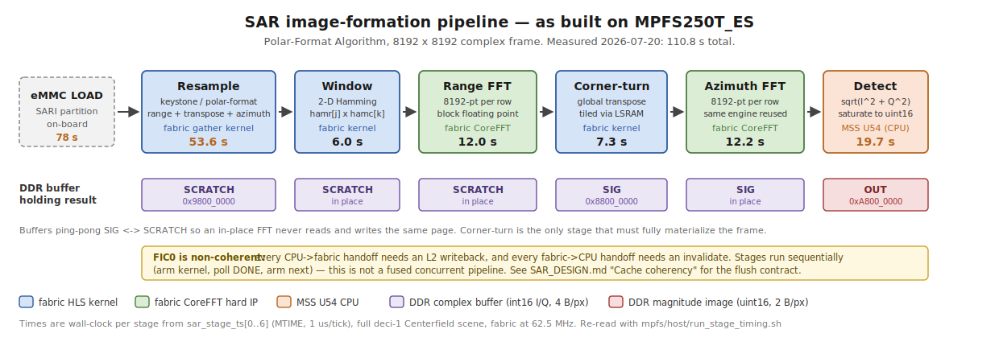
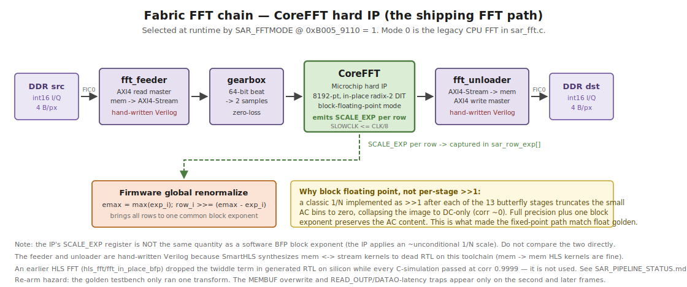
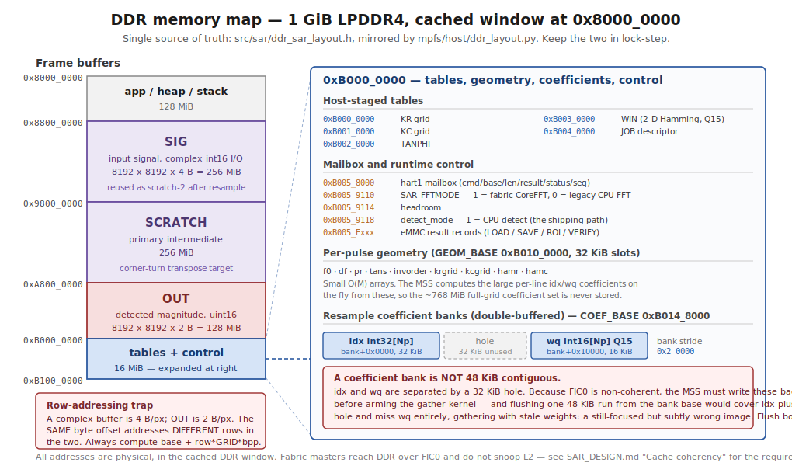

# SAR image former — detailed design

The as-built design of the spotlight-mode SAR image-formation processor on PolarFire SoC
MPFS250T_ES. This is the reference for *how the thing actually works*: dataflow, numeric contracts,
memory map, coherency rules, control interface, and the on-board data path.

Companion documents:

| Document | Covers |
|---|---|
| [`fpga/SAR_ARCHITECTURE_REPORT.md`](fpga/SAR_ARCHITECTURE_REPORT.md) | Measured per-stage timing and fabric resource usage — the numeric source of truth |
| [`fpga/SAR_PIPELINE_STATUS.md`](fpga/SAR_PIPELINE_STATUS.md) | Status, engine history, latency roadmap |
| [`fpga/SAR_PIPELINE_PROCESS.md`](fpga/SAR_PIPELINE_PROCESS.md) | The PFA math and its host-side golden cross-reference |
| [`fpga/SILICON_ISO_TEST_RUNBOOK.md`](fpga/SILICON_ISO_TEST_RUNBOOK.md) | JTAG bring-up and debug procedure — read before any silicon debug |
| [`PROJECT_SOURCE_OF_TRUTH.md`](PROJECT_SOURCE_OF_TRUTH.md) | Authoritative index and anti-hallucination rules |

---

## 1. What it computes

Input is an Umbra CPHD phase-history array (spotlight, X-band, single channel, complex float32).
Output is a focused magnitude image. The algorithm is the Polar-Format Algorithm: interpolate the
polar-sampled phase history onto a Cartesian k-space grid (the keystone resample), taper it, then
take a separable 2-D FFT and detect.

The processing frame is a fixed 8192 x 8192 complex grid. A full capture is decimated to fit; per-axis
sizing and rejection rules live in `mpfs/host/ddr_layout.py` (`plan_frame` / `check_input_dims`). Only
the native 8192-point transform exists — 16384-point and multi-length paths were dropped.

## 2. Pipeline



Stages run sequentially: the MSS arms a kernel, polls its DONE flag, then arms the next. This is not
a fused concurrent pipeline. Every stage is a DDR-to-DDR streaming pass, because the frame (256 MiB
complex) far exceeds on-chip SRAM; on-chip each stage holds only a row, a transpose tile, or AXI
burst FIFOs.

| # | Stage | Engine | In | Out | Time |
|---|---|---|---|---|---|
| 1 | Resample (range + transpose + azimuth) | fabric gather kernel + MSS coefficients | SIG | SCRATCH | 53.6 s |
| 2 | Window (2-D Hamming) | fabric kernel | SCRATCH | SCRATCH | 6.0 s |
| 3 | Range FFT | fabric CoreFFT | SCRATCH | SCRATCH | 12.0 s |
| 4 | Corner-turn (transpose) | fabric kernel | SCRATCH | SIG | 7.3 s |
| 5 | Azimuth FFT | fabric CoreFFT | SIG | SIG | 12.2 s |
| 6 | Detect (magnitude) | MSS U54 CPU | SIG | OUT | 19.7 s |

Total 110.8 s. Orchestration is `sar_form_image()` in `src/sar/sar_sequencer.c`.

### 2.0 Kernel-level decomposition

The table above is the *timing* view: six instrumented stages matching `sar_stage_ts[0..6]`. At kernel
granularity there are eight arm/wait cycles, because the resample stage internally runs
range-resample, a corner-turn, and azimuth-resample before reporting one timestamp. Both views are
correct; this is the one to use when reasoning about buffer traffic or arming order.

| # | Stage | Kernel | Reads | Writes | Timing stage |
|---|---|---|---|---|---|
| 1 | range resample (per pulse, xM) | `RES` | SIG + COEF idx/wq | SCRATCH (row `invorder[i]`, tan φ-sorted) | resample |
| 2 | corner-turn (transpose) | `CT` | SCRATCH | SIG | resample |
| 3 | azimuth resample (per range bin, xNp) | `RES` | SIG + COEF | SCRATCH (uniform k-space) | resample |
| 4 | window (2-D Hamming) | `WIN` | SCRATCH + hamr/hamc | SCRATCH (in-place taper) | window |
| 5 | range FFT | `FEED` -> CoreFFT -> `fft_unloader` | SCRATCH (stream) | SCRATCH (AXI4 write) | rangeFFT |
| 6 | corner-turn (transpose) | `CT` | SCRATCH | SIG | cornerturn |
| 7 | azimuth FFT | `FEED` -> CoreFFT -> `fft_unloader` | SIG (stream) | SIG (AXI4 write) | azFFT |
| 8 | detect (magnitude) | CPU (`DET` bypassed) | SIG | OUT (final image) | detect |

Note that the corner-turn appears twice — once inside resample and once between the two FFT passes —
and that steps 2 and 6 both write SIG while steps 1 and 3 both write SCRATCH. This is the SIG/SCRATCH
ping-pong; a stage that reloads a buffer it just wrote is a bug, not an optimisation.

### 2.1 Resample (keystone / polar-format interpolation)

Two passes with a transpose between them, all inside `resample_2pass()`.

- Pass 1 (range): each real pulse row of SIG (N samples) is resampled to the padded width Np and
  written to SCRATCH at its `tan_phi`-sorted row `invord[i]`, so SCRATCH ends up pulse-sorted. Padded
  rows M..Mp-1 are then zeroed.
- Transpose SCRATCH -> SIG so range bins become rows.
- Pass 2 (azimuth): each range-bin row (M sorted pulses) is resampled to Mp, leaving the resampled
  k-space in SCRATCH.

The interpolation contract is a two-tap linear gather:

```
out[i] = in[idx[i]] + (in[idx[i]+1] - in[idx[i]]) * wq[i] / 32768
```

equivalently `in[idx]·(1-w) + in[idx+1]·w` with `w = wq/2^15`. `idx` is an index into the source in
its natural order; `idx = -1` means out-of-range and zero-fills.

Coefficients are computed just-in-time on the MSS, one line at a time, from the small per-pulse
geometry arrays — precomputing the full grid would be ~768 MiB. The MSS double-buffers: while the
fabric kernel gathers line `i` from bank `b`, the CPU fills bank `b^1` for line `i+1`. Coefficient
generation is float on the CPU (`sar_resample_coeffs.c`, mirrors the host `interp_coeffs()` at
corr 1.0); the interpolation itself is fixed-point in fabric.

Measured split per line: kernel-wait 78%, coefficient compute 20%, cache flush 2%. The stage is
bound by fabric gather throughput, not by coefficient generation — the coefficient work is already
hidden behind the kernel.

### 2.2 Window

Separable Hamming taper applied as the on-the-fly product `hamr[j] · hamc[k]` from two Q15 1-D
tapers, rather than a materialized 2-D table. Zero inside the zero-pad region.

Do not attempt to fuse this into the resample gather. It was tried, was bit-exact in `shls sw` and
II=1 in `shls hw`, and hit two distinct SmartHLS miscompiles on silicon — see
[`fpga/SMARTHLS_ANTIPATTERNS.md`](fpga/SMARTHLS_ANTIPATTERNS.md).

### 2.3 Range FFT, corner-turn, azimuth FFT

See section 4 for the FFT engine and BFP contract.

The corner-turn is the load-bearing data-movement primitive: a global transpose cannot be fused into
a neighbouring stage, so it is the one stage that must fully materialize the frame in DDR. It is
tiled through on-chip LSRAM and is the reason the buffer plan needs a distinct destination (SCRATCH
-> SIG rather than in place).

### 2.4 Detect

Per-pixel magnitude `sqrt(I² + Q²)`, saturated to uint16.

This runs on the CPU, not in fabric. The fabric detect kernel is bypassed because SmartHLS
mis-synthesized its sign extension: source-correct C (`(int16_t)(x >> 16)`) was read as unsigned in
the generated RTL, so every negative-I pixel overflowed and saturated to 0xFFFF — about half the
image — collapsing correlation. Both `shls` cosim and a correlation check passed anyway; only a
value-level comparison caught it.

I and Q must be read as signed int16 before squaring. The branchless reference formula is:

```c
sext16(u) = (int32_t)((u & 0xFFFF) ^ 0x8000) - 0x8000
```

Engine selection is runtime: `detect_mode` @ `0xB0059118`, 1 = CPU detect (the shipping path).

## 3. Fixed-point and data contracts

- Complex samples are int16 I and int16 Q packed as one 32-bit word per pixel, hi16 = I, lo16 = Q.
- The detected OUT image is uint16 magnitude, 2 bytes per pixel.
- Therefore a complex buffer is 4 B/px and OUT is 2 B/px, and **the same byte offset addresses
  different rows in the two**. Always compute row addresses explicitly as
  `base + row · GRID · bytes_per_px`. This has bitten the project more than once.
- Resample weights `wq` are Q15 (`w = wq / 32768`).
- Window tapers `hamr`, `hamc` are Q15 int16.
- Geometry arrays (`f0`, `df`, `pr`, `tans`, `krgrid`, `kcgrid`) are float32; `invorder` is int32.

Datapath sizing, from the fixed-point emulator study: 16-bit mantissa, 18-bit twiddle, 48-bit
accumulate, BFP arithmetic shift after every stage. Measured FFT block-exponent growth is +9/+10
bits, covered by a 5-bit exponent per FFT line. At 16-bit the fixed image is visually identical to
float (corr 0.9992 on the ship scene) and retains ~53 dB usable dynamic range at ~4.6 ENOB. If 53 dB
proves marginal, 18-bit mantissa buys roughly 12 dB more and still fits one 18x18 DSP per multiply.

## 4. FFT engine and block floating point



The shipping FFT is the Microchip CoreFFT hard IP, driven as a streaming chain
`fft_feeder -> gearbox -> CoreFFT -> fft_unloader`. It is selected at runtime by `SAR_FFTMODE`
@ `0xB0059110` = 1, which is what the pipeline runs with; mode 0 is a retained legacy CPU FFT in
`sar_fft.c`.

The feeder and unloader are hand-written Verilog. This is not a style choice: SmartHLS synthesizes
mem-to-stream and stream-to-mem kernels to dead RTL on this toolchain. Memory-to-memory HLS kernels
are fine.

Block floating point is the reason the fixed-point pipeline matches the float golden. CoreFFT runs
in BFP mode and reports a per-row `SCALE_EXP`; the true value is `DATAO · 2^SCALE_EXP`. Firmware
captures the per-row exponents in `sar_row_exp[]` and renormalizes globally to a common block
exponent, `row_i >>= (emax - exp_i)`.

The alternative — a classic 1/N implemented as `>>1` after each of the 13 butterfly stages —
truncates the small AC bins to zero and collapses the image to DC-only (corr ~0). Fixed-point FFT
dynamic range must be managed with a block exponent, not per-stage truncation.

Note that the IP's `SCALE_EXP` register is not the same quantity as a software BFP block exponent
(the IP applies an approximately unconditional 1/N scale). Do not compare the two directly.

## 5. Memory map



Defined in `src/sar/ddr_sar_layout.h` and mirrored by `mpfs/host/ddr_layout.py`. These two must stay
in lock-step; the header is the bare-metal mirror, the Python module is the host-side single source.

| Base | Size | Region |
|---|---|---|
| `0x8000_0000` | 128 MiB | app / heap / stack |
| `0x8800_0000` | 256 MiB | SIG — input signal, complex int16 I/Q; reused as scratch-2 after resample |
| `0x9800_0000` | 256 MiB | SCRATCH — primary intermediate, corner-turn target |
| `0xA800_0000` | 128 MiB | OUT — detected magnitude, uint16 |
| `0xB000_0000` | 16 MiB | tables, geometry, coefficient banks, mailbox and control |

Buffers ping-pong SIG <-> SCRATCH so an in-place FFT never reads and writes the same page.

Within the tables region: host-staged grids at `0xB000_0000` (KR, KC, TANPHI, WIN, JOB); the hart1
mailbox at `0xB005_8000`; runtime knobs at `0xB0059110`/`9114`/`9118`; eMMC result records at
`0xB005_Exxx`; per-pulse geometry from `GEOM_BASE 0xB010_0000` in 32 KiB slots; and the
double-buffered resample coefficient banks from `COEF_BASE 0xB014_8000`, stride `0x2_0000`.

A coefficient bank is not 48 KiB contiguous: `idx` (int32[Np], 32 KiB) sits at bank+0x0000 and `wq`
(int16[Np], 16 KiB) at bank+0x10000, with a 32 KiB hole between. Anything that publishes a bank must
treat it as two disjoint ranges.

## 6. Cache coherency

FIC0 is not coherent — fabric masters reach DDR without snooping the L2. Every handoff across the
CPU/fabric boundary therefore needs an explicit cache operation:

| Handoff | Requirement |
|---|---|
| CPU writes data, fabric reads it | Write back L2 to DDR before arming the kernel |
| Fabric writes data, CPU reads it | Invalidate L2 before reading, or the CPU sees stale lines |
| SDMMC DMA writes DDR, CPU or fabric reads it | Write back / invalidate after the transfer completes |

Two mechanisms are in use:

- `flush_l2_cache(hartid)` — the MPFS HAL's whole-cache operation. It is a way-by-way walk: for each
  of the 16 ways it reads 131 KiB from the L2 zero device (~268k volatile loads) and manipulates the
  WayMask allocation policy. Correct, but expensive, and it invalidates everything.
- `flush_coef_bank_to_ddr(bank, n)` in `sar_sequencer.c` — writes only the covering lines to the
  CCACHE `FLUSH64` register (`CACHE_CTRL_BASE 0x0201_0000`), which writes back and invalidates the
  line containing a given physical address. Used on the resample per-line critical path, where the
  only CPU-dirty data is the coefficient bank. Roughly 768 stores instead of ~268k loads.

Because the coefficient bank is discontiguous (section 5), `flush_coef_bank_to_ddr()` flushes `idx`
and `wq` as separate ranges. A single 48 KiB run from the bank base would cover `idx` plus half the
hole and miss `wq` entirely, so the kernel would gather with stale weights — producing a
still-focused but subtly wrong image that a correlation check would likely not catch.

Anything a JTAG poll reads must be written back explicitly. A debugger read of DDR is a physical
read: it does not snoop L2, so a value the CPU wrote but did not flush appears stale. Two cases:

- The progress word at `0xB005_9100` is published by the `SAR_PROG` macro itself, one cache line per
  update. This used to happen for free as a side effect of the per-line whole-L2 flush in
  `resample_2pass()`; once that flush was narrowed to the coefficient banks it had to become
  explicit. Without it the progress counter appears frozen for the whole 53.6 s resample, which is
  indistinguishable from a hung pipeline.
- Known gap: `MBX_CMD_CRC32`'s handler writes `mbx->result` with only a fence and no writeback, so a
  JTAG read of it returns a stale value. The dedicated result records at `0xB005_Exxx` are written
  back and are trustworthy.

The general rule: narrowing a flush is safe only after enumerating everything the wide flush was
incidentally publishing. Cache maintenance that works by side effect is a latent dependency.

## 7. On-board data path (eMMC)

The scene lives on the board's soldered 8 GB eMMC, so a run needs no host data transfer. This
retires the ~3 h JTAG scene load that previously preceded every run.

Two fixed-LBA partitions, each self-describing via a superblock and TOC, so job geometry is
reconstructed at load time and never trusted from volatile RAM:

| Region | LBA | Size | Contents |
|---|---|---|---|
| INPUT (`SARI`, 0x53415249) | `0x80000` (256 MiB) | 4 GiB | packed scene image: superblock + one blob per scene |
| OUTPUT (`SARO`, 0x5341524F) | `0x880000` (4.25 GiB) | 3 GiB | superblock + persisted output image(s) |

A scene blob (`SARB`, 0x53415242) is a header, a segment table, and ten 512-aligned role segments:
`sig, f0, df, pr, tans, invorder, krgrid, kcgrid, hamr, hamc`. Each segment is tagged by role and the
firmware resolves role to DDR address via `sar_emmc_role_addr()`, scattering to the fixed addresses
in section 5. The JOB descriptor carries only scalars (M, N, fft_r, fft_a, out_dtype, bfp_in_exp,
sig_len, sig_crc) plus the SIG/OUT/SCRATCH bases — the pipeline reads geometry from the fixed
addresses, not from the JOB's legacy address fields.

Measured rates (LEGACY mode, 25 MHz, 8-bit, single-block): read 1.5 MB/s, write 0.13 MB/s. Scene
LOAD is 78 s; persisting the 128 MiB OUT image is about 16 min.

What eMMC does and does not solve: it eliminates the recurring 3 h JTAG input load, which is the
win. It does not speed host transfer — dumping the full OUT image to the PC is still bound by the
FlashPro6 JTAG link at roughly 9 KB/s. Keep the image on-card and dump small ROI crops to verify; a
faster offload needs a different host link, not a faster card.

SDMA would speed writes by one to two orders of magnitude but is currently unusable: hart1 runs with
`MSTATUS_MIE` cleared and `MSS_MMC_sdma_write` completes via the MMC PLIC ISR, so with interrupts off
it spins forever in an unhaltable hang. Single-block transfers are synchronous and cannot hang.

Output persistence is commit-last: invalidate the superblock, write the image, write the superblock
last. A power loss mid-image therefore leaves an invalid superblock and readers reject the torn
image. Do not reorder this.

## 8. Control interface

The hart1 mailbox at `0xB005_8000` is the single entry point. Layout: `cmd` +0, `base` +4, `len` +8,
`result` +0xC, `status` +0x10 (done = `0xC0FFEE03`), `seq` +0x14. Write `base` and `len` first and
`cmd` last; the hart clears `cmd` to acknowledge.

| Command | Code | Purpose |
|---|---|---|
| `ELOD` | 0x454C4F44 | Load scene eMMC -> DDR, plus JOB |
| `PIPE` | 0x50495045 | Run the image-formation pipeline |
| `ESAV` | 0x45534156 | Persist OUT -> eMMC SARO |
| `EVOU` | 0x45564F55 | Verify the persisted image by full CRC against the TOC |
| `EROI` | 0x45524F49 | Crop an ROI from the DDR OUT image |
| `EROE` | 0x45524F45 | Crop an ROI from the persisted SARO image |
| `EPRV` | 0x45505256 | Provision the INPUT partition |
| `EMMC` | 0x454D4D43 | eMMC self-test |

Results are latched in dedicated DDR records (`0xB005_E000` LOAD, `E100` SAVE, `E200` ROI, `E300`
VERIFY, `0xB005_D000` provision), each written back to DDR so a JTAG physical read sees them. Verdict
0 is pass; 1 PARAM, 2 INIT, 3 MAGIC, 4 IO, 5 CRC.

Per-stage timing is instrumented in `sar_stage_ts[0..6]` from MTIME at 1 µs per tick, readable
without re-running the pipeline via `bash mpfs/host/run_stage_timing.sh`.

Fabric kernels are controlled over AXI4-Lite through FIC0; per-kernel register offsets are in
`src/sar/sar_kernels.h`. Note there are two register-map models in the project's history — the
hardware uses the per-kernel model in `sar_kernels.h`, not the older monolithic one.

## 9. Verification contract

Correlation is scale-, phase- and orientation-invariant, so it hides real bugs — the detect
sign-extension defect passed a correlation check while corrupting half the image. Verify by value:
feed known inputs, diff actual complex sample values against the bit-accurate emulator
(`silicon_emulator.py`, which equals the float golden at corr 1.0), and only then compare to the
reference image.

When comparing a board image to the golden, account for orientation before declaring a divergence.
The board result matches the golden in the `T.rot180` orientation
(`board == golden.T[::-1,::-1]`). A naive band comparison once read corr 0.06 on a correct image that
scanned to 0.97 — run the full 8-dihedral orientation search
(`mpfs/host/correlate_cpufft.py`) first.

Current reference result: corr 0.9923 against `golden_small_mag.npy` on the Centerfield decimated
scene, with a point-target crop at 0.9962.

## 10. Known deviations from the ideal design

These are deliberate and load-bearing. Do not "fix" them without reading the linked history.

| Deviation | Reason |
|---|---|
| Detect runs on the CPU, not fabric | SmartHLS sign-extension miscompile; costs 19.7 s |
| FFT feeder/unloader are hand-written Verilog | SmartHLS mem <-> stream kernels synthesize to dead RTL |
| Window is a separate pass, not fused into resample | Two distinct SmartHLS miscompiles on fusion |
| eMMC uses single-block transfers, not SDMA | Interrupts are off on hart1; SDMA would hang unhaltably |
| Fabric runs at 62.5 MHz | 75 MHz effort stopped at marginal ROI; the HLS window/resample kernels are the Fmax limiter, not CoreFFT or the DDR bridge |
| ~50% of OUT saturates at 65535 | Detect BFP shift headroom; cosmetic, correlation is measured on unsaturated pixels |

SmartHLS is treated as an untrusted, behavioural-only tool. Every kernel output is value-checked on
silicon after a rebuild — see the `hls-trust-harness` skill and
[`fpga/SMARTHLS_ANTIPATTERNS.md`](fpga/SMARTHLS_ANTIPATTERNS.md).
