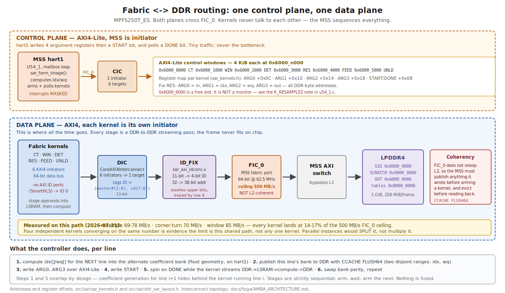
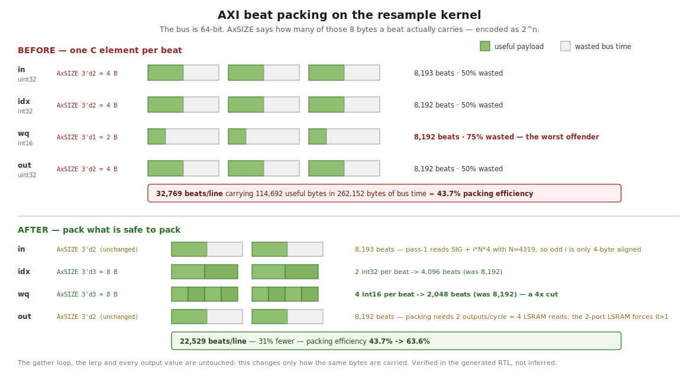

# SAR image former — detailed design

The as-built design of the spotlight-mode SAR image-formation processor on PolarFire SoC
MPFS250T_ES. This is the reference for *how the thing actually works*: dataflow, numeric contracts,
memory map, coherency rules, control interface, and the on-board data path.

Companion documents:

| Document | Covers |
|---|---|
| [`fpga/SAR_ARCHITECTURE_REPORT.md`](fpga/SAR_ARCHITECTURE_REPORT.md) | Measured per-stage timing and fabric resource usage — the numeric source of truth |
| [`fpga/SAR_PIPELINE_STATUS.md`](fpga/SAR_PIPELINE_STATUS.md) | Status, engine history, latency roadmap |
| [`fpga/SAR_PIPELINE_PROCESS.md`](fpga/SAR_PIPELINE_PROCESS.md) | The PFA math and its host-side golden cross-reference |
| [`fpga/SILICON_ISO_TEST_RUNBOOK.md`](fpga/SILICON_ISO_TEST_RUNBOOK.md) | JTAG bring-up and debug procedure — read before any silicon debug |
| [`PROJECT_SOURCE_OF_TRUTH.md`](PROJECT_SOURCE_OF_TRUTH.md) | Authoritative index and anti-hallucination rules |

---

## 1. What it computes

Input is an Umbra CPHD phase-history array (spotlight, X-band, single channel, complex float32).
Output is a focused magnitude image. The algorithm is the Polar-Format Algorithm: interpolate the
polar-sampled phase history onto a Cartesian k-space grid (the keystone resample), taper it, then
take a separable 2-D FFT and detect.

The processing frame is a fixed 8192 x 8192 complex grid. A full capture is decimated to fit; per-axis
sizing and rejection rules live in `mpfs/host/ddr_layout.py` (`plan_frame` / `check_input_dims`). Only
the native 8192-point transform exists — 16384-point and multi-length paths were dropped.

## 2. Pipeline


Stages run sequentially: the MSS arms a kernel, polls its DONE flag, then arms the next. This is not
a fused concurrent pipeline. Every stage is a DDR-to-DDR streaming pass, because the frame (256 MiB
complex) far exceeds on-chip SRAM; on-chip each stage holds only a row, a transpose tile, or AXI
burst FIFOs.

| # | Stage | Engine | In | Out |
|---|---|---|---|---|
| 1 | Resample (range + transpose + azimuth) | fabric gather kernel + MSS coefficients | SIG | SCRATCH |
| 2 | Window (2-D Hamming) | *fused into the range-FFT feeder* | — | — |
| 3 | Range FFT | fabric CoreFFT | SCRATCH | SCRATCH |
| 4 | Corner-turn (transpose) | fabric kernel | SCRATCH | SIG |
| 5 | Azimuth FFT | fabric CoreFFT | SIG | SIG |
| 6 | Detect (magnitude) | *fused into the azimuth-FFT unloader (fabric)* | — | — |

Total 58.12 s (2026-07-21); the per-stage breakdown is in
[`fpga/SAR_ARCHITECTURE_REPORT.md`](fpga/SAR_ARCHITECTURE_REPORT.md) §5, which is the single numeric
source of truth. Orchestration is `sar_form_image()` in `src/sar/sar_sequencer.c`.

### 2.0 Kernel-level decomposition

The table above is the *timing* view: six instrumented stages matching `sar_stage_ts[0..6]`. At kernel
granularity there are now seven arm/wait cycles (the window kernel is no longer armed), because the
resample stage internally runs
range-resample, a corner-turn, and azimuth-resample before reporting one timestamp. Both views are
correct; this is the one to use when reasoning about buffer traffic or arming order.

| # | Stage | Kernel | Reads | Writes | Timing stage |
|---|---|---|---|---|---|
| 1 | range resample (per pulse, xM) | `RES` | SIG + COEF idx/wq | SCRATCH (row `invorder[i]`, tan φ-sorted) | resample |
| 2 | corner-turn (transpose) | `CT` | SCRATCH | SIG | resample |
| 3 | azimuth resample (per range bin, xNp) | `RES` | SIG + COEF | SCRATCH (uniform k-space) | resample |
| 4 | ~~window (2-D Hamming)~~ | *fused into `FEED`* | — | — | window (now 0.00 s) |
| 5 | range FFT | `FEED` -> CoreFFT -> `fft_unloader` | SCRATCH (stream) | SCRATCH (AXI4 write) | rangeFFT |
| 6 | corner-turn (transpose) | `CT` | SCRATCH | SIG | cornerturn |
| 7 | azimuth FFT | `FEED` -> CoreFFT -> `fft_unloader` | SIG (stream) | SIG (AXI4 write) | azFFT |
| 8 | ~~detect (magnitude)~~ | *fused into `UNLD`* | — | OUT (final image) | detect (now 0.00 s) |

Note that the corner-turn appears twice — once inside resample and once between the two FFT passes —
and that steps 2 and 6 both write SIG while steps 1 and 3 both write SCRATCH. This is the SIG/SCRATCH
ping-pong; a stage that reloads a buffer it just wrote is a bug, not an optimisation.

### 2.1 Resample (keystone / polar-format interpolation)

Two passes with a transpose between them, all inside `resample_2pass()`.

- Pass 1 (range): each real pulse row of SIG (N samples) is resampled to the padded width Np and
  written to SCRATCH at its `tan_phi`-sorted row `invord[i]`, so SCRATCH ends up pulse-sorted. Padded
  rows M..Mp-1 are then zeroed.
- Transpose SCRATCH -> SIG so range bins become rows.
- Pass 2 (azimuth): each range-bin row (M sorted pulses) is resampled to Mp, leaving the resampled
  k-space in SCRATCH.

The interpolation contract is a two-tap linear gather:

```
out[i] = in[idx[i]] + (in[idx[i]+1] - in[idx[i]]) * wq[i] / 32768
```

equivalently `in[idx]·(1-w) + in[idx+1]·w` with `w = wq/2^15`. `idx` is an index into the source in
its natural order; `idx = -1` means out-of-range and zero-fills.

Coefficients are computed just-in-time on the MSS, one line at a time, from the small per-pulse
geometry arrays — precomputing the full grid would be ~768 MiB. The MSS double-buffers: while the
fabric kernel gathers line `i` from bank `b`, the CPU fills bank `b^1` for line `i+1`. Coefficient
generation is float on the CPU (`sar_resample_coeffs.c`, mirrors the host `interp_coeffs()` at
corr 1.0); the interpolation itself is fixed-point in fabric.

Cache maintenance on this per-line path used to dominate the stage. Replacing the whole-L2
`flush_l2_cache()` with the targeted coefficient-bank writeback of section 6 removed 13,826 whole-L2
flushes and took the stage from 53.6 s to 29.2 s — 24.4 s, or about 1.76 ms per flush, which matches
the way-by-way walk the HAL call performs. So the flush was roughly 45% of resample, not the ~2% an
earlier profile reported; that profile was taken while an experimental per-chunk flush (16x fewer
flushes) was active, and the figure outlived the reverted code. What remains is bound by fabric
gather throughput, not by coefficient generation — the coefficient work is hidden behind the kernel.

#### Resample is three workloads, and they behave differently

`sar_stage_ts` reports resample as one number, which hides the structure. `sar_resample_ts[0..3]`
splits it (measured 2026-07-21, deci-1 Centerfield):

| Part | Measured | Share | Shape | Parallel across lines? |
|---|---:|---:|---|---|
| Range gather | 8.31 s | 28% | 5,634 pulse lines, Np=8192 outputs each | yes — fully independent |
| Corner-turn | 7.33 s | 25% | one global transpose of the 256 MiB frame | **no** — global data movement |
| Azimuth gather | 13.53 s | 46% | 8,192 range-bin lines, Mp=8192 outputs each | yes — fully independent |

The independence of the two gathers is provable from the host reference rather than assumed:
`resample_coeffs` is `for i in range(m): interp_coeffs(KR, kr[i])` and `apply1` is a pure per-row map,
with no loop-carried dependency. The ordering between the three is strict, though — the corner-turn
needs all of the range output, and azimuth needs all of the corner-turn output.

Azimuth is the largest part at 46%, and costs more per line than range (1.652 ms vs 1.475 ms) because
it reads Mp=8192 samples per line against range's N=4319. Treating the two gathers as interchangeable
when optimising is therefore mis-weighted; azimuth is worth about 1.6x range.

The corner-turn is the one part that does not parallelise along the same axis, and it appears
**twice** in the pipeline — once here and once between the FFT passes (stage 4, also ~7.3 s) — so the
two together are ~14.6 s, about 17% of the whole run, from a single shared kernel.

### 2.2 Window — FUSED into the range-FFT feeder (2026-07-21)

Separable Hamming taper applied as the on-the-fly product `hamr[j] · hamc[k]` from two Q15 1-D
tapers, rather than a materialized 2-D table. Zero inside the zero-pad region.

There is no longer a standalone window pass. The taper is applied inside `fft_feeder_v.v` as data
streams into the range FFT: `hamc` lives in a 4096×32b on-chip table (2 taps/word, so table entry
n serves beat n 1:1), `hamr[row]` arrives as a scalar in the same register write that arms the row,
and a 3-stage registered multiply sits on the FIFO write side. Runtime-enabled (reg 0x18 bit16) —
ON for the range pass, OFF for the azimuth pass, which shares the same feeder instance.

Measured on silicon: window stage 6.0 s → 0.000 s, pipeline 87.58 → 79.79 s, and the FFT passes
did not slow down (25.06 s vs ~25.07 s before), so the fused multiplies cost no wall-clock. ROI crc
`0xd596c9eb` unchanged.

Two things this depends on, both deliberate:

- The arithmetic reproduces `hls_window/window.cpp` bit-for-bit, including its truncation ORDER
  (`cw = (hamr*hamc)>>15` first, then `(sample*cw)>>15`). That is what keeps the crc a valid gate.
  Note `silicon_emulator.window_fixed()` uses the OTHER order (two independent `>>15` rounds) and
  is therefore NOT bit-exact against the silicon it mirrors — unresolved, see §11.
- It is in hand-written Verilog, not HLS. Fusing the window into the resample gather was tried
  twice, was bit-exact in `shls sw` and II=1 in `shls hw`, and hit two distinct SmartHLS
  miscompiles on silicon — see [`fpga/SMARTHLS_ANTIPATTERNS.md`](fpga/SMARTHLS_ANTIPATTERNS.md).
  Do not retry that route.

### 2.3 Range FFT, corner-turn, azimuth FFT

See section 4 for the FFT engine and BFP contract.

The corner-turn is the load-bearing data-movement primitive: a global transpose cannot be fused into
a neighbouring stage, so it is the one stage that must fully materialize the frame in DDR. It is
tiled through on-chip LSRAM and is the reason the buffer plan needs a distinct destination (SCRATCH
-> SIG rather than in place).

### 2.4 Detect

Per-pixel magnitude `sqrt(I² + Q²)`, saturated to uint16.

This runs IN FABRIC (since 2026-07-21), fused into the azimuth-FFT unloader: `fft_unloader_v.v`
takes the magnitude as the second FFT streams to DDR, so there is no separate detect stage and no
CPU involvement in the datapath at all. Cost went 19.24 s -> 0.00 s, and the azimuth FFT itself got
1.50 s faster because the unloader now writes uint16 magnitudes instead of complex int32 — half the
write traffic on that pass.

It is hand-written Verilog, NOT HLS, and that is not a style preference. The HLS detect kernel was
bypassed for months because SmartHLS mis-synthesized its sign extension: source-correct C
(`(int16_t)(x >> 16)`) was read as UNSIGNED in the generated RTL, so every negative-I pixel
overflowed and saturated to 0xFFFF — about half the image — collapsing correlation. Both `shls`
cosim and a correlation check passed anyway; only a value-level comparison caught it. The Verilog
declares the operands explicitly `signed`, and `tb/tb_fft_unloader_det.v` mutation-tests exactly
this: stripping the `signed` qualifiers reproduces the failure at 2035/2048 mismatches.

The global block exponent forces one residual CPU pass: `emax` is not known until every row is
transformed, so the unloader emits magnitudes at each row's NATIVE exponent and firmware applies
`>>(emax - exp_i)` afterwards. That sweep is a uint16 shift over 128 MB — no sqrt, no sign
handling — rather than the old complex-to-magnitude pass over 512 MB.

Validated by A/B against the known-good CPU detect on identical input (the pipeline CRC gate does
not apply — the rounding order changes deliberately): max |diff| 2 LSB, ZERO pixels beyond that
over 1,048,576, correlation 0.999866. `mpfs/host/model_detect_fusion.py` predicted that ≤2 LSB
bound before any RTL existed.

I and Q must be read as signed int16 before squaring. The branchless reference formula is:

```c
sext16(u) = (int32_t)((u & 0xFFFF) ^ 0x8000) - 0x8000
```

Engine selection is runtime: `detect_mode` @ `0xB0059118`, 1 = CPU detect (the shipping path).

### 2.5 Data movement: how bytes get between fabric and DDR



Two planes cross FIC_0, and only one of them matters for performance.

### Control plane — the MSS drives, kernels never initiate

Each fabric kernel exposes a 4 KiB AXI4-Lite target at `0x6000_n000`. The MSS reaches them through
its FIC_0 initiator into a control interconnect (CIC, 1 initiator to 6 targets). Per kernel the map
is `ARG0 +0x0C`, `ARG1 +0x10`, `ARG2 +0x14`, `ARG3 +0x18`, `START`/`DONE` at `+0x08`
(`sar_kernels.h`). For resample: ARG0 = `in`, ARG1 = `idx`, ARG2 = `wq`, ARG3 = `out`, all plain DDR
byte addresses.

This traffic is a handful of register writes per line and is never the bottleneck. Kernels never talk
to each other and never self-sequence — the MSS arms one, waits for DONE, then arms the next.

### Data plane — six initiators, one shared path

Every kernel is its own AXI4 initiator with a 64-bit data bus. All six converge on a data
interconnect (DIC, 6 initiators to 1 target), then `ID_FIX`, then FIC_0, then the MSS AXI switch,
then LPDDR4. Nothing on this path snoops L2.

The AXI ID story matters and is easy to get wrong. CoreAXI4Interconnect tags each transaction with an
11-bit ID formed as `{master_number[2:0], master_id[7:0]}`. `master_number` is the interconnect's own
index of which initiator port the transaction arrived on; `master_id` is whatever the master drove.
**SmartHLS `axi_initiator` kernels have no ID ports at all**, so `master_id` is always 0 and kernels
differ only in the high bits — RES is `0x300`, a seventh initiator would be `0x600`.

`ID_FIX` (`sar_axi_idconv.v`) narrows that 11-bit ID to FIC_0's 4 bits by forwarding the low 4 bits
and stashing the upper 7 in a table **keyed by those same low 4 bits**, re-attaching them on the
response. Since every kernel's low 4 bits are zero, all initiators collide on `aw_tab[0]`. That is
safe only because stages run strictly one at a time — the module's header states the assumption
outright: "≤1 outstanding txn per distinct low-4 tag (sequential kernels)". It is a pure
combinational pass-through and does **not** throttle outstanding transactions.

> Consequence for any future parallelism: two kernels running concurrently would reconstruct each
> other's response IDs and mis-route. This is invisible to synthesis and to timing closure — such a
> design builds clean and fails only on silicon. Fixing it is an RTL change to `sar_axi_idconv.v`
> (forward `master_number` through the 4-bit tag, since `master_id` is always 0).

### The measured ceiling

| Stage | Bytes moved | Time | Throughput |
|---|---:|---:|---:|
| Resample, azimuth | 114,692 / line | 1.652 ms | 69 MB/s |
| Resample, range | 114,692 / line | 1.475 ms | 78 MB/s |
| Corner-turn | 512 MB | 7.33 s | 70 MB/s |
| Window | *(fused into the range FFT; no standalone pass since 2026-07-21)* | 0.00 s | — |

FIC_0 at 64-bit × 62.5 MHz has a 500 MB/s ceiling, so every kernel sits at 14–17% of it. Four
independent kernels converging on the same figure is evidence that the limit is this shared path
rather than any one kernel's logic — and it predicts that replicating kernels would **split** that
bandwidth rather than multiply it.

### What the controller actually does, per line

1. Compute `idx[]`/`wq[]` for the **next** line into the alternate coefficient bank (float geometry,
   on hart1).
2. Publish the **current** line's bank to DDR with `CCACHE FLUSH64` — two disjoint ranges, because a
   bank is not contiguous (section 6).
3. Write ARG0..ARG3 over AXI4-Lite.
4. Write START.
5. Spin on DONE while the kernel streams DDR → LSRAM → compute → DDR.
6. Swap bank parity and repeat.

Steps 1 and 5 overlap by design, so coefficient generation for line `i+1` hides behind the kernel
running line `i`. That is why coefficient work is currently "free" — and why it becomes the binding
constraint the moment the gather gets substantially faster.

### 2.6 AXI beat packing



The bus is 64-bit, but `AxSIZE` decides how many of those 8 bytes a beat actually carries (2^n). The
kernel originally moved **one C element per beat**: `AxSIZE 3'd2` (4 bytes) for `in`, `idx` and `out`,
and `3'd1` (2 bytes) for `wq`. That is 32,769 beats per line carrying 114,692 useful bytes inside
262,152 bytes of bus time — **43.7% packing efficiency**, with `wq` wasting 75% of every beat it used.

Reading `idx` as two int32 per 64-bit word and `wq` as four int16 per word, then unpacking into the
existing LSRAM arrays, cuts this to 22,529 beats and 63.6% efficiency. The gather loop, the lerp and
every output value are untouched — only the transport changes.

Two streams are deliberately left unpacked, and both reasons should be re-checked before anyone
"finishes the job":

- **`in`** — pass 1 reads `BUF_SIG + i*N*4` with N=4319, so for odd `i` the address is only 4-byte
  aligned and an 8-byte beat needs 8-byte alignment. Pass 2 would be fine, but one kernel binary
  serves both passes.
- **`out`** — producing two outputs per cycle would need four LSRAM reads per cycle from `buf`
  (`buf[j0]`, `buf[j0+1]`, `buf[j1]`, `buf[j1+1]`), which the two-port LSRAM cannot do; II would go
  to 2 and cancel the gain.

`idx` and `wq` are always safe because every coefficient bank (`0xB014_8000 + b*0x2_0000`, and
`+0x1_0000` for wq) is 8-byte aligned by construction.

> Tooling trap found doing this: a `#pragma HLS memory partition` placed anywhere other than
> immediately above the variable's **declaration** is silently dropped — SmartHLS warns
> `[HLS pragma] ignored`, exits 0, and the partitioning simply is not there. The `wq` unpack loop
> degraded to II=2 while `idx` coincidentally still made II=1 on the LSRAM's two native ports, so
> half the regression hid itself. Only the II report gate caught it. See
> [`fpga/SMARTHLS_ANTIPATTERNS.md`](fpga/SMARTHLS_ANTIPATTERNS.md) entry 6.

## 3. Fixed-point and data contracts

- Complex samples are int16 I and int16 Q packed as one 32-bit word per pixel, hi16 = I, lo16 = Q.
- The detected OUT image is uint16 magnitude, 2 bytes per pixel.
- Therefore a complex buffer is 4 B/px and OUT is 2 B/px, and **the same byte offset addresses
  different rows in the two**. Always compute row addresses explicitly as
  `base + row · GRID · bytes_per_px`. This has bitten the project more than once.
- Resample weights `wq` are Q15 (`w = wq / 32768`).
- Window tapers `hamr`, `hamc` are Q15 int16.
- Geometry arrays (`f0`, `df`, `pr`, `tans`, `krgrid`, `kcgrid`) are float32; `invorder` is int32.

Datapath sizing, from the fixed-point emulator study: 16-bit mantissa, 18-bit twiddle, 48-bit
accumulate, BFP arithmetic shift after every stage. Measured FFT block-exponent growth is +9/+10
bits, covered by a 5-bit exponent per FFT line. At 16-bit the fixed image is visually identical to
float (corr 0.9992 on the ship scene) and retains ~53 dB usable dynamic range at ~4.6 ENOB. If 53 dB
proves marginal, 18-bit mantissa buys roughly 12 dB more and still fits one 18x18 DSP per multiply.

## 4. FFT engine and block floating point


The shipping FFT is the Microchip CoreFFT hard IP, driven as a streaming chain
`fft_feeder -> gearbox -> CoreFFT -> fft_unloader`. It is selected at runtime by `SAR_FFTMODE`
@ `0xB0059110` = 1, which is what the pipeline runs with; mode 0 is a retained legacy CPU FFT in
`sar_fft.c`.

The feeder and unloader are hand-written Verilog. This is not a style choice: SmartHLS synthesizes
mem-to-stream and stream-to-mem kernels to dead RTL on this toolchain. Memory-to-memory HLS kernels
are fine.

Block floating point is the reason the fixed-point pipeline matches the float golden. CoreFFT runs
in BFP mode and reports a per-row `SCALE_EXP`; the true value is `DATAO · 2^SCALE_EXP`. Firmware
captures the per-row exponents in `sar_row_exp[]` and renormalizes globally to a common block
exponent, `row_i >>= (emax - exp_i)`.

The alternative — a classic 1/N implemented as `>>1` after each of the 13 butterfly stages —
truncates the small AC bins to zero and collapses the image to DC-only (corr ~0). Fixed-point FFT
dynamic range must be managed with a block exponent, not per-stage truncation.

Note that the IP's `SCALE_EXP` register is not the same quantity as a software BFP block exponent
(the IP applies an approximately unconditional 1/N scale). Do not compare the two directly.

## 5. Memory map


Defined in `src/sar/ddr_sar_layout.h` and mirrored by `mpfs/host/ddr_layout.py`. These two must stay
in lock-step; the header is the bare-metal mirror, the Python module is the host-side single source.

| Base | Size | Region |
|---|---|---|
| `0x8000_0000` | 128 MiB | app / heap / stack |
| `0x8800_0000` | 256 MiB | SIG — input signal, complex int16 I/Q; reused as scratch-2 after resample |
| `0x9800_0000` | 256 MiB | SCRATCH — primary intermediate, corner-turn target |
| `0xA800_0000` | 128 MiB | OUT — detected magnitude, uint16 |
| `0xB000_0000` | 16 MiB | tables, geometry, coefficient banks, mailbox and control |

Buffers ping-pong SIG <-> SCRATCH so an in-place FFT never reads and writes the same page.

Within the tables region: host-staged grids at `0xB000_0000` (KR, KC, TANPHI, WIN, JOB); the hart1
mailbox at `0xB005_8000`; runtime knobs at `0xB0059110`/`9114`/`9118`; eMMC result records at
`0xB005_Exxx`; per-pulse geometry from `GEOM_BASE 0xB010_0000` in 32 KiB slots; and the
double-buffered resample coefficient banks from `COEF_BASE 0xB014_8000`, stride `0x2_0000`.

A coefficient bank is not 48 KiB contiguous: `idx` (int32[Np], 32 KiB) sits at bank+0x0000 and `wq`
(int16[Np], 16 KiB) at bank+0x10000, with a 32 KiB hole between. Anything that publishes a bank must
treat it as two disjoint ranges.

## 6. Cache coherency

FIC0 is not coherent — fabric masters reach DDR without snooping the L2. Every handoff across the
CPU/fabric boundary therefore needs an explicit cache operation:

| Handoff | Requirement |
|---|---|
| CPU writes data, fabric reads it | Write back L2 to DDR before arming the kernel |
| Fabric writes data, CPU reads it | Invalidate L2 before reading, or the CPU sees stale lines |
| SDMMC DMA writes DDR, CPU or fabric reads it | Write back / invalidate after the transfer completes |

Two mechanisms are in use:

- `flush_l2_cache(hartid)` — the MPFS HAL's whole-cache operation. It is a way-by-way walk: for each
  of the 16 ways it reads 131 KiB from the L2 zero device (~268k volatile loads) and manipulates the
  WayMask allocation policy. Correct, but expensive, and it invalidates everything.
- `flush_coef_bank_to_ddr(bank, n)` in `sar_sequencer.c` — writes only the covering lines to the
  CCACHE `FLUSH64` register (`CACHE_CTRL_BASE 0x0201_0000`), which writes back and invalidates the
  line containing a given physical address. Used on the resample per-line critical path, where the
  only CPU-dirty data is the coefficient bank. Roughly 768 stores instead of ~268k loads.

Because the coefficient bank is discontiguous (section 5), `flush_coef_bank_to_ddr()` flushes `idx`
and `wq` as separate ranges. A single 48 KiB run from the bank base would cover `idx` plus half the
hole and miss `wq` entirely, so the kernel would gather with stale weights — producing a
still-focused but subtly wrong image that a correlation check would likely not catch.

Anything a JTAG poll reads must be written back explicitly. A debugger read of DDR is a physical
read: it does not snoop L2, so a value the CPU wrote but did not flush appears stale. Two cases:

- The progress word at `0xB005_9100` is published by the `SAR_PROG` macro itself, one cache line per
  update. This used to happen for free as a side effect of the per-line whole-L2 flush in
  `resample_2pass()`; once that flush was narrowed to the coefficient banks it had to become
  explicit. Without it the progress counter appears frozen for the whole 29.2 s resample, which is
  indistinguishable from a hung pipeline.
- Known gap: `MBX_CMD_CRC32`'s handler writes `mbx->result` with only a fence and no writeback, so a
  JTAG read of it returns a stale value. The dedicated result records at `0xB005_Exxx` are written
  back and are trustworthy.

A large CPU write is not self-publishing. Pass 1 zeroes the padded pulse rows — about 84 MB against
a 2 MiB L2 — so most lines write-back-evict naturally as the loop advances and the region *looks*
published. The final ~2 MiB stays dirty, so without an explicit flush the corner-turn reads the
previous run's data in the highest pad rows instead of zeros, putting non-zero content where the FFT
expects zero-padding. Whole-L2 is the right instrument here: at 64 B per line, targeting 84 MB would
be ~1.3 M `FLUSH64` stores, far worse than one way-walk, and it runs once per pipeline rather than
per line.

The general rule: narrowing a flush is safe only after enumerating everything the wide flush was
incidentally publishing. Cache maintenance that works by side effect is a latent dependency.

## 7. On-board data path (eMMC)

The scene lives on the board's soldered 8 GB eMMC, so a run needs no host data transfer. This
retires the ~3 h JTAG scene load that previously preceded every run.

Two fixed-LBA partitions, each self-describing via a superblock and TOC, so job geometry is
reconstructed at load time and never trusted from volatile RAM:

| Region | LBA | Size | Contents |
|---|---|---|---|
| INPUT (`SARI`, 0x53415249) | `0x80000` (256 MiB) | 4 GiB | packed scene image: superblock + one blob per scene |
| OUTPUT (`SARO`, 0x5341524F) | `0x880000` (4.25 GiB) | 3 GiB | superblock + persisted output image(s) |

A scene blob (`SARB`, 0x53415242) is a header, a segment table, and ten 512-aligned role segments:
`sig, f0, df, pr, tans, invorder, krgrid, kcgrid, hamr, hamc`. Each segment is tagged by role and the
firmware resolves role to DDR address via `sar_emmc_role_addr()`, scattering to the fixed addresses
in section 5. The JOB descriptor carries only scalars (M, N, fft_r, fft_a, out_dtype, bfp_in_exp,
sig_len, sig_crc) plus the SIG/OUT/SCRATCH bases — the pipeline reads geometry from the fixed
addresses, not from the JOB's legacy address fields.

Measured rates (LEGACY mode, 25 MHz, 8-bit, single-block): read 1.5 MB/s, write 0.13 MB/s. Scene
LOAD is 81.5 s; persisting the 128 MiB OUT image is about 16 min.

What eMMC does and does not solve: it eliminates the recurring 3 h JTAG input load, which is the
win. It does not speed host transfer — dumping the full OUT image to the PC is still bound by the
FlashPro6 JTAG link at roughly 9 KB/s. Keep the image on-card and dump small ROI crops to verify; a
faster offload needs a different host link, not a faster card.

SDMA would speed writes by one to two orders of magnitude but is currently unusable: hart1 runs with
`MSTATUS_MIE` cleared and `MSS_MMC_sdma_write` completes via the MMC PLIC ISR, so with interrupts off
it spins forever in an unhaltable hang. Single-block transfers are synchronous and cannot hang.

Output persistence is commit-last: invalidate the superblock, write the image, write the superblock
last. A power loss mid-image therefore leaves an invalid superblock and readers reject the torn
image. Do not reorder this.

## 8. Boot sequence and when the pipeline runs

Nothing runs automatically. The board boots into a command loop and waits; the pipeline executes only
when a host writes a `PIPE` command into the mailbox. This is deliberate — it keeps the board
debuggable and makes every run explicit and repeatable.

### 8.1 Power-on chain

1. eNVM holds `app.elf`, programmed in boot mode 1. The MPFS HAL's startup code runs first: it trains
   LPDDR4 and brings up FIC_0 before any application code executes.
2. E51 (hart 0, the monitor core) enters `e51()`. It releases the MMUART0 subblock clock/reset, raises
   a software interrupt to hart 1, and then idles in an infinite loop forever. It does no compute.
3. U54_1 (hart 1) enters `u54_1()` and does the work:
   - spins on `MIP.MSIP` waiting for the E51 wake (an active poll, not `WFI`, so the hart stays
     haltable by JTAG), then clears the soft interrupt;
   - clears `MSTATUS_MIE` and `mie` — interrupts stay masked for the lifetime of the application.
     This is the reason eMMC SDMA is unusable (section 7): its completion path is an ISR;
   - installs a direct-mode trap vector for fault recovery;
   - clears the result table, runs the self-test battery, latches `g_m2_done`;
   - zeroes the mailbox and enters the command loop, incrementing a heartbeat each pass.
4. U54_2..4 are unused.

Boot mode matters for debuggability: mode 1 (this application) and mode 0 (a WFI stub) both leave
hart 1 haltable over JTAG. An HSS build does not — JTAG then cannot halt the hart, so it is never
used for this work.

### 8.2 What boot does *not* do

- It does not program the fabric. The bitstream is loaded separately (JTAG or SPI flash); the
  firmware assumes fabric is already live. A dark fabric mimics several unrelated faults — kernels
  never complete, and the eMMC appears dead because the eMMC/SD mux select is a fabric tie.
- It does not load a scene. DDR does not survive a power cycle, so SIG is undefined at boot.
- It does not run the pipeline.

### 8.3 Required order for a run

Each step depends on the previous one. Skipping one produces a failure that looks like a different
problem, which is why the order is stated explicitly.

| Step | Action | Why it must come first |
|---|---|---|
| 1 | Program the fabric bitstream | Kernels, and the eMMC mux select, do not exist until it is live |
| 2 | Flash the application to eNVM (`run_program.sh`) | Programming the fabric requires re-flashing the app afterwards |
| 3 | Power-cycle | The freshly flashed app must actually boot |
| 4 | `ELOD` — load the scene from eMMC (81.5 s) | DDR was wiped by step 3; SIG must be populated |
| 5 | `PIPE` — run the pipeline (58.12 s) | Needs SIG and the geometry tables in DDR |
| 6 | `EROI` / `ESAV` — crop or persist the result | Needs OUT populated |

Steps 4-6 may repeat freely without re-flashing, provided the board is not power-cycled between
them. A power cycle at any point returns you to step 4, never earlier.

### 8.4 Reading state over JTAG

How a debugger reaches memory changes what it sees, which explains an otherwise confusing
inconsistency:

- While the hart is halted, accesses go through its progbuf — they use the hart's own load/store
  path and are therefore cache-coherent. This is why the host can write the mailbox and poll
  `mbx->status` without any flush.
- While the hart is running, the debugger must use the system bus, which is a physical read that does
  not snoop L2. Anything polled during a run — notably the progress word at `0xB005_9100` — must be
  explicitly written back by the firmware, or it appears frozen.

## 9. Control interface

The hart1 mailbox at `0xB005_8000` is the single entry point. Layout: `cmd` +0, `base` +4, `len` +8,
`result` +0xC, `status` +0x10 (done = `0xC0FFEE03`), `seq` +0x14. Write `base` and `len` first and
`cmd` last; the hart clears `cmd` to acknowledge.

| Command | Code | Purpose |
|---|---|---|
| `ELOD` | 0x454C4F44 | Load scene eMMC -> DDR, plus JOB |
| `PIPE` | 0x50495045 | Run the image-formation pipeline |
| `ESAV` | 0x45534156 | Persist OUT -> eMMC SARO |
| `EVOU` | 0x45564F55 | Verify the persisted image by full CRC against the TOC |
| `EROI` | 0x45524F49 | Crop an ROI from the DDR OUT image |
| `EROE` | 0x45524F45 | Crop an ROI from the persisted SARO image |
| `EPRV` | 0x45505256 | Provision the INPUT partition |
| `EMMC` | 0x454D4D43 | eMMC self-test |

Results are latched in dedicated DDR records (`0xB005_E000` LOAD, `E100` SAVE, `E200` ROI, `E300`
VERIFY, `0xB005_D000` provision), each written back to DDR so a JTAG physical read sees them. Verdict
0 is pass; 1 PARAM, 2 INIT, 3 MAGIC, 4 IO, 5 CRC.

Per-stage timing is instrumented in `sar_stage_ts[0..6]` from MTIME at 1 µs per tick, readable
without re-running the pipeline via `bash mpfs/host/run_stage_timing.sh`.

Fabric kernels are controlled over AXI4-Lite through FIC0; per-kernel register offsets are in
`src/sar/sar_kernels.h`. Note there are two register-map models in the project's history — the
hardware uses the per-kernel model in `sar_kernels.h`, not the older monolithic one.

## 10. Verification contract

Correlation is scale-, phase- and orientation-invariant, so it hides real bugs — the detect
sign-extension defect passed a correlation check while corrupting half the image. Verify by value:
feed known inputs, diff actual complex sample values against the bit-accurate emulator
(`silicon_emulator.py`, which equals the float golden at corr 1.0), and only then compare to the
reference image.

When comparing a board image to the golden, account for orientation before declaring a divergence.
The board result matches the golden in the `T.rot180` orientation
(`board == golden.T[::-1,::-1]`). A naive band comparison once read corr 0.06 on a correct image that
scanned to 0.97 — run the full 8-dihedral orientation search
(`mpfs/host/correlate_cpufft.py`) first.

Current reference result: corr 0.9923 against `golden_small_mag.npy` on the Centerfield decimated
scene, with a point-target crop at 0.9962.

## 11. Known deviations from the ideal design

These are deliberate and load-bearing. Do not "fix" them without reading the linked history.

| Deviation | Reason |
|---|---|
| Detect is fabric, in the FFT unloader (not a kernel of its own) | The standalone HLS detect kernel is unusable (sign-extension miscompile). Fusing it into `fft_unloader_v.v` in Verilog both fixes that and deletes the 19.24 s pass (§2.4) |
| Resample gather emits SINGLE-BEAT AXI reads | SmartHLS refuses burst conversion: the two-tap interpolation issues two AXI loads per iteration (`hls.log`: "cannot be converted into an AXI burst transfer: resample.cpp:41,43"). ~880 us/line against a 131 us II=1 schedule, and the AR-burst FIFO has "2 uses per cycle but only 1 units available", which is why `max_outstanding` 1->8 did nothing. Largest remaining target |
| FFT feeder/unloader are hand-written Verilog | SmartHLS mem <-> stream kernels synthesize to dead RTL |
| Window is fused into the FFT feeder (Verilog), not into resample (HLS) | Two distinct SmartHLS miscompiles on the resample-fusion route; the Verilog feeder route works and is silicon-proven (§2.2) |
| `silicon_emulator.window_fixed()` is NOT bit-exact vs `window.cpp` | It applies the two tapers as two separate `>>15` rounds; the kernel folds them into one `cw` first. Differs in the low bit. Pre-existing, found 2026-07-21, unresolved — the mirror's docstring claims bit-accuracy, so one of the two should change |
| eMMC uses single-block transfers, not SDMA | Interrupts are off on hart1; SDMA would hang unhaltably |
| Fabric runs at 62.5 MHz | 75 MHz effort stopped at marginal ROI; the HLS window/resample kernels are the Fmax limiter, not CoreFFT or the DDR bridge |
| ~50% of OUT saturates at 65535 | Detect BFP shift headroom; cosmetic, correlation is measured on unsaturated pixels |

SmartHLS is treated as an untrusted, behavioural-only tool. Every kernel output is value-checked on
silicon after a rebuild — see the `hls-trust-harness` skill and
[`fpga/SMARTHLS_ANTIPATTERNS.md`](fpga/SMARTHLS_ANTIPATTERNS.md).
