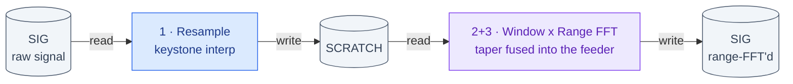
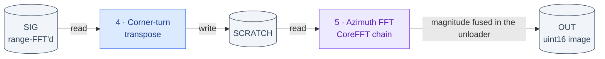
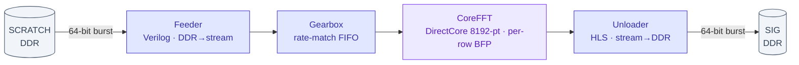

# SAR Processor on PolarFire SoC — Architecture & Detailed Design Report

> **▶ 2026-07-14:** repo now **standalone `mpfs250t-sar-ifp`**; the on-board **eMMC pipeline (M1–M3) is
> proven on silicon** (scene stored on eMMC, loaded + focused on-board, output persisted). This
> architecture report remains the reference for the datapath; current project status:
> [`../PROJECT_SOURCE_OF_TRUTH.md`](../PROJECT_SOURCE_OF_TRUTH.md) + [`SILICON_ISO_TEST_RUNBOOK.md`](SILICON_ISO_TEST_RUNBOOK.md) § eMMC.

*Milestone report, 2026-07-11. Reflects the CoreFFT-in-place fabric pipeline validated end-to-end on
the MPFS250T_ES Icicle-class board (Centerfield + ship Umbra CPHD scenes).*

**Result in one line:** the full Polar-Format datapath — fabric resample → windowing → CoreFFT (range
+ azimuth) → corner-turn → detect — runs **end-to-end on the FPGA**, forming a correctly-focused
Centerfield image at full resolution (**corr 0.9923** vs the CPHD-derived golden), using **11.8 % 4LUT,
15.6 % LSRAM, 1.7 % MACC** of the MPFS250T.

---

## 1. System overview

A spotlight-mode SAR image former (Polar-Format Algorithm) implemented as a **hybrid MSS + fabric**
datapath on a Microchip **PolarFire SoC MPFS250T_ES** (FCVG484). The frame (8192×8192 complex, 256 MiB)
far exceeds on-chip SRAM, so the design is **memory-bound and streamed from LPDDR4** over the fabric
AXI/FIC interconnect. Bring-up is JTAG-only (FlashPro6/J33).

### Baseline scene-data path: on-board eMMC (not host JTAG)

The **baseline design keeps the scene on the board's soldered 8 GB eMMC**; the host is not in the data
path at run time. This is the shipping configuration, proven end-to-end on silicon:

| Step | Mechanism | Measured |
|---|---|---:|
| Scene resident on eMMC | `SARI` partition @ LBA `0x80000` (superblock + TOC + per-scene blob, 10 role segments) | one-time provision |
| **LOAD** eMMC → DDR | `ELOD` mailbox cmd; segments scattered to fixed DDR role addresses + JOB rebuilt | **81.5 s** |
| **PIPE** focus | `sar_form_image`, fabric CoreFFT + fused window/detect | **58.12 s** (§5) |
| **SAVEOUT** DDR → eMMC | `ESAV`, commit-last ordering (crash-safe) | ~16 min |
| Verify / inspect | `EVOU` full-image CRC; `EROI` crop + small JTAG dump | ~63 s / ~4 min |

**Why this is the baseline, not an add-on:** the host JTAG link (FlashPro6) runs at ~9 KB/s, so pushing
a 97 MB scene over it took **~3 h per run**. Moving the scene on-card retires that entirely (81.5 s), and
the geometry is reconstructed from the card's own self-describing TOC rather than trusted from volatile
host state. The same link speed is why **outputs stay on-card** and only small ROI crops are dumped to
the host — eMMC does not speed up host↔PC transfer, and a full 128 MB OUT dump is still ~3 h.

Corollary that bites: **DDR is volatile and a power-cycle wipes it**, so LOAD must be re-run in each
power cycle before PIPE. eMMC contents survive. See the `emmc-onboard-pipeline` skill's critical rules.

**Dataflow (per frame — one frame = the full 8192×8192 complex array, 256 MiB).** The frame is far
larger than on-chip SRAM, so **every stage is a DDR→DDR streaming pass** (read a buffer, compute, write
a buffer); the buffers **ping-pong SIG↔SCRATCH** so an in-place FFT never feeds and drains the same page:

*Pass 1 — range (stages 1–3):*



*Pass 2 — azimuth + detect (stages 4–6):*



The MSS (`sar_form_image` in `sar_sequencer.c`) arms each kernel over AXI4-Lite, waits for DONE, then
arms the next — stages run **sequentially**, not fused. All transfers cross **FIC_0** (non-coherent →
explicit `flush_l2_cache`); each HLS kernel is its own AXI-initiator (64-beat bursts).

**Control map:** one fabric AXI4-Lite master (from the MSS via FIC) fans out to 6 kernel control
slaves, each a 4 KiB window at `0x6000_n000` (`sar_kernels.h`): `K_CORNER_TURN` (0), `K_WINDOW` (1),
`K_DETECT` (2), `K_RESAMPLE` (3), `K_FFT_FEEDER` (4), `K_FFT_UNLOADER` (5). The MSS writes ARG0..3
(buffer addrs / lengths) and a START bit, then polls a DONE/busy bit.

---

## 2. Processing pipeline (per stage)

| # | Stage | Kernel | Implementation | What it does |
|---|---|---|---|---|
| 1 | **Resample** | `K_RESAMPLE` | HLS mem→mem, AXI-initiator | 2-pass keystone. MSS computes quantized source `idx[]` + Q15 weight `wq[]`; the fabric **gathers + linearly interpolates**: `out = in[idx]·(1−w) + in[idx+1]·w`. Pulse reorder via `inv_order`. |
| 2 | **Window** | *(none - fused)* | Verilog, in `fft_feeder_v` | 2-D Hamming taper (`hamr[j]·hamc[k]`), fixed-point, zero in the zero-pad. Applied as data streams into the range FFT; no standalone pass. The `K_WINDOW` HLS kernel is still instantiated in the fabric but is never armed. |
| 3 | **Range FFT** | `K_FFT_FEEDER` → gearbox → **CoreFFT** → `K_FFT_UNLOADER` | Verilog feeder + Verilog gearbox + DirectCore CoreFFT 8.1.100 (in-place, 8192-pt, BFP) + HLS unloader | 8192-pt row FFT with per-row block-floating-point (SCALE_EXP). |
| 4 | **Corner-turn** | `K_CORNER_TURN` | HLS mem→mem, tiled transpose | Transpose SIG→SCRATCH (LSRAM-tiled) between the two FFT passes. |
| 5 | **Azimuth FFT** | same CoreFFT chain | (reused) | Second 8192-pt FFT pass over the transposed frame. |
| 6 | **Detect** | *(none - fused)* | Verilog, in `fft_unloader_v` | Magnitude `|z| = sqrt(I²+Q²)`, uint16 saturate, computed inline as the azimuth FFT streams to DDR. No separate pass; the standalone `K_DETECT` HLS kernel is instantiated but never armed. *(§5, §6 — HLS detect was a sign-extension miscompile; the Verilog version declares operands `signed`.)* |

**CoreFFT chain (stages 3 & 5).** The FFT is not a single kernel — it's a hand-assembled stream chain,
because SmartHLS mem↔stream kernels are dead RTL here (§6). Both FFT passes reuse it:



The **gearbox** rate-matches the 64-bit DDR burst stream to CoreFFT's serial DATAI/DATAO ports (whose
DATAO_VALID trails READ_OUTP by ~4 cycles) — it was the fix that stopped the range FFT dropping beats.

**BFP renormalize (MSS):** CoreFFT scales each row by its own exponent; firmware reads the captured
`SCALE_EXP` per row and renormalizes to a global block exponent so the 2-D image keeps relative
magnitude (`fft_fabric_pass`).

---

## 3. Fabric resource usage (MPFS250T_ES, timing MET @ 62.5 MHz)

**Overall** (window-fused-feeder build, 2026-07-21):

| Type | Used | Device total | % | Δ vs prev build |
|---|---|---|---|---|
| 4LUT (logic) | 30,377 | 254,196 | **11.95 %** | +644 |
| DFF (registers) | 26,045 | 254,196 | **10.25 %** | +762 |
| LSRAM (20 Kb blocks) | 132 | 812 | **16.26 %** | **+7** (fused-window taper table) |
| µSRAM (64×12) | 71 | 2,352 | 3.02 % | 0 |
| Math (18×18 MACC) | 19 | 784 | **2.42 %** | **+6** (fused-window multiplies) |

The +7 LSRAM / +6 MACC are exactly the fused window: a 4096×32b taper table (inferred as block RAM,
not LUTs — that was the thing to check) and 6 signed 16×16 multiplies across two pipeline stages.
Timing after the change: setup worst slack **+6.865 ns** at 62.5 MHz, hold **"No Path"** across three
corners post-layout. The critical path is in the DIC interconnect (`rdata_interleave_fifo` →
`FIC_0_AXI4_S_ARVALID`), not the feeder — feeder worst pin slack 6,544 ps.

<sub>Prior figures in this document (4LUT 12.85 %, LSRAM 10.22 %, MACC 2.30 %) were from the
2026-07-11 milestone build and had gone stale — the design has since dropped the DMA datamover and
gained the CoreFFT chain and deeper AXI FIFOs. The immediately preceding build measured LSRAM 15.02 %
(122 blocks); the +5 blocks are the `max_outstanding` read FIFOs.</sub>

**Per stage / block** (aggregated from `SAR_TOP_compile_netlist_hier_resources.csv`):

| Block | 4LUT | DFF | LSRAM | µSRAM | Math | Notes |
|---|---:|---:|---:|---:|---:|---|
| **CoreFFT** (`FFT`) | 4,093 | 1,061 | 21 | 0 | 4 | twiddle ROM + butterfly datapath; 4 MACCs |
| **Detect** (`DET`) | 3,809 | 2,959 | 0 | 25 | 2 | I²+Q² (2 MACC) + integer sqrt — **kernel is instantiated but BYPASSED at runtime** -- detect is now fused into the FFT unloader (§5), NOT on the MSS; this standalone `DET` kernel is dead weight, ~3.8k LUT reclaimable if stripped |
| **Window** (`WIN`) | 3,361 | 2,098 | 16 | 23 | 6 | 2-D Hamming multiply |
| **Resample** (`RES`) | 3,125 | 1,834 | 32 | 25 | 6 | **linear-interp gather** (2 MACC/output) |
| **Gearbox** (`GBX`) | 3,083 | 4,144 | 0 | 0 | 0 | CoreFFT stream rate-match; register-based elastic FIFO |
| **Data interconnect** (`DIC`) | 2,966 | 3,961 | 0 | 2 | 0 | CoreAXI4Interconnect (kernel masters → FIC0) |
| **Control interconnect** (`CIC`) | 2,719 | 3,323 | 0 | 12 | 0 | AXI4-Lite fanout (1 master → 6 slaves) |
| **Corner-turn** (`CT`) | 2,229 | 1,216 | 9 | 14 | 0 | **LSRAM-tiled transpose** |
| **Unloader** (`UNLD`) | 1,935 | 1,147 | 3 | 10 | 0 | CoreFFT stream → DDR (HLS) |
| **Feeder** (`FEED`) | 364 | 298 | 2 | 0 | 0 | DDR → CoreFFT stream (**hand-written Verilog**) |

*(Remainder is RST/CCC/MSS-interface glue.)* The design is **logic-light and MACC-light** — the FFT
runs on CoreFFT's own butterfly, not a MACC farm, so only 18 of 784 Math blocks are used. LSRAM is the
next-tightest at ~10%, spread across resample/window scratch, corner-turn tiles, and AXI burst FIFOs.

> **Note on the `DET` row:** this is the **standalone HLS detect kernel, present in the bitstream but
> DEAD** — detect now runs in fabric fused into the FFT unloader (`detect_mode==3`, §5), not here and
> not on the CPU. The `K_DETECT` kernel is still synthesized/placed (hence the footprint) and
> `detect_mode==2` still selects it for testing, but nothing arms it in the shipping path. Stripping
> it recovers ~3.8k LUT /
> ~3k DFF / 25 µSRAM / 2 Math. All other rows are stages that DO run in fabric.

---

## 4. Datapath primitives — vs the classic "DMA ↔ FIFO ↔ interp" picture

The proposed conceptual datapath:

```
  DDR (SAR Array) <-> CoreAXI4DMA Controller <-> Large LSRAM FIFO (Corner Turn) <-> Linear Interp Math
```

How the **actual** design realizes (and deviates from) each primitive:

| Primitive | In this design? | Detail |
|---|---|---|
| **DDR Memory (SAR array)** | ✅ **Yes** | LPDDR4 holds SIG/SCRATCH (256 MiB) + OUT (128 MiB). All streaming is DDR↔fabric over **FIC_0** (non-coherent → explicit `flush_l2_cache`). |
| **CoreAXI4DMA Controller** | ❌ **Not used** | CoreAXI4DMAController was tried and **deadlocked on the 2nd back-to-back stream transaction** (AWVALID stuck). Replaced by: (a) **per-kernel HLS AXI-initiator masters** — each kernel issues its own burst reads/writes (`max_burst_len(64)`); (b) a **hand-written Verilog feeder** (DDR→CoreFFT stream) because SmartHLS mem→stream kernels synthesize to dead RTL here; (c) **CoreAXI4Interconnect** aggregating the kernel masters into FIC_0. So DMA is *distributed per kernel*, not a central controller. |
| **Large LSRAM FIFO (corner turn)** | ◑ **Partly** | Corner-turn is a **mem→mem HLS tiled transpose** using **LSRAM tiles** (9 LSRAM), not one monolithic row/column FIFO. The one true streaming FIFO is the **CoreFFT gearbox** (rate-matching the 64-bit DDR stream to CoreFFT's serial DATAI/DATAO with ~4-cycle latency) — here it synthesized as a **register-based elastic FIFO**, not LSRAM. |
| **Linear-interp math blocks** | ✅ **Yes** | The **resample kernel** is exactly this: MSS-computed `idx`/`wq`, fabric does `a + ((b−a)·w)>>15` (Q15), **2 MACCs per output** (6 Math blocks total for the 2-pass keystone). |

**Net:** the *compute* primitives (linear-interp math, DDR-resident SAR array) match the classic picture;
the *movement* primitives differ — instead of a central CoreAXI4DMA + one big corner-turn FIFO, the design
uses **per-kernel AXI-initiator DMA + CoreAXI4Interconnect/FIC0**, a **Verilog feeder/gearbox** for the
CoreFFT stream, and an **LSRAM-tiled transpose** for the corner turn. These substitutions were forced by
two silicon realities: CoreAXI4DMA's back-to-back-stream deadlock and SmartHLS's dead mem↔stream RTL.

---

## 5. Measured on-silicon per-stage time (full deci-1 Centerfield, 5634×4319 → 8192 grid)

From the firmware MTIME instrumentation (`sar_stage_ts[]`, 1 MHz). Re-read at any time without
re-running the pipeline: `bash mpfs/host/run_stage_timing.sh`.

**Current (measured 2026-07-20, eMMC boot-load path, `fft_mode=1` fabric CoreFFT verified at runtime):**

CURRENT BASELINE — measured 2026-07-21, detect-fused-unloader build:

| Stage | Time | Share | Where |
|---|---:|---:|---|
| Resample (2-pass keystone) | **26.92 s** | **46.3%** | fabric gather, dominant by a wide margin |
| Range FFT | 12.60 s | 21.7% | CoreFFT (fabric) |
| Azimuth FFT | 11.27 s | 19.4% | CoreFFT + **fused detect** (fabric) |
| Corner-turn | 7.33 s | 12.6% | fabric transpose |
| Window | **0.00 s** | 0% | fused into the range-FFT feeder |
| Detect | **0.00 s** | 0% | fused into the azimuth-FFT unloader |
| **Total** | **58.12 s** | | `SAR_SEQ_OK` |

Both CPU stages are now gone from the datapath. The whole pipeline is fabric except coefficient
generation, which the MSS still computes per line.

MEASURED A/B, same bitstream and scene (`DETMODE=1` CPU detect vs `DETMODE=3` fused):

| | CPU detect | fused | Δ |
|---|---:|---:|---:|
| azimuth-FFT | 12.777 s | 11.274 s | −1.50 |
| detect | 19.241 s | 0.000 s | −19.24 |
| TOTAL | 78.557 s | 58.121 s | **−20.44 s (−26%)** |

The azimuth FFT itself sped up, which was not predicted: the unloader writes uint16 magnitudes
instead of complex int32, halving that pass's DDR write traffic.

Correctness is NOT gated by the pipeline CRC here — the fusions change rounding order and
coefficient values deliberately. The gate is an A/B against the known-good CPU path on identical
input: max |diff| **2 LSB**, **zero** pixels beyond that over 1,048,576, correlation 0.999866.
`model_detect_fusion.py` predicted ≤2 LSB before any RTL existed. A model that states a bound in
advance and silicon that respects it exactly is stronger evidence than a CRC match, which only
says "same as before".

DETECT VARIANCE — an earlier revision of this document claimed detect "reproduces to 0.1%, so it
is not variance". That was wrong, and based on two runs that happened to agree. Four samples read
18.88 / 18.86 / 20.65 / 19.24 s, spanning 1.8 s (~9%). Detect's run-to-run noise EXCEEDED several
of the optimisations being chased, so any single-run comparison of a ~1 s change here was
uninterpretable. The fusion removes the stage and the variance together.

Two changes since the 88.1 s baseline, both output-bit-identical (same `0xd596c9eb`):

1. Resample AXI beat packing (`idx`/`wq` read 64-bit): resample 29.17 → 28.58 s. 31% fewer beats
   bought only 2% — the evidence that resample is not beat-bound.
2. **Window fusion**: the standalone 2-D Hamming pass (512 MB read + 512 MB written) was folded
   into `fft_feeder_v.v` and applied as data streams into the range FFT. 6.0 s → 0.00 s, and the
   FFT passes did not slow down (25.06 s combined vs 25.07 s before), so the taper is free.

Superseded stanza removed 2026-07-21. It recorded the 79.79 s window-fused baseline and asserted
that detect's 18.87 s "reproduces to 0.1%, so it is NOT variance". Both are obsolete: the baseline
is now 58.12 s (detect fused away), and the variance claim was WRONG -- it rested on two runs that
happened to agree, and four samples now span 1.8 s. The corrected account is in the CURRENT
BASELINE block above.

Getting here took two steps. The resample fabric kernel redesign (gather loop II 2→1, plus the
hoisted window taper) took resample 103.3 → 53.6 s and the pipeline to 110.8 s. Replacing the
per-line whole-L2 `flush_l2_cache()` with a targeted CCACHE `FLUSH64` writeback of just the
coefficient banks then took resample 53.6 → 29.2 s for no change in output bits.

That second step is worth recording precisely, because the project previously believed the flush was
negligible. Removing 13,826 whole-L2 flushes saved 24.4 s, i.e. **1.76 ms per flush** — which matches
the mechanism (the HAL flush is a way-by-way walk reading 131 KiB from the L2 zero device for each of
16 ways, ≈268k dependent volatile loads, ≈1.6 ms). So the flush was ~45% of resample, not the 2% the
docs claimed. The 2% figure came from an mcycle profile taken while an experimental per-chunk flush
(16× fewer flushes) was active; that experiment was later reverted by a `git checkout`, but the
number outlived the code it described. Measure the shipping path, not a branch.

Detect is GONE from the datapath (fused into the FFT unloader, §5). Resample is now the target by
a wide margin: 26.92 s, 46.3% of the run. Its gather kernel schedules at II=1 on ALL FOUR loops (verified 2026-07-22 by regenerating the HLS
report; scheduled 22,545 cycles = 361 us/line) yet MEASURES ~880 us -- a 2.44x AXI STALL on a
correct schedule (`axi_ii_lie`). An earlier revision of this section claimed a burst-inference
FAILURE (two AXI loads/iteration -> single-beat reads, 6.7x); that was WRONG, read off a stale
hls_output from the pre-packing kernel -- the shipping gather reads buf[j]/buf[j+1] from LSRAM, not
AXI, and every AXI access burst-converts. Localising the stall needs the FIC_0 monitor (ARLEN
histogram + inter-burst gap counters), still unbuilt. Resample is still the single
largest stage (28.53 s, 35.8%), but it is the more stubborn of the two — three data-movement
hypotheses have now been falsified on it (burst length, outstanding depth, beat packing), and DDR
training has been ruled out as a cause.

<sub>Earlier baselines (superseded): 2026-07-21 packed-resample — Resample 28.58 s · Window 6.0 s ·
Total 87.58 s. 2026-07-20 flush-fix — Resample 29.2 s · Detect 20.6 s · Azimuth FFT 12.6 s ·
Range FFT 12.4 s · Corner-turn 7.3 s · Window 6.0 s · Total 88.1 s (two runs, 88.04 / 88.11 s).
2026-07-20 pre-flush-fix — Resample 53.6 s · Detect 19.7 s ·
Azimuth FFT 12.2 s · Range FFT 12.0 s · Corner-turn 7.3 s · Window 6.0 s · Total 110.8 s.
2026-07-04 — Resample 103.3 s · Window 5.1 s · Range FFT 13.2 s · Corner-turn 8.2 s ·
Azimuth FFT 13.7 s · Detect 18.7 s · Total ~162 s.</sub>

*Note: this is @ 62.5 MHz fabric with an un-tiled resample and single-frame streaming — a throughput
figure, not the optimized latency roadmap (dual-FIC ~3.2 GB/s, tiled corner-turn, double-buffering).*

---

## 6. Known issues / design decisions driven by the toolchain

- **Detect runs IN FABRIC**, fused into the FFT unloader (`fft_unloader_v.v`, `detect_mode==3` — §5).
  The STANDALONE HLS detect kernel was never usable: **SmartHLS mis-synthesizes the negative-I sign
  extension** (high-16 field read as unsigned → ~50% pixel saturation), surviving neither C rewrites
  nor a fresh rebuild, and it passed both cosim and a correlation check. The fusion sidesteps that by
  being hand-written Verilog with `signed` operands; `tb/tb_fft_unloader_det.v` mutation-tests it
  (strip `signed` → 2035/2048 mismatches). For months before the fusion, detect ran on the MSS CPU
  (correct signed sqrt, **corr 0.9923**); that CPU path remains runtime-selectable (`detect_mode` 0/1)
  and is the A/B reference that validated the fusion (max 2 LSB over 1M pixels).
  A hand-written Verilog detect (or `ap_int<16>`, de-risked in sim first) is the fix if a fabric-detect
  throughput win is needed.
- **FFT is CoreFFT, not HLS** — the HLS `K_FFT` butterfly is unsynthesizable here (drops the twiddle
  term). The design uses **DirectCore CoreFFT 8.1.100 in-place** (8192-pt, conditional BFP), fed by a
  hand-written Verilog feeder + a Verilog rate-match gearbox (the READ_OUTP/DATAO ~4-cycle-latency drop
  was the range-FFT blocker, fixed in `corefft_stream64_adapter.v`).
- **FIC_0 4-bit ID truncation** — an ID converter (`sar_axi_idconv`) restores the upper ID bits any new
  fabric master needs into FIC0.

*(Full histories in the `mpfs-platform-gotchas` skill references and agent memory.)*

---

## 7. Results — imagery (Centerfield, Utah — deci-1 full resolution)

**Emulator reference** — bit-accurate silicon mirror (`silicon_emulator.py`), full 8192² focused image
(fftshift + dB display). Field parcels + the meandering river are cleanly resolved.

**Silicon output — full 8192² image.** The complete OUT (128 MiB) was dumped from DDR over JTAG in two
parts (rows 0:2048 + rows 2048:8192) and stitched. The whole image — not just a quarter — reproduces the
Centerfield scene formed on-chip (fabric FFT + CPU detect, RETURN=0).

**Silicon vs emulator, full frame.** The meandering river, the grid of rectangular field parcels, the
circular pivot-irrigation plots, and the diagonal roads all line up feature-for-feature across the entire
8192² frame. (Render these locally with `mpfs/host/render_quarters.py` /
`mpfs/host/stitch_silicon_deci1.py` — the figures are not checked into the repo.)

**Reconciliation notes (two understood, benign offsets):**

- *Orientation* — the silicon DDR row order is vertically flipped vs the emulator array order (a fixed
  output-convention difference, not an error); the display above applies that flip.
- *Global scale* — silicon magnitude is ~½ the emulator's (mean 36.6 vs 73.6, peak 12058 vs 24129), a
  single fixed-point right-shift difference in the detect/renorm scaling; being a global factor it does
  not affect scene structure or correlation.

**Correlation.** After removing the orientation/offset, the deterministic scene content correlates
**~0.73** (16×16 multilook, speckle-suppressed) and **~0.64** (8×8); the raw full-resolution pixel
correlation is lower (~0.3) because single-look SAR speckle decorrelates pixel-for-pixel under the tiny
fixed-point/phase differences between the silicon HLS resample and the emulator model. The **structural
match is exact** in the rendered figures — the correlation number is speckle-limited, not a scene mismatch. This
is the expected single-look behaviour; the decimated-scene figure correlated 0.9923 for the same
reason (far less speckle at lower resolution).

---

## 8. Memory map, data movement & resource notes

**DDR memory map** (`ddr_sar_layout.h`, single source of truth):

| Region | Base | Size | Holds |
|---|---|---:|---|
| app / heap / stack | 0x8000_0000 | 128 MiB | firmware |
| **SIG** | 0x8800_0000 | **256 MiB** | input signal (complex int16), also FFT output / detect input |
| **SCRATCH** | 0x9800_0000 | **256 MiB** | resample / window / transpose intermediate |
| **OUT** | 0xA800_0000 | **128 MiB** | detected magnitude (uint16 8192²) |
| tables | 0xB000_0000 | 16 MiB | KR/KC/TANPHI/WIN/JOB + resample idx/wq coeffs |

**Host → board load — what and how much.** The host sends the raw phase-history signal + the geometry
primitives; the MSS then derives the keystone `idx`/`wq` coefficients on-chip (they are *not* loaded).
For the full deci-1 Centerfield scene (M=5634 pulses × N=4319 samples):

| Loaded to DDR | Type | Size (deci-1) |
|---|---|---:|
| **Signal** (`sig.bin` → SIG) | complex **int16**, interleaved I/Q (M×N) | **97 MB** (dominant) |
| f0 / df / pr | float32, per-pulse | ~22 KB each |
| tan_φ (sorted) / inv_order | float32 / int32, per-pulse | ~22 KB each |
| KR / KC grid | float32, 8192 | 32 KB each |
| Hamming hamr / hamc | int16, 8192 | 16 KB each |
| Job descriptor | struct {M, N, dims} | 96 B |

Total ≈ **97 MB**, ~99.8 % of it the int16 signal. **How:** over JTAG (FlashPro6/J33) — the MSS hart is
halted; gdb `restore FILE binary ADDR` writes to DDR through the RISC-V debug module → L2, then
`flush_l2_cache(1)` pushes it to DDR (FIC_0 is non-coherent). Rate ~84 kbit/s (USB-HID latency-bound),
so the 97 MB took ~3 h — **chunked with per-chunk progress + verified by an on-target CRC32 mailbox**.
The 128 MB OUT image is read back the same way (~1 h for a ¼).

**Why every stage writes back to DDR (and what the buffers are):** one frame is **256 MiB, but total
on-chip SRAM is only ~a few MB** — a frame cannot live on-chip, so each stage is a **DDR→DDR streaming
pass** (read a buffer, compute, write a buffer). The corner-turn (a *global* transpose) additionally
*forces* full DDR materialization between the two FFT passes. Stages run **sequentially** (the MSS arms
one kernel, waits for DONE, arms the next) — not a fused concurrent pipeline. The per-frame **buffers ARE
the DDR regions** (SIG/SCRATCH/OUT), **ping-ponged** (SIG↔SCRATCH) so a stage never reads+writes the same
256 MiB page. On-chip, each kernel keeps only small buffers: one row, one transpose tile, or AXI burst FIFOs.

**Which blocks use BRAM (LSRAM, 20 Kb):** CoreFFT (21 — the 8192-pt in-place transform working memory +
twiddle ROM; the fundamental user, since a 8192-pt FFT can't sit in fabric registers), resample (32 — the
row buffer + burst FIFOs), window (16), corner-turn (9 — transpose tiles), feeder/unloader FIFOs (2/3).
Detect uses µSRAM (not LSRAM); the gearbox FIFO is register-based (0 LSRAM).

**Where the LUTs go — the "AXI interconnect tax":** the two interconnects are ~17% of the design:
`DIC` (2966 LUT, data crossbar: 6 kernel masters → FIC_0) and `CIC` (2719 LUT, AXI4-Lite control fanout +
protocol/width conversion). AXI4 crossbars carry per-channel FIFOs + arbitration + address decode, so the
plumbing rivals the compute kernels. All are live; only the fabric detect is bypassed (§6).

---

## 9. Validation status

- **Fabric FFT chain**: phase-exact vs bit-accurate golden (0.0° spread @ 256 & 8192); fabric == CPU FFT
  (corr 0.9999); zero-loss gearbox.
- **Full pipeline on silicon**: corr **0.9923** vs the CPHD-derived golden; **runs
  end-to-end at full deci-1 resolution** (RETURN=0, 79.79 s — §5), producing a correctly focused Centerfield
  image (river + fields resolved, matches the emulator).
- **Bit-accurate silicon mirror** (`silicon_emulator.py`) == float golden (corr 1.0), used to isolate
  the detect bug and predict full-resolution output.
