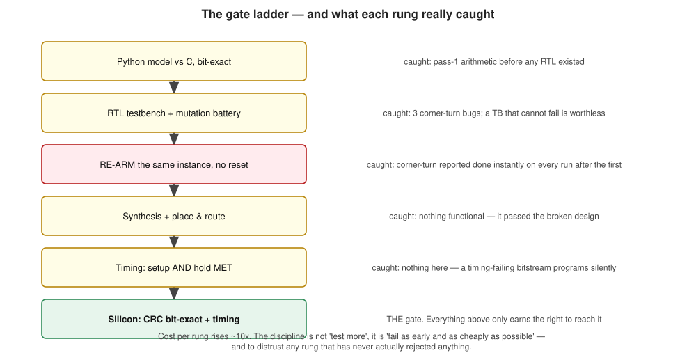
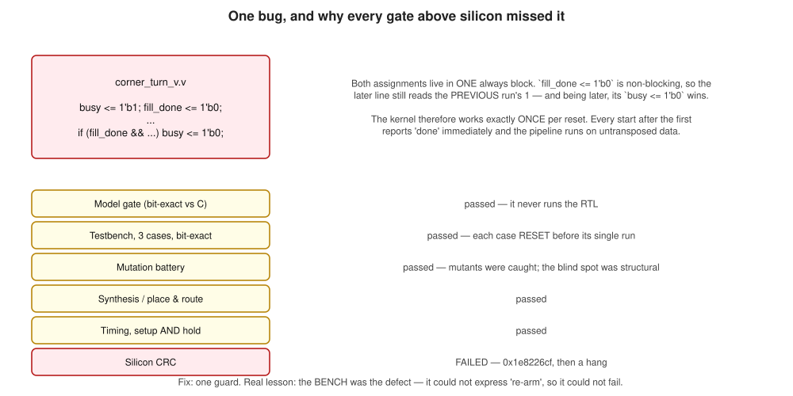

<!-- _class: lead -->

# System-on-Chip & Firmware Development using AI Agents

## Agents, skills and verification gates

**Worked example:** a Synthetic Aperture Radar image-formation processor
on a Microchip PolarFire SoC MPFS250T

<span class="tiny">28 July 2026</code></span>

---

## What this deck is

> **Transforming the way we work.** AI tools can be adopted to speed-up the development process by bridging system-side applications / algorithms with fabric / firmware implementations.

**Part 1 — AI-based Approach.** How an AI agent is orchestrated to do FPGA and firmware
work for sophisticated algorithms: what the subagents are for, what the skills and memory do, and why the
verification gates are shaped the way they are.

**Part 2 — On-Chip SAR Processor.** Design and Implementation of SAR image-formation pipeline:
signal processing, fabric implementation, data movement, memory,
timing, and measured result.


---

## The example, in one slide

Everything in Part 1 is illustrated with **one real project**, so the method is judged
against something that actually shipped rather than in the abstract.

| | |
|---|---|
| **Goal** | Turn raw radar pulses into a focused image, entirely on one chip |
| **Input** | 5,634 pulses x 4,319 samples of SAR phase history — not a picture |
| **Output** | 8,192 x 8,192 image |
| **Hardware** | PolarFire SoC MPFS250T: 4x RISC-V @ 600 MHz + FPGA fabric, one 64-bit port to DDR |
| **Result** | **110.8 s → 18.45 s** per image, output **bit-identical** throughout |

Two things about this hardware drive every decision in Part 1:

- **A rebuild takes ~50 minutes**, and a test needs a human to power-cycle the board. Being
  wrong is expensive, so the agent must be cheap to *disprove*, not fast to answer.
- **Correctness is checkable exactly.** A checksum of the output image either matches
  `0x319037b2` or it does not. No judgement, no partial credit — which is what makes the
  verification gates in Part 1 possible at all.

---

<!-- _class: part -->

# Part 1

## Orchestration

Why hardware breaks the usual agent loop, and what to build instead

---

## Software and fabric / firmware are not the same problem


> **Consequence:** the agent has to be **thorough** — referencing design documents and reasoning implementation. Every board iteration must undergo a **board-free verification first, and each iteration must be instrumented to answer multiple questions**.

---

## The orchestration model


---

## Subagents — and what they are really for

| agent | job |
|---|---|
| `fpga-ref-verifier` | Check an IP integration against the vendor guide **before** committing to it |
| `architectural-critic` | Red-team a design; assume every correctness claim is false until the handshake is shown |
| `ingestion-triage` | Turn raw JTAG/register hex into a labelled state map |
| `smartdebug-planner` | Resolve probe net names from the *programmed* netlist |
| `synthesis-repair` | Minimal, compilable fix within stated constraints |
| `libero-build` | Headless build that refuses to return a bitstream unless timing is MET |
| `silicon-test-runner` | Drive a JTAG test with consideration of the project's constraints |
| `doc-accuracy` | Audit docs against source; report only provable drift |

---

## Skills — packaged procedures, layered by how portable they are

A **skill** is a named procedure the agent loads on demand: the exact steps, addresses,
commands and gotchas for one recurring job. `ai-framework/` splits them by **how far the
knowledge travels**, so the reusable part is not trapped inside the project that produced it.

| layer | what it holds | size | example skill |
|---|---|---|---|
| `generic-fpga-soc` | vendor-agnostic **method** — reference-first design, distrust of HLS output, value-level verification, concurrency critique | 9 skills · 4 agents | `hls-output-distrust`, `kernel-isolation-testing` |
| `microchip-fpga-soc` | **toolchain** — Libero headless flows, SmartHLS authoring, SmartDebug probes, FlashPro6/OpenOCD hygiene | 5 skills · 3 agents | `flashpro6-jtag-recovery`, `smarthls-kernel-authoring` |
| `mpfs250t` | **one silicon revision** — ES engineering-sample errata, MPU disabled, eNVM limits | 1 skill | `mpfs250t-es-errata` |
| `.claude/skills/` | **this project** — its scene, its addresses, its history | 16 skills | `emmc-onboard-pipeline`, `silicon-iso-test` |

The layering is the point: the bottom row is disposable the day the chip changes, and the
top row moves to **any** FPGA project unchanged. Writing a lesson down forces the question
*how specific is this actually?* — which is a design review in itself.

---

## Memory — what survives the session

Skills are what the agent *does*. Memory is what stops it relearning.

- `CLAUDE.md` — behavioural rules, earned the hard way, checked into the repo
- runbooks (`DEV_GUIDE.md`) — proven procedures, each with the exact command and the failure it avoids
- `MEMORY.md` — durable project facts carried across sessions

> A lesson not written down **in the same session it was learned** is a lesson the next
> session pays for again. On this project that rule was itself learned by paying twice.

---

## The gate ladder

Each rung is cheap to run and can reject the change. Nothing reaches the board
until everything above it has passed.



---

## Why gates, and not "the model is careful"

The model's confidence is **uncorrelated** with correctness. Only gate output counts.

Three rules that did the heavy lifting:

**1. Board-free first.** A Python model bit-exact against the C. A testbench.
A mutation battery. Only then a build, only then silicon.

**2. A test that cannot fail is worthless.** Every testbench is mutation-tested —
deliberately break the design and require the bench to notice. One bench on this
project was found to be hollow: it never checked the payload at all.

**3. Verify timing MET before debugging function.** A timing violation mimics a
functional bug perfectly, and the toolchain programs a failing bitstream
*silently*.

---

## What the ladder actually caught



---

## The lesson from that bug

The fix was one guard. The finding was about the **bench**, not the RTL.

```verilog
if (starting) begin busy <= 1'b1; fill_done <= 1'b0; ... end
...
// NOT on the launch cycle: fill_done still reads the PREVIOUS run's 1
if (!starting && fill_done && ...) busy <= 1'b0;
```

The testbench instantiated a fresh case per scenario — so **every case reset
before its single run**, and "re-arm" was structurally unexpressible. It could
not fail, so it did not.

The bench now takes an `NRUNS` parameter and starts one instance three times with
no reset. It was verified **non-vacuous**: it fails on the old RTL, passes on the fix.

> Generalised into the runbook: *every kernel testbench must re-arm the same
> instance at least twice.* Firmware drives kernels thousands of times per frame;
> a bench that resets between runs is testing a different machine.

---

## Honest limits

Things that went wrong that no amount of prompting fixes:

- **Three wrong hypotheses in a row** for one regression — re-arm, then timing,
  then a bundled second change. Only the third survived contact with evidence.
- **A "free" memory slot that wasn't.** An out-of-bounds instrumentation write
  landed on a control block and silently halved a multi-hart optimisation.
  Caught only because the frame time moved.
- **A measurement that answered the wrong question** — two instrumentation points
  shared a slot, so the later one had been overwriting the earlier one every run.
- **Documentation drift.** An audit of six documents found 6 HIGH-severity
  inaccuracies, including a register map that would hang the bus.

The pattern: **the agent is good at generating plausible explanations and bad at
knowing which one is true.** Every mechanism above exists to close that gap.

---

<!-- _class: part -->

# Part 2

## The SAR processor

Signal processing, fabric, memory, timing — and the measured result

---

## The problem

**Synthetic Aperture Radar** synthesises a large virtual antenna from a moving
platform's pulses. The raw data is *phase history*, not an image — forming the
image is the compute problem.

| | |
|---|---|
| Input | CPHD phase history, 5634 pulses × 4319 samples (Centerfield, Utah) |
| Output | 8192 × 8192 focused image, uint16 magnitude |
| Algorithm | Polar Format Algorithm (PFA) |
| Hardware | PolarFire SoC MPFS250T — 4× U54 RISC-V @ 600 MHz + FPGA fabric |
| Data path | 2 GiB DDR4; fabric reaches it through one 64-bit port |

The device is a **mid-range SoC FPGA**, not a datacentre part. Everything that
follows is shaped by that: the frame never fits on chip, so every stage is a
DDR-to-DDR streaming pass.

---

## Why this chip

A SAR image former on-board rather than on the ground is a **SWaP-C** problem — size, weight,
power and cost — which is what puts it on a CubeSat, a UAV or a small satellite.

| PolarFire SoC property | why it matters here |
|---|---|
| **Flash configuration**, not SRAM | The bitstream is non-volatile: configuration survives power-off, and flash config cells are inherently immune to single-event upsets — the usual argument for LEO |
| **Low static power** | Measured **436.6 mW static** of 2357.6 mW total (fabric only, vectorless estimate) |
| **Heterogeneous** — 4× RV64GC + fabric | Streaming, regular work on fabric; irregular and control work on the CPUs |
| **784 MACC blocks** | The expected constraint for a DSP pipeline — see below |

**The expected constraint was not the real one.** This design uses **68 of 784 MACC (8.7%)** and
**412 of 812 LSRAM (50.7%)**. It is not arithmetic-bound. Every optimisation that mattered was
about **moving data**: burst shape, DDR read latency, and one 64-bit port shared by every kernel.

> A generic reading of the datasheet would have predicted a multiplier-limited design and budgeted
> effort accordingly. Measurement said otherwise, and measurement won.

---

## What this implementation is — and is not

Stated plainly, because SAR pipelines vary enormously and the differences change what the numbers mean.

**It is:** the **Polar Format Algorithm** — keystone resample, 2-D taper, two 8192-point FFTs with a
corner-turn between them, magnitude detect. Bare-metal on the RISC-V cores, no OS.

**It is not:**

| not this | what we actually do |
|---|---|
| Range-Doppler / Chirp Scaling | PFA — no RCMC, no matched-filter range compression |
| Motion compensation on the CPU | The CPHD input is *already* motion-compensated — that is what the "C" means |
| Real-time ingest over SerDes / PCIe | A stored scene, loaded from the board's own eMMC |
| Single-Look Complex output | Detected **uint16 magnitude** — detect is fused into the FFT-2 unloader |
| Linux or an RTOS | Bare-metal sequencer on one hart, three worker harts |

So this is **on-board offline focusing of a stored scene**, not a real-time front-end. The 18.45 s
is time-to-image for one 8192² frame, not a streaming throughput figure.

---

## The signal processing chain


---

## Stage by stage

**1 — Keystone resample.** The polar-sampled phase history is interpolated onto a
rectangular grid. Two 1-D gathers (range, then azimuth) with a transpose between
them. Per output sample: an index and a Q15 interpolation weight.

**2 — Window.** 2-D Hamming taper for sidelobe control. **Separable** — outer
product of two 1-D tapers — so it fuses into the FFT feeder and costs nothing.

**3 & 5 — Two 8192-point FFTs.** One per axis. Block floating point with a
per-row exponent, and a global renormalisation pass afterwards.

**4 — Corner-turn.** A full 8192² transpose, so the second FFT reads rows that
were columns. Pure data movement, and a DDR access-pattern problem.

**6 — Detect.** Magnitude `|z|`, fused into the FFT-2 unloader.

> Two of six stages have **no kernel of their own**. Fusing them removed two
> complete DDR passes.

---

## The naming trap

This one is load-bearing and has misled readers repeatedly:

| field name | which pass | what it actually transforms |
|---|---|---|
| `rangeFFT` | FFT-1 | the **AZIMUTH** axis |
| `azFFT` | FFT-2 | the **RANGE** axis |

The names are historical and **inverted** with respect to the physics.

Every table in this deck and in the project's architecture document uses the
**physical meaning**. The field names are not authoritative — they are just what
the identifiers happen to be called.

<span class="small">This is the kind of detail that costs an afternoon when an
optimisation is applied to the wrong axis, which is why it is called out at every
appearance rather than fixed by a rename.</span>

---

## Fabric implementation


---

## What is in the fabric, and why

**Two complete CoreFFT chains** run concurrently on disjoint row blocks
(64 rows each). Each chain: coefficient generator → feeder (gather + window) →
gearbox → CoreFFT → unloader (+ detect).

**Hand-written Verilog, not high-level synthesis**, for the feeder, unloader,
gearbox, coefficient generator and corner-turn. Not a style preference — the
generated kernels issued half-width bursts and stalled the DDR port.

**One SmartHLS kernel remains** in the datapath (resample). Retiring it is
tracked work.

**Hard IP**: CoreFFT (8192-point, block floating point, 69,790 cycles/row) and
the AXI4 interconnects.

> Everything reaches DDR through **one 64-bit port at 100 MHz** — FIC_0,
> ~800 MB/s ceiling. The shared interconnect, not the kernel count, is what every
> optimisation eventually runs into.

---

## Data movement and on-chip memory


---

## Memory: where 412 LSRAM blocks went

| block | LSRAM | role |
|---|---:|---|
| `CT` corner-turn | **128** | double-buffered full-width tiles |
| `RES` resample | 66 | gather + interpolation (SmartHLS) |
| `FEED` ×2 | 54 each | row buffer + fused window taper |
| `COEFG` ×2 | 32 each | coefficient tables (KC / tan grids) |
| `FFT` ×2 | 21 each | CoreFFT twiddle + butterfly |
| `UNLD` ×2 | 2 each | output skid |

**412 of 812 (50.7%)**, plus 866 µSRAM, 68 MACC, 84,130 4LUT, 62,652 DFF.

The corner-turn is the largest consumer — roughly **3× the kernel it replaced**.
That memory buys double-buffering, so fill and drain overlap and the DDR port
never idles waiting for the kernel.

> Hand-derived LSRAM estimates have been wrong **in both directions three times**
> on this project. The rule is now: run synthesis, read the report.

---

## Timing


---

## Two clock domains, one of them nearly full

| domain | frequency | worst setup slack |
|---|---|---|
| Fabric (`OUT0`) | 100 MHz | **+0.182 ns** on a ~9.82 ns path |
| CoreFFT (`SLOWCLK`) | 12.5 MHz | +67.8 ns |

The fabric domain has **essentially no margin left**. Raising the clock is not a
free optimisation — it needs path surgery first, and would raise power on a design
that is already 81.5% dynamic.

**Power** (first measurement, vectorless SmartPower, fabric only):

| | mW |
|---|---:|
| Total | **2357.6** |
| Static | 436.6 |
| Dynamic | 1921.0 |

<span class="small">Excludes the four U54s, the DDR controller and the PHY.
Vectorless means default toggle rates — trust the build-to-build delta, not the
absolute figure.</span>

---

## Where the time goes — measured, not modelled

FIC_0 bus telemetry, per kernel, on silicon:

| kernel | port active | DDR read-wait | genuine idle | bursts |
|---|---:|---:|---:|---|
| Corner-turn *(before)* | 22.7% | 35.8% | **41.5%** | half-width |
| Corner-turn *(after)* | 26.2% | **71.8%** | **2.0%** | 64-beat avg |
| Range gather | 23.2% | 36.9% | **~40%** | 98.2% at 65–256 |
| FFT-1 row group | 5.2% | 7.3% | **~80%** | — |

Three conclusions, each of which **overturned a plan**:

- Corner-turn idle collapsed 41.5% → 2.0%. It is finished as a kernel problem;
  what remains is DDR latency, with ~3× port headroom unusable behind it.
- The range gather **already issues long bursts** — so rewriting it the way the
  corner-turn was rewritten would buy nothing. Its 40% idle is off-bus.
- FFT-1 is ~80% bus-idle, so its small regression is **not** bus contention.

---

## The result

| | |
|---|---|
| Frame time | **18.45 s** (from 110.8 s) |
| Correctness | **bit-exact** — crop CRC `0x319037b2`, from a cold start |
| Correlation vs golden | 0.9923 (speckle-limited at full single-look resolution) |
| Timing | MET multi-corner, setup **and** hold |
| Scene load | 81 s from the board's own eMMC (was ~3 h over JTAG) |

**Thirteen individually-measured optimisation steps**, every one silicon-validated
with the CRC unchanged.

The largest single win — the hand-written corner-turn — was **−6.71 s (−26.7%)**,
and its first build was bit-*wrong* on silicon while passing synthesis, place &
route, setup and hold, and a 3-case testbench.

---

## What is left

Ranked by **measurement**, after the bus telemetry re-ordered the list:

| lever | est. payoff | basis |
|---|---:|---|
| Pass-1 fabric coefficient generator | ~2 s | measured: ~40% of a 5.2 s stage is idle |
| Range-FFT regression | ~0.4 s | measured, 3.5× the run-to-run spread |
| Corner-turn prefetch depth | unknown | 71.8% read-wait, ~3× port headroom |
| `resample_v.v` | small alone | bursts already long — no burst defect |
| CT#1 / FFT-1 overlap | ≤2 s | needs a third buffer the address map blocks |

**Two entries were demoted and one promoted** by four minutes of on-board
measurement. Before it, the ranking was backwards.

Realistic ceiling: **11–13 s**, not single digits. The three stages are now within
1.9 s of each other — no single change can repeat a 26% cut.

---

<!-- _class: lead -->

# What generalises

---

## Five things worth taking away

**1. Design the loop around the cost of being wrong.** Where a mistake costs
50 minutes, the agent's job is to be *cheap to disprove*, not fast to answer.

**2. Gates, not confidence.** Every claim passes a mechanism that can reject it.
Mutation-test the gates themselves, or they quietly become decoration.

**3. Measure before optimising.** Bus telemetry demoted two planned optimisations
and promoted a third. The intuition — "rewrite it like the last one" — was wrong,
and analogy is exactly what an LLM is best at and most misled by.

**4. Write it down the same session.** Runbooks and rules in the repo, not in the
conversation. The context window is not memory.

**5. Report faithfully.** Three failed hypotheses, an out-of-bounds write, a
measurement that answered the wrong question — all recorded. The value of the
record is that it contains the failures.

---

<!-- _class: lead -->

# Appendix

<span class="small">Figures are editable — open any
<code>docs/slides/diagrams/*.drawio.svg</code> in draw.io and it is shapes, not a
picture. Regenerate with <code>python docs/slides/make_diagrams.py</code>.</span>

**Source documents**
`docs/ARCHITECTURE.md` — as-built contract, register maps, buffer map
`docs/SAR_IMPLEMENTATION_RECORD.md` — the measured optimisation history
`docs/fpga/DEV_GUIDE.md` — build/debug runbook and methodology lessons
`docs/USER_GUIDE.md` — clone-to-board operating procedure
