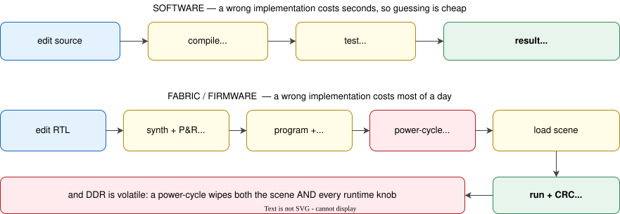
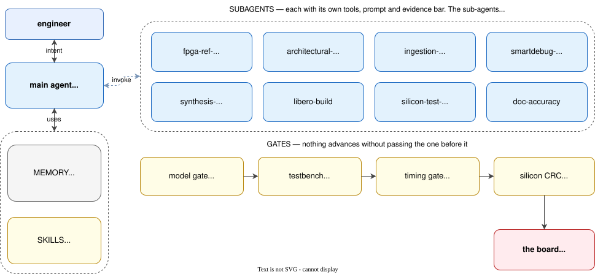
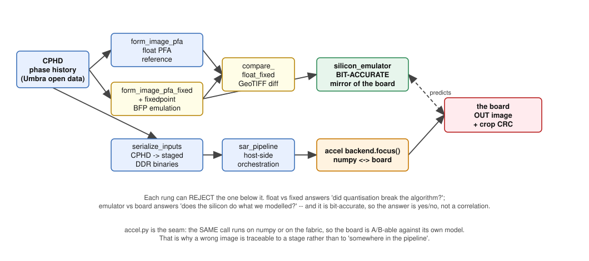
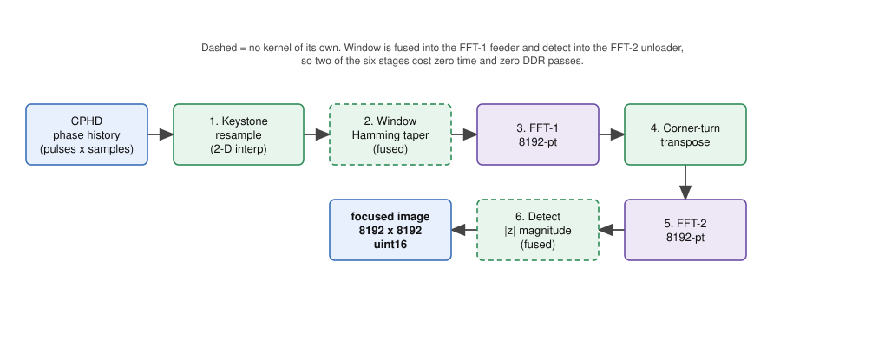
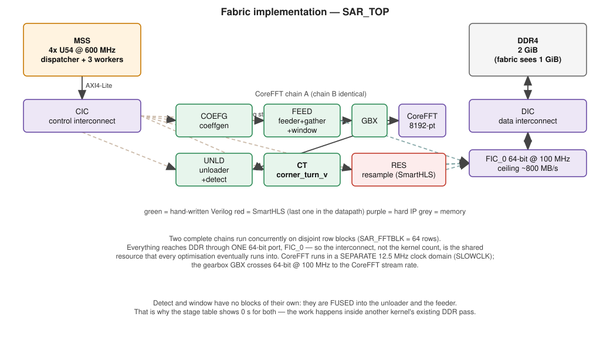
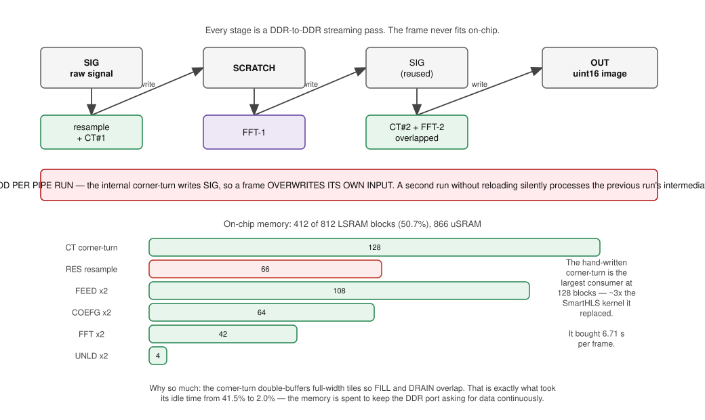
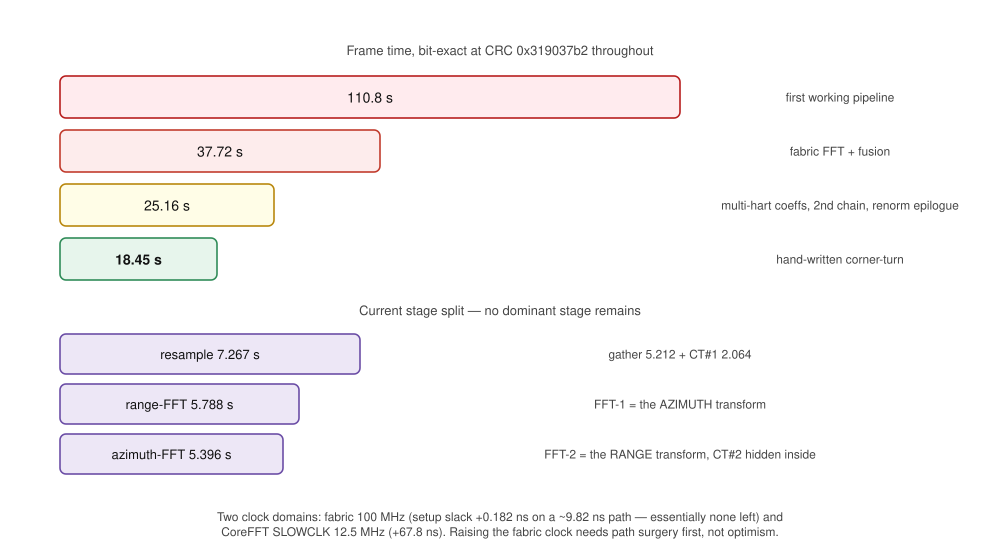

<!-- _class: lead -->

# System-on-Chip & Firmware Development using AI Agents

## Agents, skills and verification gates

**Worked example:** a Synthetic Aperture Radar image-formation processor
on a Microchip PolarFire SoC MPFS250T

28 July 2026</code>

---

## What this deck is

> **Transforming the way we work.** AI tools can be adopted to speed-up the development process by bridging system-side applications / algorithms with fabric / firmware implementations.

**Part 1 — AI-based Approach.** How an AI agent is orchestrated to do FPGA and firmware
work for sophisticated algorithms: what the subagents are for, what the skills and memory do, and why the
verification gates are shaped the way they are.

**Part 2 — On-Chip SAR Processor.** Design and Implementation of SAR image-formation pipeline:
signal processing, fabric implementation, data movement, memory,
timing, and measured result.

---

<!-- _class: part -->

# Part 1: AI Orchestration

Why hardware breaks the usual agent loop, and what to build instead

---

## Software and fabric / firmware are not the same problem

> **Consequence:** the agent has to be **thorough** — referencing design documents and reasoning implementation. Every board iteration must undergo a **board-free verification first, and each iteration must be instrumented to answer multiple questions**.

---

## The orchestration model

---

## Proposed "AI framework" 

A **directory of plain text, version-controlled next to the RTL**. Four kinds of thing, all of which the agent loads on demand:

| ingredient | what it is | count here |
|---|---|---|
| **Agents** | A specialised worker with its own tools, prompt and evidence bar. Returns a conclusion, not a transcript | 8 |
| **Skills** | A named procedure — the exact steps, addresses and gotchas for one recurring job | 26 |
| **Commands** | A shortcut that runs a fixed workflow | 2 |
| **Memory** | Rules (`CLAUDE.md`), runbooks, and durable facts that survive the session | 3 files |

It lives in two places, and the split is deliberate:

- **`ai-framework/`** — packaged as **installable plugins**, layered by how far the knowledge
  travels (method → toolchain → one silicon revision). Reusable on the next project.
- **`.claude/`** — this project's own agents and skills: its scene, its addresses, its history.

**Why bother.** An agent that must be *told* the JTAG hygiene every session will eventually not
be told. And writing a lesson down forces the question *how specific is this actually?* — a design
review in itself. It is all Markdown: a new engineer can open it, disagree, and edit.

---

## Subagents — one per stage of the design flow

Each has its own tools, its own prompt, and its own evidence bar.

| flow stage | agent | what it is for |
|---|---|---|
| **Architecture** | `fpga-ref-verifier` | Check the IP integration against the vendor guide **before** committing to a design |
| **Architecture** | `architectural-critic` | Red-team it — assume every correctness claim is false until the handshake is shown |
| **Logical design** | `synthesis-repair` | Minimal, compilable RTL/firmware fix within stated constraints |
| **Physical design** | `libero-build` | Headless synth → P&R → timing; refuses a bitstream unless setup **and** hold are MET |
| **Bring-up** | `silicon-test-runner` | Drive a JTAG test with the project's hygiene baked in |
| **Bring-up** | `ingestion-triage` | Turn raw JTAG/register hex into a labelled state map |
| **Bring-up** | `smartdebug-planner` | Resolve probe net names from the *programmed* netlist |
| **Documentation** | `doc-accuracy` | Audit docs against source; report only provable drift |

**Verification is not one of the agents — it is a chain of references, and each link can reject
the design.** A float Python model says whether the algorithm is right; a bit-accurate fixed-point
emulator predicts exactly what the silicon should produce; RTL testbenches with mutation batteries
say whether the hardware matches; the timing gate says whether it can run; and a bit-exact checksum
on the board says whether it did. An agent may propose. Only these may accept.
---

## Skills — packaged procedures, layered by how portable they are

A **skill** is a named procedure the agent loads on demand: the exact steps, addresses,
commands and gotchas for one recurring job.
`ai-framework/` splits them by **how far the knowledge travels**, so the reusable part depends on the amount of chip selection overlap.

| layer | what it holds | size | example skill |
|---|---|---|---|
| `generic-fpga-soc` | vendor-agnostic **method** — reference-first design, distrust of HLS output, value-level verification, concurrency critique | 9 skills · 4 agents | `hls-output-distrust`, `kernel-isolation-testing` |
| `microchip-fpga-soc` | **toolchain** — Libero headless flows, SmartHLS authoring, SmartDebug probes, FlashPro6/OpenOCD hygiene | 5 skills · 3 agents | `flashpro6-jtag-recovery`, `smarthls-kernel-authoring` |
| `mpfs250t` | **one silicon revision** — ES engineering-sample errata, MPU disabled, eNVM limits | 1 skill | `mpfs250t-es-errata` |
| `.claude/skills/` | **this project** — its scene, its addresses, its history | 16 skills | `emmc-onboard-pipeline`, `silicon-iso-test` |

The layering is the point: the bottom row is disposable the day the chip changes, and the
top row moves to **any** FPGA project unchanged. Writing a lesson down forces the question
*how specific is this actually?* — which is a design review in itself.

---
## Memory — what survives the session

Skills are what the agent *does*. Memory is what stops it relearning.

- `CLAUDE.md` — behavioural rules, earned the hard way, checked into the repo
- runbooks (`DEV_GUIDE.md`) — proven procedures, each with the exact command and the failure it avoids
- `MEMORY.md` — durable project facts carried across sessions

**Memory is a staging area, not the destination.** Notes land there first because that is the
cheapest place to put them mid-task. They are then **promoted**, periodically and deliberately:

`observation → CLAUDE.md / runbook → skill → agent or command`

A recurring note becomes a skill; a repeated judgement becomes an agent; a fixed sequence becomes
a command. Most notes are never promoted, which is the right outcome.

---

## Commands — from OpenSpecs

This project uses `opsx` — a spec-driven change workflow before touching RTL.

| command | what it does |
|---|---|
| `/opsx:explore` | Think, investigate, clarify. **Explicitly forbidden from implementing** |
| `/opsx:propose` | Create the change: `proposal.md` (what & why), `design.md` (how), `tasks.md` (steps) |
| `/opsx:apply` | Implement the tasks from that change |
| `/opsx:sync` | Merge the change's delta specs into the main specs |
| `/opsx:archive` | Close it out once shipped |

---

## What can be driven headless with Libero SOC

On this toolchain, the whole flow can run directly with Libero, where each stage is exposes as a Tcl `run_tool`. Fully run on command line through `libero.exe SCRIPT:build.tcl`.

| stage | headless invocation |
|---|---|
| Create project, import IP / MSS, register HDL+ cores | `open_project`, `import_mss_component`, `create_hdl_core`, `build_design_hierarchy` |
| Synthesis | `run_tool {SYNTHESIZE}` |
| Compile / netlist | `run_tool {COMPILE}` |
| Place & route | `run_tool {PLACEROUTE}` |
| Static timing | `run_tool {VERIFYTIMING}` → parse the report, **gate on it** |
| Power estimate | `run_tool {VERIFYPOWER}` |
| Bitstream + programming file | `run_tool {GENERATEPROGRAMMINGDATA}`, `{GENERATEPROGRAMMINGFILE}`, `export_prog_job` |
| Program the device | `run_tool {PROGRAMDEVICE}` (FlashPro6) |

The rest is scriptable too: `pfsoc_mss.exe` (MSS config), `shls sw`/`shls hw` (SmartHLS),
`vsim -c` (ModelSim), `mpfsBootmodeProgrammer` (eNVM), OpenOCD + GDB (the board).

---

<!-- _class: part -->

# Part 2: SAR Processor

Signal processing, fabric, memory, timing — and measured result

---

## Why do the SAR processing on a PolarFire SOC

Current approach is for a radar satellite to downlink its **raw phase history data** — enormous (multple GBs) to a ground station for processing. The image, and any decision from it, arrives hours later.

Forming the image **on the spacecraft** changes what can be sent and when:

| | |
|---|---|
| **Shorter sense-to-action** | Detection happens where the data is captured, not a downlink and a ground pass later |
| **Far less to downlink** | A target chip and its coordinates instead of a full raw dataset |
| **Direct to the platform** | The result can go straight to whoever needs it, bypassing the ground station |
| **Capability in a small satellite** | Makes SAR viable on a bus that cannot carry a large processing payload |

 

> This is an enabling step for **automatic target detection with edge AI**. An on-board target classifier needs a focused image to run on, and that image has to be produced within the same power and mass budget.

---

## The SAR processing problem

**Synthetic Aperture Radar** synthesises a large virtual antenna from a moving platform's pulses. The raw data is *phase history*, not an image — forming the image is the compute problem.

| | |
|---|---|
| **Goal** | Turn raw radar pulses into a focused image, entirely on one chip |
| Input | Complex phase history data (CPHD), up to 8192 pulses × 8192 samples |
| Output | 8192 × 8192 focused image, uint16 magnitude |
| Algorithm | Polar Format Algorithm (PFA) |
| Hardware | PolarFire SoC MPFS250T — 4× U54 RISC-V @ 600 MHz + FPGA fabric |
| Data path | 2 GiB DDR4; fabric reaches it through one 64-bit port | 

 

**The real difficulty is not the arithmetic.** It is routing, storing and transposing a
**giant 2-D dataset** inside tight fabric and memory limits: the frame never fits on chip, so every
stage is a DDR-to-DDR streaming pass through a single 64-bit port.

---

## Why this chip

A SAR image former on-board rather than on the ground is a **SWaP-C** problem — size, weight,
power and cost — which is what puts it on a CubeSat, a UAV or a small satellite.

| PolarFire SoC property | why it matters here |
|---|---|
| **Flash configuration**, not SRAM | The bitstream is non-volatile: configuration survives power-off, and flash config cells are inherently immune to single-event upsets — the usual argument for LEO |
| **Low static power** | Measured **436.6 mW static** of 2357.6 mW total (fabric only, vectorless estimate) |
| **Heterogeneous** — 4× RV64GC + fabric | Streaming, regular work on fabric; irregular and control work on the CPUs |
| **784 MACC blocks** | The expected constraint for a DSP pipeline — see below |

**The expected constraint was not the real one.** This design uses **68 of 784 MACC (8.7%)** and
**412 of 812 LSRAM (50.7%)**. It is not arithmetic-bound. Every optimisation that mattered was
about **moving data**: burst shape, DDR read latency, and one 64-bit port shared by every kernel.

> A generic reading of the datasheet would have predicted a multiplier-limited design and budgeted
> effort accordingly. Measurement said otherwise, and measurement won.

---

## What this implementation is

**Polar Format Algorithm**, end to end on one chip:

| stage | where it runs |
|---|---|
| Keystone resample (range gather + transpose) | fabric kernel, coefficients generated on fabric |
| 2-D Hamming taper | fused into the FFT-1 feeder — no separate pass |
| Two 8192-point FFTs, one per axis | CoreFFT hard IP, two chains in parallel |
| Corner-turn between them | hand-written Verilog, double-buffered full-width tiles |
| Magnitude detect | fused into the FFT-2 unloader — no separate pass |

**Scene in, image out, entirely on the board.** The 8192² scene is loaded from the board's own
eMMC, focused in **18.45 s**, and written back as a uint16 image — no host involvement in the
datapath. Orchestration is a bare-metal sequencer on one RISC-V hart, with three more harts doing
the coefficient and renormalisation work in parallel.

Input is **CPHD** — phase history that already carries its motion compensation, which is what the
"C" stands for. The pipeline takes it from there.

---

## Build it in Python first — then move it, stage by stage

The intent was never "write RTL". It was: **get a correct image on a laptop, then push each stage
onto the chip without ever losing the ability to say whether it is still correct.**

That ordering is what makes the hardware tractable. Every fabric kernel has a Python ancestor that
still runs, so a wrong image is a question with an answer — *which stage diverged, and by how many
bits* — rather than a hunt.

---

## Why a ladder and not one model

| model | question it answers |
|---|---|
| `form_image_pfa` (float) | Is the **algorithm** right? Compared against the scene's own reference image |
| `form_image_pfa_fixed` + `fixedpoint` | Does it survive **quantisation** — 16-bit I/Q, block floating point? |
| `compare_float_fixed` | What did fixed point actually **cost**, measured on the output GeoTIFFs |
| `silicon_emulator` | **Bit-accurate.** Predicts the board's output exactly — not approximately |
| `accel.backend.focus()` | The **seam**: same call, numpy or fabric, so the board is A/B-able against its own model |

The bit-accurate rung is the one that earns its keep. Because it is exact rather than correlated, a
mismatch is a **defect with a location**, not a quality judgement — and this project has repeatedly
found that correlation hides real bugs that a bit-level diff exposes immediately.

---

## The signal processing chain

---

## Stage by stage

**1 — Keystone resample.** The polar-sampled phase history is interpolated onto a
rectangular grid. Two 1-D gathers (range, then azimuth) with a transpose between
them. Per output sample: an index and a Q15 interpolation weight.

**2 — Window.** 2-D Hamming taper for sidelobe control. **Separable** — outer
product of two 1-D tapers — so it fuses into the FFT feeder and costs nothing.

**3 & 5 — Two 8192-point FFTs.** One per axis. Block floating point with a
per-row exponent, and a global renormalisation pass afterwards.

**4 — Corner-turn.** A full 8192² transpose, so the second FFT reads rows that
were columns. Pure data movement, and a DDR access-pattern problem.

**6 — Detect.** Magnitude `|z|`, fused into the FFT-2 unloader.

> Two of six stages have **no kernel of their own**. Fusing them removed two
> complete DDR passes.

---

## Fabric implementation

---

## What is in the fabric, and why

**Two complete CoreFFT chains** run concurrently on disjoint row blocks
(64 rows each). Each chain: coefficient generator → feeder (gather + window) →
gearbox → CoreFFT → unloader (+ detect).

**Hand-written Verilog, not high-level synthesis**, for the feeder, unloader,
gearbox, coefficient generator and corner-turn. Not a style preference — the
generated kernels issued half-width bursts and stalled the DDR port.

**One SmartHLS kernel remains** in the datapath (resample). Retiring it is
tracked work.

**Hard IP**: CoreFFT (8192-point, block floating point, 69,790 cycles/row) and
the AXI4 interconnects.

> Everything reaches DDR through **one 64-bit port at 100 MHz** — FIC_0,
> ~800 MB/s ceiling. The shared interconnect, not the kernel count, is what every
> optimisation eventually runs into.

---

## Data movement and on-chip memory

---

## Memory: where 412 LSRAM blocks went

| block | LSRAM | role |
|---|---:|---|
| `CT` corner-turn | **128** | double-buffered full-width tiles |
| `RES` resample | 66 | gather + interpolation (SmartHLS) |
| `FEED` ×2 | 54 each | row buffer + fused window taper |
| `COEFG` ×2 | 32 each | coefficient tables (KC / tan grids) |
| `FFT` ×2 | 21 each | CoreFFT twiddle + butterfly |
| `UNLD` ×2 | 2 each | output skid |

**412 of 812 (50.7%)**, plus 866 µSRAM, 68 MACC, 84,130 4LUT, 62,652 DFF.

The corner-turn is the largest consumer — roughly **3× the kernel it replaced**.
That memory buys double-buffering, so fill and drain overlap and the DDR port
never idles waiting for the kernel.

> Hand-derived LSRAM estimates have been wrong **in both directions three times**
> on this project. The rule is now: run synthesis, read the report.

---

## Timing

---

## Two clock domains, one of them nearly full

| domain | frequency | worst setup slack |
|---|---|---|
| Fabric (`OUT0`) | 100 MHz | **+0.182 ns** on a ~9.82 ns path |
| CoreFFT (`SLOWCLK`) | 12.5 MHz | +67.8 ns |

The fabric domain has **essentially no margin left**. Raising the clock is not a
free optimisation — it needs path surgery first, and would raise power on a design
that is already 81.5% dynamic.

**Power** (first measurement, vectorless SmartPower, fabric only):

| | mW |
|---|---:|
| Total | **2357.6** |
| Static | 436.6 |
| Dynamic | 1921.0 |

Excludes the four U54s, the DDR controller and the PHY.
Vectorless means default toggle rates — trust the build-to-build delta, not the
absolute figure.

---

## Where the time goes — measured, not modelled

FIC_0 bus telemetry, per kernel, on silicon:

| kernel | port active | DDR read-wait | genuine idle | bursts |
|---|---:|---:|---:|---|
| Corner-turn *(before)* | 22.7% | 35.8% | **41.5%** | half-width |
| Corner-turn *(after)* | 26.2% | **71.8%** | **2.0%** | 64-beat avg |
| Range gather | 23.2% | 36.9% | **~40%** | 98.2% at 65–256 |
| FFT-1 row group | 5.2% | 7.3% | **~80%** | — |

Three conclusions, each of which **overturned a plan**:

- Corner-turn idle collapsed 41.5% → 2.0%. It is finished as a kernel problem;
  what remains is DDR latency, with ~3× port headroom unusable behind it.
- The range gather **already issues long bursts** — so rewriting it the way the
  corner-turn was rewritten would buy nothing. Its 40% idle is off-bus.
- FFT-1 is ~80% bus-idle, so its small regression is **not** bus contention.

---

## The result

| | |
|---|---|
| Frame time | **18.45 s** (from 110.8 s) |
| Correctness | **bit-exact** — crop CRC `0x319037b2`, from a cold start |
| Correlation vs golden | 0.9923 (speckle-limited at full single-look resolution) |
| Timing | MET multi-corner, setup **and** hold |
| Scene load | 81 s from the board's own eMMC (was ~3 h over JTAG) |

**Thirteen individually-measured optimisation steps**, every one silicon-validated
with the CRC unchanged.

The largest single win — the hand-written corner-turn — was **−6.71 s (−26.7%)**,
and its first build was bit-*wrong* on silicon while passing synthesis, place &
route, setup and hold, and a 3-case testbench.

---

## What is left

Ranked by **measurement**, after the bus telemetry re-ordered the list:

| lever | est. payoff | basis |
|---|---:|---|
| Pass-1 fabric coefficient generator | ~2 s | measured: ~40% of a 5.2 s stage is idle |
| Range-FFT regression | ~0.4 s | measured, 3.5× the run-to-run spread |
| Corner-turn prefetch depth | unknown | 71.8% read-wait, ~3× port headroom |
| `resample_v.v` | small alone | bursts already long — no burst defect |
| CT#1 / FFT-1 overlap | ≤2 s | needs a third buffer the address map blocks |

**Two entries were demoted and one promoted** by four minutes of on-board
measurement. Before it, the ranking was backwards.

Realistic ceiling: **11–13 s**, not single digits. The three stages are now within
1.9 s of each other — no single change can repeat a 26% cut.

---

<!-- _class: lead -->

# What generalises

---

## Five things worth taking away

**1. Design the loop around the cost of being wrong.** Where a mistake costs
50 minutes, the agent's job is to be *cheap to disprove*, not fast to answer.

**2. Gates, not confidence.** Every claim passes a mechanism that can reject it.
Mutation-test the gates themselves, or they quietly become decoration.

**3. Measure before optimising.** Bus telemetry demoted two planned optimisations
and promoted a third. The intuition — "rewrite it like the last one" — was wrong,
and analogy is exactly what an LLM is best at and most misled by.

**4. Write it down the same session.** Runbooks and rules in the repo, not in the
conversation. The context window is not memory.

**5. Report faithfully.** Three failed hypotheses, an out-of-bounds write, a
measurement that answered the wrong question — all recorded. The value of the
record is that it contains the failures.

---

<!-- _class: lead -->

# Appendix

Figures are editable — open any
<code>docs/slides/diagrams/*.drawio.svg</code> in draw.io and it is shapes, not a
picture. Regenerate with <code>python docs/slides/make_diagrams.py</code>.

**Source documents**
`docs/ARCHITECTURE.md` — as-built contract, register maps, buffer map
`docs/SAR_IMPLEMENTATION_RECORD.md` — the measured optimisation history
`docs/fpga/DEV_GUIDE.md` — build/debug runbook and methodology lessons
`docs/USER_GUIDE.md` — clone-to-board operating procedure
