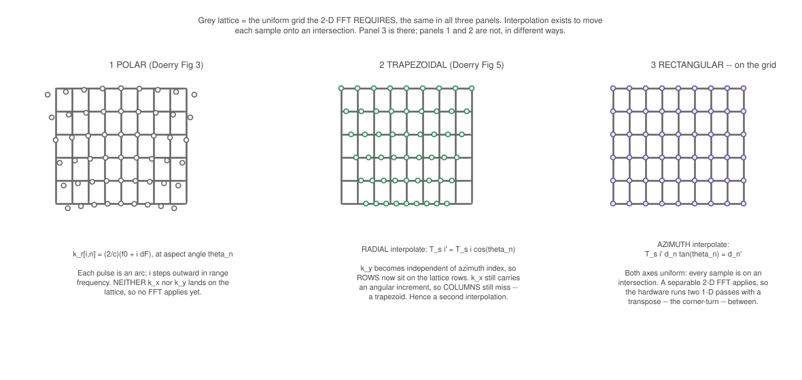
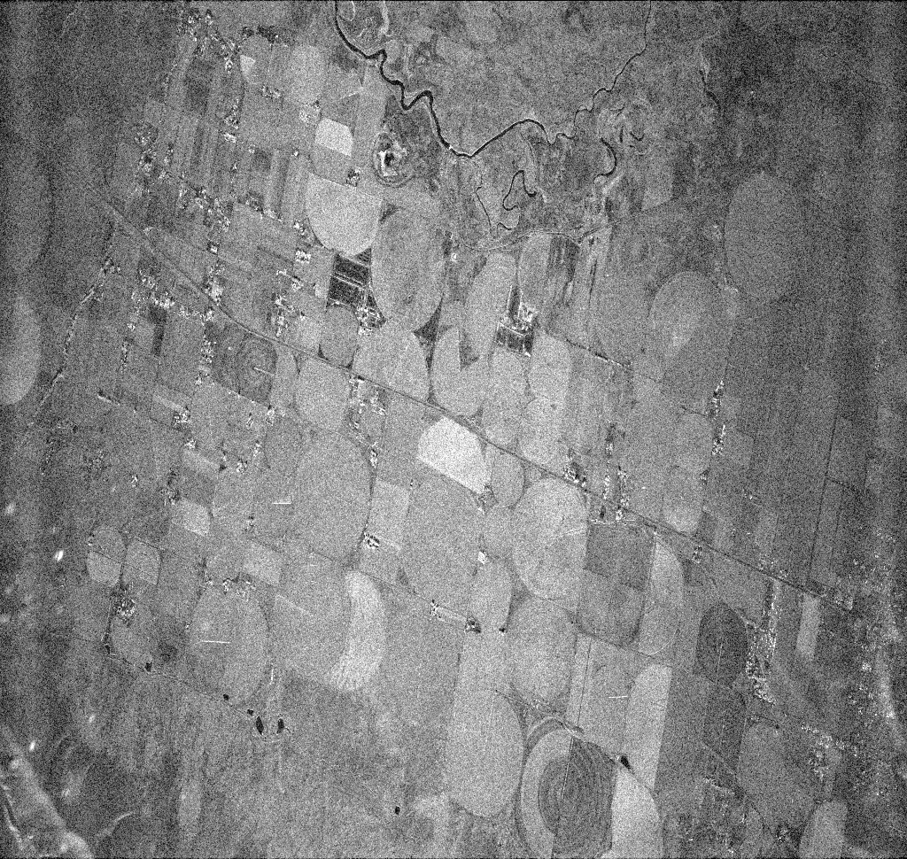
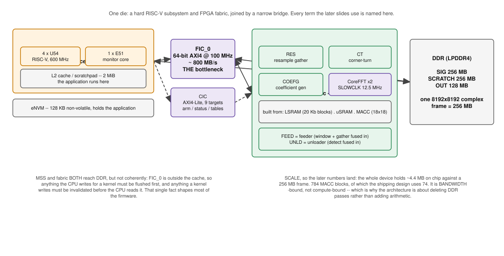
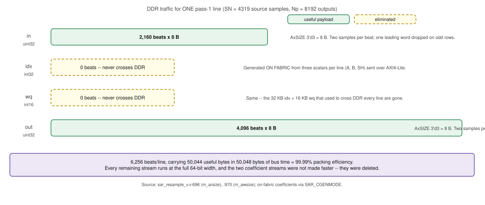
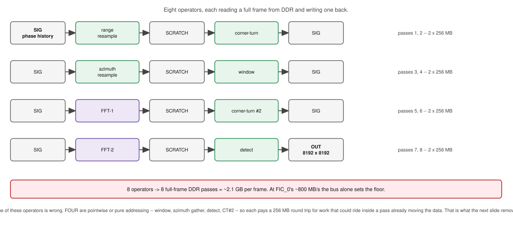

# A SAR Image-Formation Processor on PolarFire SoC

From CPHD phase history to a detected image, on an MPFS250T

**Part 1** — the problem
**Part 2** — the mathematics, stage by stage
**Part 3** — how it maps onto fabric

---
# Part 1 — Problem statement

Take **CPHD phase-history data** and produce a **detected image**, on one MPFS250T.

| requirement | target |
|---|---|
| Input | complex phase history, **≤ 8192 × 8192** samples — **int16 I + int16 Q**, 4 B/sample (256 MB) |
| Output | detected magnitude, **8192 × 8192** — **uint16**, 2 B/pixel (128 MB) |
| Internal | int16 complex throughout, **block floating point** across the FFTs |
| Wall-clock | **≤ 15 s** per frame |
| Chip resources | minimise power and area |
| Interpolation | **baseline: linear** · **variant: 32-tap sinc** |

- Two interpolation variants: 
  - linear kernel provides a low resource implementation 
  - sinc kernel for higher image quality at expense of more fabric resources

---
# Part 2 — The Python reference pipeline

<br>


<br>

`src/form_image_pfa.py` — python implementation of the **Polar Format Algorithm (PFA)**.

---
# PFA geometry — polar in, rectangular out



---

# Broad description of the polar format

**$(k_x,k_y)$ is the spatial-frequency plane** — the Fourier domain of the ground scene, in cycles
per metre. A pulse at aspect angle $\phi_i$ measuring radial frequency $k$ contributes one sample at

$$k_y = k\cos\phi_i \quad\text{(along the mean look direction)},\qquad
  k_x = k\sin\phi_i \quad\text{(across it)}$$

so a single pulse traces a **radial spoke** at angle $\phi_i$ — hence *polar* format. 

The 2-D FFT that forms the image requires samples on a **rectangular** $(k_x,k_y)$ lattice. 

Middle panel — **pass 1** resamples every pulse onto the common grid $K_R$. Since $p_r[i]=\cos\phi_i$
projects onto the mean look direction, $k_r$ *is* the $k_y$ component, so this makes $k_y$ uniform.
$k_x$ still carries an angular increment, leaving a **trapezoid**.

Right panel — **pass 2** resamples along the pulse axis onto $K_C$, making $k_x$ uniform too.

---

# ① Range resample — keystone, fast-time

Each pulse $i$ samples the range-frequency axis on **its own grid** — uniform in $j$, but with an
origin and a spacing unlike any other pulse's, and unlike the common output grid $K_R$. What varies
pulse to pulse is the **look angle**: $p_r[i]=\cos\phi_i$ projects the frequency ramp onto the mean
look direction, so a pulse seen further off boresight lands its samples closer together.

$$k_r[i,j] \;=\; p_r[i]\,\bigl(f_0[i] + j\,\Delta f[i]\bigr) \;=\; x_{0,i} + j\,\Delta x_i$$

| symbol | implementation | meaning |
|---|---|---|
| $f_0[i]$ | `freq[i,0]` | first RF frequency of pulse $i$ |
| $\Delta f[i]$ | `freq[i,1] - freq[i,0]` | step per sample — the ramp is linear, so one difference defines it |
| $p_r[i]$ | `ax[i]*(dx/dn) + ay[i]*(dy/dn)` | $\hat a_i\cdot\hat d=\cos\phi_i$ — projection on the **mean** look direction $\hat d=(dx,dy)/dn$. (`dx,dy` are that mean vector; nothing to do with $\Delta x_i$). $p_r[i]$ is what makes $k_r$ the $k_y$ component, which is why pass ① lines the rows up. |
| $x_{0,i}$ | `a*f0[i]`, with `a = 2*pr[i]/c` | this pulse's grid origin |
| $\Delta x_i$ | `a*df[i]` | its spacing — the value ① divides by |

---

# Finding the resampling indices $(k,\mu)$

Both resample passes seek to finds the data value at output location $q$. The difference is only in how $(k,\mu)$ is obtained, where $k$ is the integer sample, $\mu$ is the fractional value.

<div style="display:flex;gap:1.6em">
<div style="flex:1">

**① Range — closed form**

Source grid is uniform in $j$, so invert it directly:

$$t=\frac{K_R[q]-x_{0,i}}{\Delta x_i},\quad k=\lfloor t\rfloor,\quad \mu=t-k$$

Computationally, it consists of one subtract, one multiply by a precomputed $1/\Delta x_i$, and one floor operation.

---

# ② Azimuth resample - across pulses

Source abscissa is $\tau=\tan\phi$ sorted: **not uniform**. Along range bin $r$ a sample sits at $K_R[r]\,\tau[m]$, so solving $K_C[q]=K_R[r]\tan\phi$ gives

$$u=\frac{K_C[q]}{K_R[r]},\quad k=\max\{m:\tau[m]\le u\},\quad \mu=\frac{u-\tau[k]}{\tau[k+1]-\tau[k]}$$

$u$ is the target expressed as a *tangent*, which lets the search run against $\tau$ directly.

</div>
</div>

$\tau$ is **row-invariant** — one table for all 8192 rows. Searching in $k_x$ units instead would mean rescaling it 8192 times. And because both $\tau$ and $K_C$ are sorted, the search is a merge scan, not a binary search:

```c
while (k+2 < M && tau[k+1] <= u) k++;   /* one pointer, never retreats: O(M+Mp) per row */
```

---

# Common interpolation kernel across both resample passes

The output value from the resample operation can be either:

$$\text{out}[q]=(1-\mu)\,\text{in}[k]+\mu\,\text{in}[k{+}1]
\qquad\qquad
\text{out}[q]=\sum_{n=0}^{31}c_n(\mu)\,\text{in}[k{-}15{+}n]$$

<div style="font-size:0.85em">

2-tap baseline (left) and the 32-tap polyphase sinc (right), taps spanning $k{-}15\ldots k{+}16$ so
tap $n$ sits at offset $n-15-\mu$, DC-normalised: 

$$c_n(\mu)=\operatorname{sinc}(n-15-\mu)\big/\sum_m \operatorname{sinc}(m-15-\mu)$$

Only $(k,\mu)$ is derived differently — so an interpolator kernel is applicable to both passes.

</div>

---

# ③ Window · ④ FFT · ⑤ Detect

**Window** — separable Hamming, suppressing sidelobes from the finite aperture:

$$w[r,c] = w_r[r]\,w_c[c],\qquad w[n] = 0.54 - 0.46\cos\!\left(\tfrac{2\pi n}{N-1}\right)$$

**FFT** — a 2-D transform takes rectangular $k$-space to the image. It is separable, which is
the entire reason the hardware can do it in two 1-D passes with a transpose between:

$$I[y,x] = \sum_{r}\sum_{c} S[r,c]\;e^{-2\pi i (ry/N_p + cx/M_p)}$$

$S[r,c]$ is the **windowed, rectangular $k$-space array** produced by stages ①–③: row $r$ is a
range-frequency bin, column $c$ a cross-range (Doppler) bin, each entry a complex int16 sample.
It is what the polar-to-rectangular resampling exists to construct — the FFT is only valid on a
*uniformly* sampled grid, which the raw phase history is not.

**Detect** — discard phase, keep brightness: 
$$\text{OUT}[y,x] = \sqrt{\Re^2 + \Im^2}$$

---

# Python pseudo code

```python
# ---- HOST ONLY: ingest + geometry (never on the board) -------------------
reader  = open_phase_history(cphd)             # CF8 complex phase history
tables  = prepare_tables(reader, meta)         # f0, df, pr, tan_phi, KR, KC, window
sig     = reader.read_chip(...)                # 5634 x 4319 complex64
sig_i16 = quantise(sig)                        # -> int16 I/Q, the board's SIG buffer

# ---- MIRRORS THE BOARD, op for op (silicon_emulator.py) ------------------
for i in range(M):                             # PASS 1  range, per pulse
    kr        = (2*pr[i]/c) * (f0[i] + arange(N)*df[i])
    idx, wq   = interp_coeffs(KR, kr)          # closed form: uniform source grid
    scratch[order[i]] = gather(sig_i16[i], idx, wq)     # 2-tap lerp or 32-tap sinc

sig_t = scratch.T                              # corner-turn

for j in range(Np):                            # PASS 2  azimuth, per range bin
    src      = KR[j] * tan_s                   # NON-uniform abscissa
    idx, wq  = interp_coeffs(KC, src)          # merge scan, not a division
    g2[j]    = gather(sig_t[j], idx, wq)

g2w    = window_fixed(g2)                      # separable Hamming, Q15
yr, er = fft_pass_bfp(g2w)                     # FFT-1 + block-floating-point renorm
ya, ea = fft_pass_bfp(yr.T)                    # corner-turn, FFT-2
img    = detect_fixed(ya.T)                    # |z| -> uint16   OUT
```

<!-- name of actual python files -->

---
# Python processing stages

| stage | where it runs today |
|---|---|
| CPHD read, geometry tables, int16 quantise | **host only** — the board is handed `SIG` + small tables |
| both gathers, window, FFTs, corner-turns, detect | **emulates the board**, bit-accurate |
| `interp_coeffs` | **both** — on silicon this is `sar_coeffgen` in fabric |

The middle block is a **bit-accurate mirror** of the FPGA design: same int16 truncation, same Q15 weights, same block-floating-point exponents. This serves as a reference to validate the board implementation.

---
# Verification

The metric that matters is a **value-level diff against a reference running the same arithmetic**.
Correlation against a *different* implementation cannot separate "wrong" from "different".

```python
# 1. board-free: RTL vs a pure-integer model of the same datapath
gen_*_vectors.py  ->  tb_*.v          # ModelSim: 0 mismatching beats or FAIL
check_coeffgen_fixed.py               # model byte-identical to the C, both source orders

# 2. is the bench even testing the shipped module?
check_tb_params.py                    # bench params == what synthesis builds, or FAIL

# 3. non-vacuity: does the test actually exercise the path?
for mutation in [...]: assert bench_fails(mutation)

# 4. silicon: same interpolator on both sides
board = EROI(crop)                    # dump from OUT over JTAG
py    = silicon_emulator(cphd, range_sinc=..., az_sinc=...)
align = solve_orientation(board, py)  # board[i,j] = py.T[(-i)%N, (-j)%N]
assert corr(board, py[align]) high AND diagonal beats off-diagonal
```

---
# **Four traps this exists to catch**, each of which has actually happened here:

| trap | what it looked like | caught by |
|---|---|---|
| bench on the wrong parameters | 16/16 cases pass, silicon image wrong | `check_tb_params.py` |
| vacuous test | mutation changes nothing | mutation sweep |
| orientation mismatch | corr 0.005 — reads as "broken" | calibrate on a known-good pair first |
| reference mismatch | 32-tap scored against a 2-tap golden | run the model with the *same* kernel |
<!-- I think this slide should be about the 16 cases-->
---
# Reference data — Centerfield, Utah

<div style="font-size:0.82em">

| the dataset | |
|---|---|
| source | Umbra open data, `s3://umbra-open-data-catalog/sar-data/tasks/` |
| task / collect | **Centerfield, Utah** — `2023-10-10-16-57-44_UMBRA-04` |
| task UUID | `c0dbd830-e863-42c5-97d0-2cfd291bcb2a` |
| file | `..._CPHD.cphd`, 188 MB, CF8 complex phase history |

| input | | output | |
|---|---|---|---|
| pulses × samples | 5,634 × 4,319 | grid | 8192 × 8192 uint16 |
| bandwidth | 113.6 MHz | size | 134 MB |
| sample spacing | 26.3 kHz | resolution | 1.41 m rg × 1.73 m cr |
| | | pixel spacing | 0.74 m rg × 1.19 m cr |
| | | scene extent | 6.1 km × 9.7 km |

</div>

Resolution is $1/\text{k-space span}$; pixel spacing is $1/(N\cdot\Delta k)$ — the grid is **oversampled ~1.9×** relative to resolution, which is why the image is not aliased.

---
# Image formed from python processing



---
# Part 3 — MPFS250T Architecture and Resources



Every fabric operator reaches DDR through the FIC_0 port.

---
# Resource constraints on the MPFS250T

A 8192 × 8192 complex frame is **256 MB** at 4 B/sample. The whole device does not have enough memory to process fully on chip:

| on-chip memory | MPFS250T |
|---|---|
| LSRAM | 812 × 20 Kb = **~2.0 MB** |
| µSRAM | 2,352 × 768 b = **~0.2 MB** |
| MSS L2 (as scratchpad) | **2 MiB** |
| **Total** | **~4.4 MB — about 1/58th of one frame** |

No processing stage can be held on chip, and every stage needs to stream through DDR. This constraint drives the whole processing architecture:
- the design is **bandwidth-bound, not compute-bound**
- the fabric↔DDR port (FIC_0, 64-bit @ 100 MHz ≈ **800 MB/s**) is the scarce resource
- **every DDR round-trip costs more than any arithmetic optimisation**

The engineering approach is therefore *fewer passes over the data*, not only fast computations.

---
# DDR memory allocation


---
# DDR memory map concept

SIG and SCRATCH are 256 MB as the complex data is 4 B/sample. `OUT` is half the size of the others because the detected image is **uint16**, 2 B/px, plus a small geometry/telemetry block .  

| buffer | address | size | role |
|---|---|---|---|
| `SIG` | `0x8800_0000` | 256 MB | phase history in, then ping-pong |
| `SCRATCH` | `0x9800_0000` | 256 MB | resample out, then FFT ping-pong |
| `OUT` | `0xA800_0000` | 128 MB | detected image, 2 B/px |
| geometry | `0xB000_0000`+ | ~1 MB | `f0`, `df`, `pr`, `tan_s`, `KR`, `KC`, `invorder` |
| knobs / telemetry | `0xB005_9xxx` | words | runtime mode + per-stage timing |

**Buffers are 256 MB apart on purpose.** An in-place FFT stalls: the DMA is still flushing transform *t* while the feeder pulls *t+1* over the shared interconnect, CoreFFT drops `BUF_READY` and the pipeline locks. Ping-ponging `SCRATCH`↔`SIG` keeps read and write on  **separate 256 MB pages** — validated on silicon after an in-place build hung at transform 1.

---
# Fabric-to-DDR routing


---
# Optimisation 1 — maximise AXI beat packing



> The two streams — `in` and `out` — both run at the full 64-bit width or 8 B/beat > at 99.99 % packing efficiency.

---
# CoreFFT streaming chain


`feeder → gearbox → CoreFFT → unloader`, crossing from the 100 MHz fabric domain into CoreFFT's
12.5 MHz `SLOWCLK`. The feeder is where the azimuth gather and the window are fused in; the
unloader is where detect is fused. Two such chains run in parallel, splitting rows.

---
# Dataflow — the unfused pipeline




---
# Optimisation 2 — fusing operator stages

Write the pipeline as a composition of operators on the $8192^2$ array:

$$I \;=\; D\,\circ\,F_2\,\circ\,T\,\circ\,F_1\,\circ\,W\,\circ\,G_{az}\,\circ\,T\,\circ\,G_{rg}\;(S)$$

If done naively, **every operator is one pass over 256 MB** — eight passes, and at FIC_0's ~800 MB/s. Each pass costs at least 0.6 s of data transfer. The design approach is to **fuse** any operator into a neighbouring streaming pass iff it is local in the streaming index.

| operator | form | local? |
|---|---|---|
| $W$ window | diagonal: $(Ws)[n]=w[n]s[n]$ | yes — pointwise |
| $G$ **gather** — the resample's inner op | $(Gs)[q]=\sum_{t}c_t\,s[k_q+t]$, $t$ finite | yes — finite support. Note: *Resample* is the intent — put the samples on a new grid; *gather* names the operation the fabric performs — an indexed read of a few neighbouring samples plus a weighted blend, $2$ taps for the linear kernel, $32$ for sinc. |
| $D$ detect | $(Dz)[n]=\lvert z[n]\rvert$ | yes — pointwise |
| $F$ FFT | every output depends on **all** inputs | **no** — needs its own pass |
| $T$ transpose | output $(r,c)$ from input $(c,r)$ | **no** — the access pattern *is* the cost |

---
# Dataflow after fusing operators


---
# Stage fusion — mathematical equivalent

Four stages have **no independent pass** over DDR. Each fusion is justified by an algebraic
identity, not by convenience:

| fusion | the identity that makes it exact |
|---|---|
| **window → FFT-1 feeder** | $F_1(Ws)$ with $W$ diagonal. The feeder emits $w[n]s[n]$ as it reads $s[n]$: a diagonal operator commutes with the read order, so no reordering and no second pass. |
| **azimuth gather → FFT-1 feeder** | $F_1(G_{az}s)$. The feeder is already an *addressing* engine; $G$ only changes **which** index it presents and adds a finite-tap blend. Support is $O(1)$ per output. |
| **detect → FFT-2 unloader** | $D$ is pointwise on $F_2$'s output, so $\lvert z\rvert$ is computed as samples drain. Reading 256 MB back merely to square-and-add would be pure waste. |
| **corner-turn #2 ∥ FFT-2** | $F_2=\bigoplus_r F_2^{(r)}$ — rows are **independent**, so strip $s$ may be transposed while strip $s-1$ transforms. Overlap, not elimination. |

By fusing, the 8 conceptual stages become 5 full-frame DDR passes, and four of them — window, azimuth gather, detect, CT#2 — does not incur extra DDR traffic. Only the two FFTs and the two transposes, the operators that are *not* local, still need passes of their own.

---
# Optimisation 3 — coefficient generation on fabric

Per line the 2-tap gather needs $(k,\mu)$ for all 8192 outputs — **32 KB `idx` + 16 KB `wq`**.
Computing that on the MSS and publishing it to DDR cost more than the gather itself: bus telemetry showed **~40 %** of the range gather was the port sitting *idle*, waiting on CPU coefficients.

Because the range grid is uniform, $(k,\mu)$ is closed-form in fixed point:

$$v \;=\; \bigl((Q[q]\cdot A) \gg S\bigr) + B,\qquad k \;=\; v \gg 24,\qquad \mu \;=\; v[23{:}9]$$
with $A \approx 2^{S}/\Delta x$ and $B \approx -x_0/\Delta x$ — **three scalars per line**, not 8192 coefficients. The CPU writes 3 registers; the fabric generates the rest.

---
# Resource utilisation and timing closure

| resource | used | device | % | note |
|---|---|---|---|---|
| 4LUT | 136,595 | 254,196 | 54 % | |
| DFF | 93,678 | 254,196 | 37 % | |
| **LSRAM** | **537** | **812** | **66 %** | line buffers, FFT ping-pong, 2×32 sinc banks |
| uSRAM | 1,620 | 2,352 | 69 % | polyphase coefficient tables |
| **MACC** | **266** | **784** | **34 %** | still *not* compute-bound |
| User I/O | 11 | 144 | 8 % | |
| Chip power | 2.726 W | | | 438 mW static / 2288 mW dynamic (vectorless) |

| clock domain | period | setup slack | verdict |
|---|---|---|---|
| **fabric 100 MHz** | 10.000 ns | **+0.924 ns** | multi-corner `VIOLRPT` clean |
| CoreFFT 12.5 MHz | 80.000 ns | +68.413 ns | clean |

**Both 32-tap sinc kernels fit at 100 MHz with 9.2 % margin** — more headroom than the original
2-tap baseline had (+0.255 ns, 2.6 %).

Getting there needed one structural change. With both kernels present, `COEFG`'s fp32 multiplier
became the critical path — it had been marginal since long before the sinc work, and the extra
fabric simply consumed the headroom hiding it. Adding a third pipeline stage (splitting the
round-add off the 48-bit normalise mux) moved the worst slack from 0.000 to **+0.924 ns**.

The interpolators were never on a timing path. Cost of the fix: +12 k 4LUT, +6.8 k DFF, +64 MACC —
and closure that no longer depends on the layout seed: all three seeds return +0.819 / +0.924 /
+0.700, so the *worst* placement still clears by 7 %.

---
# Pipeline timing — where the 14.17 s goes

Measured on Centerfield (5,634 × 4,319 → 8192 grid), both 32-tap sinc interpolators armed.

| stage | time | share | limited by |
|---|---|---|---|
| Resample — range gather | **1.67 s** | 12 % | DDR read latency |
| Resample — corner-turn #1 | **2.06 s** | 15 % | global transpose, not parallelisable |
| FFT-1 (+ azimuth gather, window) | **4.65 s** | 33 % | CoreFFT `SLOWCLK` |
| FFT-2 (+ detect, CT#2 overlapped) | **5.78 s** | 41 % | CoreFFT `SLOWCLK` |
| Window, azimuth gather, detect, CT#2 | **0 s** | — | fused / overlapped |
| **Total** | **14.17 s** | | **within the 15 s budget** |

The FFTs are **74 %** of the frame and their domain has 85 % timing margin, so the CoreFFT clock —
not the resample — remains the clearest lever.

**Both sincs are faster than the 2-tap baseline was** (14.95 s), which was not the expected trade.
The 0.78 s came from a memory-map fix, not the interpolator: a coefficient table had been mapped
across `SAR_CWRK`, the multi-hart coefficient-worker region that paces FFT-1.

---
# Correctness — how the fabric build is trusted

Fusion and fixed point both change the arithmetic, so *matching the Python* has to be proven,
not assumed:

- **Value-level, not correlation.** Correlation is scale-, phase- and orientation-invariant; it
  passes on a conjugated or bin-reversed FFT. Stages are compared **sample by sample** against a
  bit-accurate model.
- **Bit-exact anchor.** The linear build reproduces a fixed crop CRC from a cold start.
- **Stage isolation.** Any stage can be halted and its DDR buffer dumped for a value diff —
  pass 1 measured **99.19 % exact** against the model on silicon.

---
# Interpolation variant — 32-tap sinc

The 2-tap kernel is cheap but lossy where this data lives (≈ 97.8 % of Nyquist):

| kernel | scalloping @ 0.978 Nyq | complex error |
|---|---|---|
| **2-tap linear** (baseline) | **29.2 dB** | −4.0 dB |
| **32-tap sinc** (variant) | **3.5 dB** | −13.6 dB |

**Scalloping** is peak-to-peak gain variation with sub-sample position: at $\mu=0.5$ the 2-tap
gain collapses to $|\cos(\pi f/2)|\!\to\!0.034$, so a scatterer's brightness depends on where it
lands *between* samples by up to 29 dB.

Cost: 32 banks (mod-32 banking makes each bank hit exactly once → single-port), 64 MACs/stage,
a 5-level pipelined adder tree. **Resources fit; timing is the risk** at 2.6 % slack.

---
# Realised bandwidth — the bus is *not* the limit any more

FIC_0 is 64-bit @ 100 MHz ≈ **800 MB/s**. Bytes actually moved per frame, against measured stage time:

| arrow | MB | s | MB/s | % of FIC_0 |
|---|---|---|---|---|
| range gather `SIG → SCRATCH` | 281.9 | 1.675 | 168.4 | 21 % |
| corner-turn #1 `SCRATCH → SIG` | 536.9 | 2.064 | **260.1** | **33 %** |
| FFT-1 (+ gather, window) | 536.9 | 4.646 | 115.6 | 14 % |
| CT#2 + FFT-2 (+ detect) | 939.5 | 5.781 | 162.5 | 20 % |
| **whole frame** | **2,295** | **14.17** | **162.0** | **20 %** |

Nothing exceeds a third of the bus. Deleting DDR passes worked so well that **the bottleneck moved**:
FFT-1's 4.65 s sits within 0.3 % of the CoreFFT `SLOWCLK` transform floor, so the design is now
transform-clock bound, not bandwidth bound. The busiest arrow is the corner-turn — the one operator
that is neither fusable nor local.

---
# Summary

| | |
|---|---|
| **Problem** | CPHD → detected 8192×8192 image, ≤ 15 s, minimum silicon |
| **Approach** | PFA; delete DDR passes rather than accelerate arithmetic |
| **Key moves** | fuse window/gather/detect into the FFT feeders and unloader; overlap CT#2 with FFT-2; generate coefficients on fabric from 3 scalars per line |
| **Achieved** | **14.17 s**, **2.73 W**, timing MET **+0.924 ns**, 266/784 MACC, 537/812 LSRAM |
| **Interpolation** | 32-tap polyphase sinc in **both** resample passes — scalloping 29.2 dB → 3.5 dB |
| **Verified** | each arm matches a Python reference running the *same* interpolator; bench gated against silicon parameters |

The budget was met by **moving less data**, not by computing faster — the frame now runs at 20 % of
the available bus bandwidth and is limited by the 12.5 MHz transform clock.
