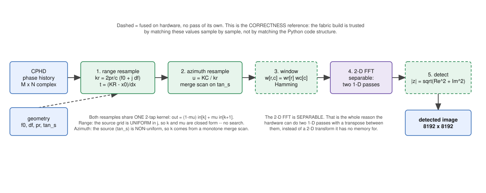
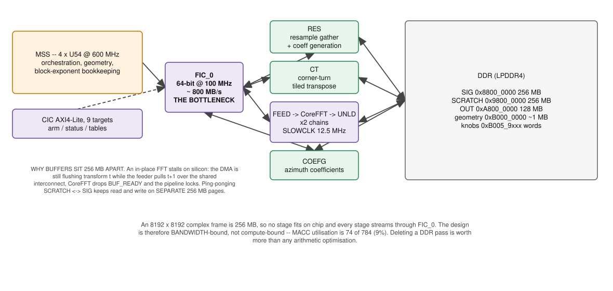
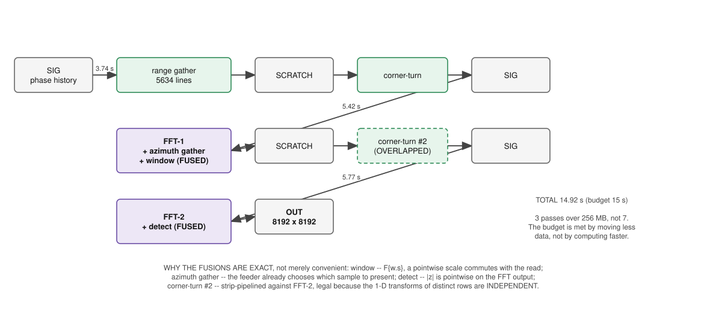

# A SAR Image-Formation Processor on PolarFire SoC

From CPHD phase history to a detected image, on an MPFS250T

**Part 1** — the problem
**Part 2** — the mathematics, stage by stage
**Part 3** — how it maps onto fabric

---

# Part 1 — Problem statement

Take **CPHD phase-history data** and produce a **detected image**, on one MPFS250T.

| requirement | target |
|---|---|
| Input | complex phase history, **≤ 8192 × 8192** samples |
| Output | detected magnitude image, **8192 × 8192** |
| Wall-clock | **≤ 15 s** per frame |
| Chip resources | minimise power and area |
| Interpolation | **baseline: linear** · **variant: 32-tap sinc** |

The two interpolation variants are a deliberate pair: the linear build establishes a correct,
cheap reference, and the sinc build buys image quality at a known cost in silicon.

---

# Why the resource constraint bites

An 8192 × 8192 complex frame is **256 MB** at 4 B/sample. The MPFS250T has no on-chip memory
remotely that large, so *every* stage streams through DDR.

That single fact drives the whole architecture:

- the design is **bandwidth-bound, not compute-bound**
- the fabric↔DDR port (FIC_0, 64-bit @ 100 MHz ≈ **800 MB/s**) is the scarce resource
- **every DDR round-trip you can delete is worth more than any arithmetic optimisation**

The engineering goal is therefore *fewer passes over the data*, not faster maths.

---

# Part 2 — The Python reference pipeline



`src/form_image_pfa.py` — the **Polar Format Algorithm** (PFA), the correctness reference for
everything that follows.

```
CPHD ─► geometry ─► ① range resample ─► ② azimuth resample
                          (per pulse)        (per range bin)
     ─► ③ 2-D window ─► ④ 2-D FFT ─► ⑤ detect ─► image
```

Each stage below is stated as the mathematics first, because the fabric implementation is
justified by matching it — not by matching the Python line by line.

---

# ① Range resample — keystone, fast-time

Each pulse *i* samples the range-frequency axis on its **own non-uniform grid**, because the
sensor's range to scene centre changes pulse to pulse:

$$k_r[i,j] \;=\; \frac{2\,p_r[i]}{c}\,\bigl(f_0[i] + j\,\Delta f[i]\bigr) \;=\; x_{0,i} + j\,\Delta x_i$$

with $p_r[i]$ the radial unit-projection, $f_0$ the start RF frequency and $\Delta f$ the
frequency step. Resample each pulse onto the **common** grid $K_R[q]$:

$$t = \frac{K_R[q] - x_{0,i}}{\Delta x_i},\qquad k=\lfloor t \rfloor,\qquad \mu = t-k$$
$$\text{out}[q] = (1-\mu)\,\text{in}[k] + \mu\,\text{in}[k{+}1]$$

**The grid is uniform in $j$**, so no search is needed — $k$ and $\mu$ are closed-form. That is
what later makes on-fabric coefficient generation possible.

---

# ② Azimuth resample — keystone, slow-time

After a transpose, each range bin is resampled along the pulse axis onto a uniform
cross-range grid $K_C$, using $\tan\phi$ (the sorted aspect angle) as the source abscissa:

$$u = \frac{K_C[q]}{k_r},\qquad k = \max\{\,m : \tan\phi_s[m] \le u\,\},\qquad
\mu = \frac{u - \tan\phi_s[k]}{\tan\phi_s[k{+}1]-\tan\phi_s[k]}$$

Same 2-tap kernel as ①. The difference is structural: the source abscissa is **non-uniform**, so
$k$ comes from a **monotone merge scan** rather than a division — one pointer walking forward as
$q$ advances, $O(M+M_p)$ for the whole line rather than $O(M_p \log M)$.

Together ① and ② map the polar-sampled phase history onto a **rectangular** $k$-space grid.

---

# ③ Window · ④ FFT · ⑤ Detect

**Window** — separable Hamming, suppressing sidelobes from the finite aperture:

$$w[r,c] = w_r[r]\,w_c[c],\qquad w[n] = 0.54 - 0.46\cos\!\left(\tfrac{2\pi n}{N-1}\right)$$

**FFT** — a 2-D transform takes rectangular $k$-space to the image. It is separable, which is
the entire reason the hardware can do it in two 1-D passes with a transpose between:

$$I[y,x] = \sum_{r}\sum_{c} S[r,c]\;e^{-2\pi i (ry/N_p + cx/M_p)}$$

**Detect** — discard phase, keep brightness:

$$\text{OUT}[y,x] = \sqrt{\Re^2 + \Im^2}$$

---

# Part 3 — Mapping onto MPFS250T fabric



Two compute domains, one narrow bridge:

| | |
|---|---|
| **MSS** | 4× U54 @ 600 MHz — orchestration, geometry, block-exponent bookkeeping |
| **Fabric** | resample · corner-turn · CoreFFT ×2 chains · coefficient generator |
| **Bridge** | **FIC_0**, 64-bit @ 100 MHz — *the* bottleneck, ~800 MB/s |
| **Control** | CIC, 9 AXI4-Lite targets — kernel arm/status |

Fabric runs at **100 MHz**; CoreFFT's `SLOWCLK` domain at **12.5 MHz** (CLK/8).

---

# DDR memory map and why it is laid out this way

| buffer | address | size | role |
|---|---|---|---|
| `SIG` | `0x8800_0000` | 256 MB | phase history in, then ping-pong |
| `SCRATCH` | `0x9800_0000` | 256 MB | resample out, then FFT ping-pong |
| `OUT` | `0xA800_0000` | 128 MB | detected image, 2 B/px |
| geometry | `0xB000_0000`+ | ~1 MB | `f0`, `df`, `pr`, `tan_s`, `KR`, `KC`, `invorder` |
| knobs / telemetry | `0xB005_9xxx` | words | runtime mode + per-stage timing |

**Buffers are 256 MB apart on purpose.** An in-place FFT stalls: the DMA is still flushing
transform *t* while the feeder pulls *t+1* over the shared interconnect, CoreFFT drops
`BUF_READY` and the pipeline locks. Ping-ponging `SCRATCH`↔`SIG` keeps read and write on
**separate 256 MB pages** — validated on silicon after an in-place build hung at transform 1.

---

# Dataflow — one frame



```
SIG ──① range gather (per pulse, 5634×)──► SCRATCH        3.74 s
SCRATCH ──corner-turn (tiled transpose)──► SIG            fused
SIG ──② azimuth gather + ③ window + ④ FFT-1──► SCRATCH    5.42 s
SCRATCH ──corner-turn #2──► SIG                           overlapped
SIG ──④ FFT-2 + ⑤ detect──► OUT                           5.77 s
                                             ───────────────────
                                             TOTAL       14.92 s
```

Each arrow is a **full pass over 256 MB**. The count of arrows is the design.

---

# Stage fusion — and why it is mathematically legal

Four stages have **no independent pass** over DDR. Each fusion is justified by an algebraic
identity, not by convenience:

| fused into | why it is exact |
|---|---|
| **window → FFT-1 feeder** | $\mathcal{F}\{w\odot s\}$ — scaling each sample as it is fed is identical to scaling the array first. Pointwise multiply commutes with the read. |
| **azimuth gather → FFT-1 feeder** | The feeder chooses *which* sample to present. Gathering `in[k], in[k+1]` and blending costs the feeder nothing extra and removes a whole 256 MB round-trip. |
| **detect → FFT-2 unloader** | $\sqrt{\Re^2+\Im^2}$ is pointwise on the transform output; computing it as samples drain avoids reading 256 MB back to square-and-add. |
| **corner-turn #2 ∥ FFT-2** | Strip-pipelined: CT#2 transposes strip *s* while FFT-2 consumes strip *s−1*. Legal because the 1-D transforms of distinct rows are **independent**. |

**Result: 3 DDR passes instead of 7.** The 15 s budget is met by deleting traffic.

---

# Coefficient generation — the largest single win

Per line the 2-tap gather needs $(k,\mu)$ for all 8192 outputs — **32 KB `idx` + 16 KB `wq`**.
Computing that on the MSS and publishing it to DDR cost more than the gather itself: bus
telemetry showed **~40 %** of the 5.21 s range gather was the port sitting *idle*, waiting on CPU
coefficients.

Because the range grid is uniform, $(k,\mu)$ is closed-form in fixed point:

$$v = \frac{(Q[q]\cdot A) \gg S}{} + B,\qquad k = v \gg 24,\qquad \mu = v[23{:}9]$$

with $A \approx 2^{S}/\Delta x$ and $B \approx -x_0/\Delta x$ — **three scalars per line**, not
8192 coefficients. The CPU writes 3 registers; the fabric generates the rest.

**5.21 s → 3.74 s**, and the coefficient traffic disappears from DDR entirely.

---

# Resource utilisation and timing — linear build

| resource | used | device | note |
|---|---|---|---|
| 4LUT | 85,288 | 250 K | |
| DFF | 63,417 | 250 K | |
| **LSRAM** | **441** | | line buffers, FFT ping-pong, coefficient tables |
| **MACC** | **74** | **784** | 9 % — the design is *not* compute-bound |
| Chip power | **2.42 W** | | 437 mW static / 1980 mW dynamic (vectorless) |

| clock domain | period | setup slack | hold slack |
|---|---|---|---|
| **fabric 100 MHz** | 10.000 ns | **+0.255 ns** | +0.038 ns |
| CoreFFT 12.5 MHz | 80.000 ns | +67.536 ns | +0.069 ns |

The 100 MHz domain has **2.6 % margin** — it is the binding constraint on any future change.

---

# Pipeline timing — where the 14.92 s goes

| stage | time | share | limited by |
|---|---|---|---|
| Range gather | **3.74 s** | 25 % | DDR read latency |
| FFT-1 (+ gather, window) | **5.42 s** | 36 % | CoreFFT `SLOWCLK` |
| FFT-2 (+ detect) | **5.77 s** | 39 % | CoreFFT `SLOWCLK` |
| Window, corner-turns, detect | **0 s** | — | fused / overlapped |
| **Total** | **14.92 s** | | **within the 15 s budget** |

The FFTs are now **75 %** of the frame, and their domain has 84 % timing margin — the clearest
remaining lever is the CoreFFT clock, not the resample.

---

# Correctness — how the fabric build is trusted

Fusion and fixed point both change the arithmetic, so *matching the Python* has to be proven,
not assumed:

- **Value-level, not correlation.** Correlation is scale-, phase- and orientation-invariant; it
  passes on a conjugated or bin-reversed FFT. Stages are compared **sample by sample** against a
  bit-accurate model.
- **Bit-exact anchor.** The linear build reproduces a fixed crop CRC from a cold start.
- **Stage isolation.** Any stage can be halted and its DDR buffer dumped for a value diff —
  pass 1 measured **99.19 % exact** against the model on silicon.

---

# The interpolation variant — 32-tap sinc

The 2-tap kernel is cheap but lossy where this data lives (≈ 97.8 % of Nyquist):

| kernel | scalloping @ 0.978 Nyq | complex error |
|---|---|---|
| **2-tap linear** (baseline) | **29.2 dB** | −4.0 dB |
| **32-tap sinc** (variant) | **3.5 dB** | −13.6 dB |

**Scalloping** is peak-to-peak gain variation with sub-sample position: at $\mu=0.5$ the 2-tap
gain collapses to $|\cos(\pi f/2)|\!\to\!0.034$, so a scatterer's brightness depends on where it
lands *between* samples by up to 29 dB.

Cost: 32 banks (mod-32 banking makes each bank hit exactly once → single-port), 64 MACs/stage,
a 5-level pipelined adder tree. **Resources fit; timing is the risk** at 2.6 % slack.

---

# Summary

| | |
|---|---|
| **Problem** | CPHD → detected 8192×8192 image, ≤ 15 s, minimum silicon |
| **Approach** | PFA; delete DDR passes rather than accelerate arithmetic |
| **Key moves** | fuse window/gather/detect into the FFT feeders and unloader; overlap CT#2 with FFT-2; generate coefficients on fabric from 3 scalars per line |
| **Achieved** | **14.92 s**, **2.42 W**, 74/784 MACC, timing MET |
| **Variant** | 32-tap sinc — scalloping 29.2 dB → 3.5 dB, same algorithm, more silicon |

The budget was met by **moving less data**, not by computing faster.
